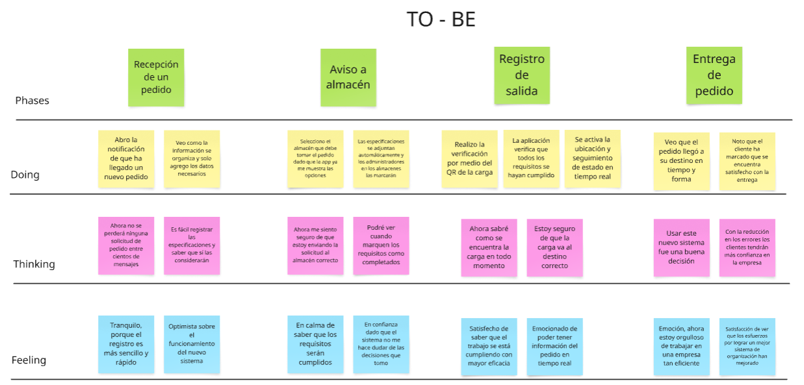
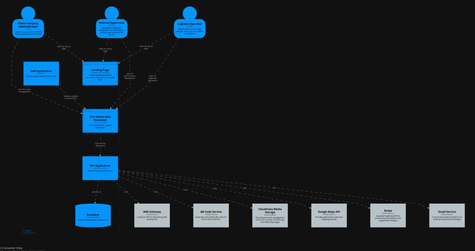
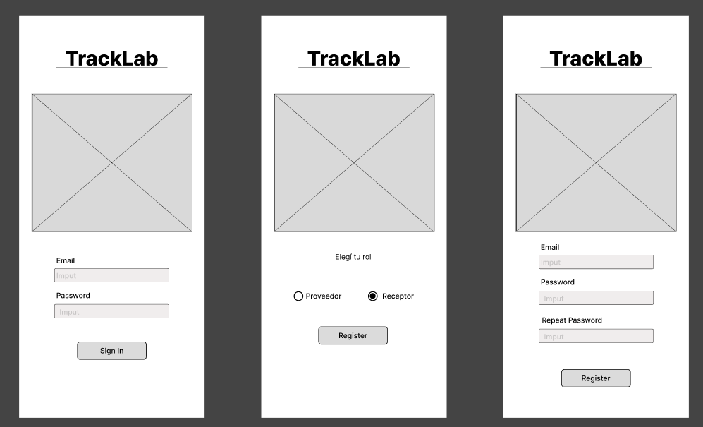

<div>
  <p align="center"></p>
  <p align="center"><b>Universidad Peruana de Ciencias Aplicadas</b></p>
  <p align="center"><b>Ingeniería de Software</b></p>
  <p align="center">Periodo: 202520</p>
  <p align="center">1ACC0238 | Aplicaciones para Dispositivos Móviles</p>
  <p align="center">NRC: 14649</p>
  <p align="center">Docente: David Gerardo Quevedo Velasco</p>
  </br>
  <p align="center">---------------------------------</p>
  </br>
  <p align="center"><b>"Informe de Trabajo Final"</b></p>  
  <p align="center">Startup: LogistiCore</p>
  <p align="center">Producto: TrackLab</p>
  </br>
  <p align="center">Integrantes:</p>
  <p align="center">U202319881 - Baldeón Vivar, Santiago Armando</p>
  <p align="center">U202218634 - De La Cruz Moreno Roy Hernan</p>
  <p align="center">U201912401 - Trillo Hernandez, Anghel Melanie</p>
  <p align="center">U20221F693 - Vargas Javier Jose Enrique</p>
  </br>
  <p align="center">Noviembre 2025</p>
</div>

---

## Versiones del Informe

| _Versión_ | _Fecha_    | _Autor_ | _Descripción de modificación_ |
| --------- | ---------- | ------- | ----------------------------- |
| 1.0       | 06/09/2025 |  | Creación del repositorio |
| 1.1       | 16/09/2025 |  | Capítulos I (sin entrevistas), Capítulo II (ubiquitous language) y Capítulo 3 (hasta 3.2) |
| 1.2       | 08/10/2025 |  | Implementación de los capítulos IV|

---

## Project Report Collaboration Insights

URL del repositorio para el reporte del proyecto: https://github.com/LogistiCore/tracklab-project 

**TB1**

Para el desarrollo del informe pertinente a la TB1, se dividió la implementación de secciones de la siguiente forma entre los integrantes del grupo:

| **Integrantes**                  | **Tareas asignadas** |
| ---------------------------------|----------------------|
| Vargas Javier Jose Enrique       | Bounded Contexts, Diccionario de clases, Organizacion de las capas del sistema |
| Trillo Hernandez, Anghel Melanie |  |
| De La Cruz Moreno Roy Hernan     |  |
| Baldeón Vivar, Santiago Armando  | Canvas, Diseño de entrevistas, style guidelines, wireframes, mockup, class dictionary, Source Code Style Guide & Conventions, Sprint Backlog 1, edición del video |

El proceso de colaboración durante el informe se realizó tanto con commits como compartiendo avances a través de documentos de google. 

---

## Github Collaboration Insights

Github también presenta un timeline de las ramas principales y los procesos de merge a los que se han sometido. Todas las ramas se crearon tomando en cuenta el diseño de GitFlow para una buena organización cuando se usa un software de control de versiones.

Se puede identificar a los integrantes como:
- Vargas Javier Jose, Enrique: 
- Trillo Hernandez, Anghel Melanie: am27th
- De La Cruz Moreno, Roy Hernan: 
- Baldeón Vivar, Santiago Armando: Santibal11

Asimismo, se explican las ramas que tenemos hasta el momento: 
- main: Aún no se encuentra representada, pues se hace un merge en cada entrega al ser la rama principal del proyecto.
- develop: Representada por la rama blanca. Se trata de la rama principal para el proceso del desarrollo del proyecto.
- readme: Representada por la rama morada. Se trata de la rama en la que se han estado realizando las modificaciones al informe.

## Students Outcomes

<table>
  <thead>
    <tr>
      <th>Criterios específicos</th>
      <th>Acciones realizadas</th>
      <th>Conclusiones</th>
    </tr>
  </thead>
  <tbody>
    <tr>
      <td><strong>Trabaja en equipo para proporcionar liderazgo en forma conjunta</strong></td>
      <td>
        <strong>Baldeón Vivar, Santiago Armando</strong><br><br>
        <strong>TB1</strong><br>
        Me encargué del Canvas, el diseño de entrevistas, los lineamientos de estilo, wireframes, mockup, diccionario de clases, guía de estilo para el código fuente, el Sprint Backlog 1 y la edición del video. Estas tareas me ayudaron a colaborar desde distintas áreas, facilitando la documentación del avance del equipo y asegurando la calidad visual y técnica de nuestras entregas.<br><br>
        <strong>Vargas Javier, Jose Enrique</strong><br><br>
        <strong>TB1</strong><br>
        Contribuí parcialmente en la sección de Domain-Driven Software Architecture, participando en el bounded contexts, diccionario de clases y la organización de las capas del sistema. <br><br>
      </td>
      <td>
        Al haber concluido con la primera entrega, logramos coordinar tiempos y responsabilidades como equipo para apoyarnos entre todos y cumplir con todos los requisitos. Establecimos una coordinación óptima que nos permitió profundizar conocimientos y practicar nuevas habilidades con apoyo mutuo.<br><br>
      </td>
    </tr>
    <tr>
      <td><strong>Crea un entorno colaborativo e inclusivo, establece metas, planifica tareas y cumple objetivos</strong></td>
      <td>
        <strong>Baldeón Vivar, Santiago Armando</strong><br><br>
        <strong>TB1</strong><br>
        Para el TB1 organicé mis tareas a partir del backlog del equipo y coordiné con mis compañeros para poder entregar a tiempo. Siempre estuve abierto a comentarios y ofrecí ayuda cuando alguien del grupo necesitaba apoyo. Estas acciones me ayudaron a reforzar un ambiente de confianza y trabajo colaborativo, que facilitó el cumplimiento de nuestros objetivos.<br><br>
        <strong>Vargas Javier, Jose Enrique</strong><br><br>
        <strong>TB1</strong><br>
        Durante el TB1 participé parcialmente en el desarrollo del Capítulo IV, realizando ajustes en las secciones elaboradas para mejorar la claridad y consistencia del informe. Además, me mantuve en comunicación con mis compañeros para alinear los cambios y asegurar que la documentación reflejara adecuadamente el trabajo del equipo.<br><br>
      </td>
      <td>
        Al término de la TB1, podemos concluir que conseguimos formar un entorno de colaboración, a través del cual podíamos realizar consultas entre compañeros mientras nos asegurábamos de cumplir con nuestros aportes a tiempo y de llegar a alcanzar nuestros objetivos de aprendizaje iniciales. Por otro lado, consideramos que la planificación, aunque siempre puede mejorarse, nos ayudó a tener suficiente tiempo como para volver a revisar ciertos detalles y mejorar la calidad de la entrega.<br><br>
      </td>
    </tr>
  </tbody>
</table>


---

# Contenido

1. __[Capítulo I: Presentación](#capítulo-i-presentación)__  
   1.1. [Startup Profile](#11-startup-profile)  
   &nbsp;&nbsp;&nbsp;&nbsp;1.1.1. [Descripción de la Startup](#111-descripción-de-la-startup)  
   &nbsp;&nbsp;&nbsp;&nbsp;1.1.2. [Perfiles de integrantes del equipo](#112-perfiles-de-integrantes-del-equipo)  
   1.2. [Solution Profile](#12-solution-profile)  
   &nbsp;&nbsp;&nbsp;&nbsp;1.2.1. [Antecedentes y problemática](#121-antecedentes-y-problemática)  
   &nbsp;&nbsp;&nbsp;&nbsp;1.2.2. [Lean UX Process](#122-lean-ux-process)  
   &nbsp;&nbsp;&nbsp;&nbsp;&nbsp;&nbsp;&nbsp;&nbsp;1.2.2.1. [Lean UX Problem Statements](#1221-lean-ux-problem-statements)  
   &nbsp;&nbsp;&nbsp;&nbsp;&nbsp;&nbsp;&nbsp;&nbsp;1.2.2.2. [Lean UX Assumptions](#1222-lean-ux-assumptions)  
   &nbsp;&nbsp;&nbsp;&nbsp;&nbsp;&nbsp;&nbsp;&nbsp;1.2.2.3. [Lean UX Hypothesis Statements](#1223-lean-ux-hypothesis-statements)  
   &nbsp;&nbsp;&nbsp;&nbsp;&nbsp;&nbsp;&nbsp;&nbsp;1.2.2.4. [Lean UX Canvas](#1224-lean-ux-canvas)  
   1.3. [Segmentos objetivo](#13-segmentos-objetivo)  

2. __[Capítulo II: Requirements Development and Software Solution Design](#capítulo-ii-requirements-development-and-software-solution-design)__  
   2.1. [Competidores](#21-competidores)  
   &nbsp;&nbsp;&nbsp;&nbsp;2.1.1. [Análisis competitivo](#211-análisis-competitivo)  
   &nbsp;&nbsp;&nbsp;&nbsp;2.1.2. [Estrategias y tácticas frente a competidores](#212-estrategias-y-tácticas-frente-a-competidores)  
   2.2. [Entrevistas](#22-entrevistas)  
   &nbsp;&nbsp;&nbsp;&nbsp;2.2.1. [Diseño de entrevistas](#221-diseño-de-entrevistas)  
   &nbsp;&nbsp;&nbsp;&nbsp;2.2.2. [Registro de entrevistas](#222-registro-de-entrevistas)  
   &nbsp;&nbsp;&nbsp;&nbsp;2.2.3. [Análisis de entrevistas](#223-análisis-de-entrevistas)  
   2.3. [Needfinding](#23-needfinding)  
   &nbsp;&nbsp;&nbsp;&nbsp;2.3.1. [User Personas](#231-user-personas)  
   &nbsp;&nbsp;&nbsp;&nbsp;2.3.2. [User Task Matrix](#232-user-task-matrix)  
   &nbsp;&nbsp;&nbsp;&nbsp;2.3.3. [User Journey Mapping](#233-user-journey-mapping)  
   &nbsp;&nbsp;&nbsp;&nbsp;2.3.4. [Empathy Mapping](#234-empathy-mapping)  
   &nbsp;&nbsp;&nbsp;&nbsp;2.3.5. [Ubiquitous Language](#235-ubiquitous-language)  
   2.4. [Requirements specification](#24-requirements-specification)  
   &nbsp;&nbsp;&nbsp;&nbsp;2.4.1. [User Stories](#241-user-stories)  
   &nbsp;&nbsp;&nbsp;&nbsp;2.4.2. [Impact Mapping](#242-impact-mapping)  
   &nbsp;&nbsp;&nbsp;&nbsp;2.4.3. [Product Backlog](#243-product-backlog)  
   2.5. [Strategic-Level Domain-Driven Design](#25-strategic-level-domain-driven-design)  
   &nbsp;&nbsp;&nbsp;&nbsp;2.5.1. [EventStorming](#251-eventstorming)  
   &nbsp;&nbsp;&nbsp;&nbsp;&nbsp;&nbsp;&nbsp;&nbsp;2.5.1.1. [Candidate Context Discovery](#2511-candidate-context-discovery)  
   &nbsp;&nbsp;&nbsp;&nbsp;&nbsp;&nbsp;&nbsp;&nbsp;2.5.1.2. [Domain Message Flows Modeling](#2512-domain-message-flows-modeling)  
   &nbsp;&nbsp;&nbsp;&nbsp;&nbsp;&nbsp;&nbsp;&nbsp;2.5.1.3. [Bounded Context Canvases](#2513-bounded-context-canvases)  
   &nbsp;&nbsp;&nbsp;&nbsp;2.5.2. [Context Mapping](#252-context-mapping)  
   &nbsp;&nbsp;&nbsp;&nbsp;2.5.3. [Software Architecture](#253-software-architecture)  
   &nbsp;&nbsp;&nbsp;&nbsp;&nbsp;&nbsp;&nbsp;&nbsp;2.5.3.1. [Software Architecture Context Level Diagrams](#2531-software-architecture-context-level-diagrams)  
   &nbsp;&nbsp;&nbsp;&nbsp;&nbsp;&nbsp;&nbsp;&nbsp;2.5.3.2. [Software Architecture Container Level Diagrams](#2532-software-architecture-container-level-diagrams)  
   &nbsp;&nbsp;&nbsp;&nbsp;&nbsp;&nbsp;&nbsp;&nbsp;2.5.3.3. [Software Architecture Deployment Diagrams](#2533-software-architecture-deployment-diagrams)  
   2.6. [Tactical-Level Domain-Driven Design](#26-tactical-level-domain-driven-design)  
   &nbsp;&nbsp;&nbsp;&nbsp;2.6.x. [Bounded Context: <Bounded Context Name>](#26x-bounded-context-name)  
   &nbsp;&nbsp;&nbsp;&nbsp;&nbsp;&nbsp;&nbsp;&nbsp;2.6.x.1. [Domain Layer](#26x1-domain-layer)  
   &nbsp;&nbsp;&nbsp;&nbsp;&nbsp;&nbsp;&nbsp;&nbsp;2.6.x.2. [Interface Layer](#26x2-interface-layer)  
   &nbsp;&nbsp;&nbsp;&nbsp;&nbsp;&nbsp;&nbsp;&nbsp;2.6.x.3. [Application Layer](#26x3-application-layer)  
   &nbsp;&nbsp;&nbsp;&nbsp;&nbsp;&nbsp;&nbsp;&nbsp;2.6.x.4. [Infrastructure Layer](#26x4-infrastructure-layer)  
   &nbsp;&nbsp;&nbsp;&nbsp;&nbsp;&nbsp;&nbsp;&nbsp;2.6.x.5. [Bounded Context Software Architecture Component Level Diagrams](#26x5-bounded-context-software-architecture-component-level-diagrams)  
   &nbsp;&nbsp;&nbsp;&nbsp;&nbsp;&nbsp;&nbsp;&nbsp;2.6.x.6. [Bounded Context Software Architecture Code Level Diagrams](#26x6-bounded-context-software-architecture-code-level-diagrams)  
   &nbsp;&nbsp;&nbsp;&nbsp;&nbsp;&nbsp;&nbsp;&nbsp;&nbsp;&nbsp;&nbsp;&nbsp;2.6.x.6.1. [Bounded Context Domain Layer Class Diagrams](#26x61-bounded-context-domain-layer-class-diagrams)  
   &nbsp;&nbsp;&nbsp;&nbsp;&nbsp;&nbsp;&nbsp;&nbsp;&nbsp;&nbsp;&nbsp;&nbsp;2.6.x.6.2. [Bounded Context Database Design Diagram](#26x62-bounded-context-database-design-diagram)  

3. __[Capítulo III: Solution UI/UX Design](#capítulo-iii-solution-uiux-design)__  
   3.1. [Product design](#31-product-design)  
   &nbsp;&nbsp;&nbsp;&nbsp;3.1.1. [Style Guidelines](#311-style-guidelines)  
   &nbsp;&nbsp;&nbsp;&nbsp;&nbsp;&nbsp;&nbsp;&nbsp;3.1.1.1. [General Style Guidelines](#3111-general-style-guidelines)  
   &nbsp;&nbsp;&nbsp;&nbsp;3.1.2. [Information Architecture](#312-information-architecture)  
   &nbsp;&nbsp;&nbsp;&nbsp;&nbsp;&nbsp;&nbsp;&nbsp;3.1.2.1. [Organization Systems](#3121-organization-systems)  
   &nbsp;&nbsp;&nbsp;&nbsp;&nbsp;&nbsp;&nbsp;&nbsp;3.1.2.2. [Labelling Systems](#3122-labelling-systems)  
   &nbsp;&nbsp;&nbsp;&nbsp;&nbsp;&nbsp;&nbsp;&nbsp;3.1.2.3. [SEO Tags and Meta Tags](#3123-seo-tags-and-meta-tags)  
   &nbsp;&nbsp;&nbsp;&nbsp;&nbsp;&nbsp;&nbsp;&nbsp;3.1.2.4. [Searching Systems](#3124-searching-systems)  
   &nbsp;&nbsp;&nbsp;&nbsp;&nbsp;&nbsp;&nbsp;&nbsp;3.1.2.5. [Navigation Systems](#3125-navigation-systems)  
   &nbsp;&nbsp;&nbsp;&nbsp;3.1.3. [Landing Page UI Design](#313-landing-page-ui-design)  
   &nbsp;&nbsp;&nbsp;&nbsp;&nbsp;&nbsp;&nbsp;&nbsp;3.1.3.1. [Landing Page Wireframe](#3131-landing-page-wireframe)  
   &nbsp;&nbsp;&nbsp;&nbsp;&nbsp;&nbsp;&nbsp;&nbsp;3.1.3.2. [Landing Page Mock-up](#3132-landing-page-mock-up)  
   &nbsp;&nbsp;&nbsp;&nbsp;3.1.4. [Mobile Applications UX/UI Design](#314-mobile-applications-uxui-design)  
   &nbsp;&nbsp;&nbsp;&nbsp;&nbsp;&nbsp;&nbsp;&nbsp;3.1.4.1. [Mobile Applications Wireframes](#3141-mobile-applications-wireframes)  
   &nbsp;&nbsp;&nbsp;&nbsp;&nbsp;&nbsp;&nbsp;&nbsp;3.1.4.2. [Mobile Applications Wireflow Diagrams](#3142-mobile-applications-wireflow-diagrams)  
   &nbsp;&nbsp;&nbsp;&nbsp;&nbsp;&nbsp;&nbsp;&nbsp;3.1.4.3. [Mobile Applications Mock-ups](#3143-mobile-applications-mock-ups)  
   &nbsp;&nbsp;&nbsp;&nbsp;&nbsp;&nbsp;&nbsp;&nbsp;3.1.4.4. [Mobile Applications User Flow Diagrams](#3144-mobile-applications-user-flow-diagrams)  
   &nbsp;&nbsp;&nbsp;&nbsp;&nbsp;&nbsp;&nbsp;&nbsp;3.1.4.5. [Mobile Applications Prototyping](#3145-mobile-applications-prototyping)  

4. __[Capítulo IV: Product Implementation & Validation](#capítulo-iv-product-implementation--validation)__  
   4.1. [Software Configuration Management](#41-software-configuration-management)  
   &nbsp;&nbsp;&nbsp;&nbsp;4.1.1. [Software Development Environment Configuration](#411-software-development-environment-configuration)  
   &nbsp;&nbsp;&nbsp;&nbsp;4.1.2. [Source Code Management](#412-source-code-management)  
   &nbsp;&nbsp;&nbsp;&nbsp;4.1.3. [Source Code Style Guide & Conventions](#413-source-code-style-guide--conventions)  
   &nbsp;&nbsp;&nbsp;&nbsp;4.1.4. [Software Deployment Configuration](#414-software-deployment-configuration)  
   4.2. [Landing Page & Mobile Application Implementation](#42-landing-page--mobile-application-implementation)  
   &nbsp;&nbsp;&nbsp;&nbsp;4.2.1. [Sprint n](#421-sprint-n)  
   &nbsp;&nbsp;&nbsp;&nbsp;&nbsp;&nbsp;&nbsp;&nbsp;4.2.1.1. [Sprint Planning n](#4211-sprint-planning-n)  
   &nbsp;&nbsp;&nbsp;&nbsp;&nbsp;&nbsp;&nbsp;&nbsp;4.2.1.2. [Sprint Backlog n](#4212-sprint-backlog-n)  
   &nbsp;&nbsp;&nbsp;&nbsp;&nbsp;&nbsp;&nbsp;&nbsp;4.2.1.3. [Development Evidence for Sprint Review](#4213-development-evidence-for-sprint-review)  
   &nbsp;&nbsp;&nbsp;&nbsp;&nbsp;&nbsp;&nbsp;&nbsp;4.2.1.4. [Testing Suite Evidence for Sprint Review](#4214-testing-suite-evidence-for-sprint-review)  
   &nbsp;&nbsp;&nbsp;&nbsp;&nbsp;&nbsp;&nbsp;&nbsp;4.2.1.5. [Execution Evidence for Sprint Review](#4215-execution-evidence-for-sprint-review)  
   &nbsp;&nbsp;&nbsp;&nbsp;&nbsp;&nbsp;&nbsp;&nbsp;4.2.1.6. [Services Documentation Evidence for Sprint Review](#4216-services-documentation-evidence-for-sprint-review)  
   &nbsp;&nbsp;&nbsp;&nbsp;&nbsp;&nbsp;&nbsp;&nbsp;4.2.1.7. [Software Deployment Evidence for Sprint Review](#4217-software-deployment-evidence-for-sprint-review)  
   &nbsp;&nbsp;&nbsp;&nbsp;&nbsp;&nbsp;&nbsp;&nbsp;4.2.1.8. [Team Collaboration Insights during Sprint](#4218-team-collaboration-insights-during-sprint)  
  
5. __[Conclusiones](#Conclusiones)__  
   5.1. [Conclusiones](#61-conclusiones)  
   5.2. [Recomendaciones](#62-recomendaciones)  
6. __[Bibliografía](#bibliografía)__  
7. __[Anexos](#anexos)__  

---
# Capítulo I: Introducción

## 1.1. Startup Profile

### 1.1.1. Descripción de la Startup

La startup, presentada bajo el nombre de LogistiCore, tiene como objetivo transformar digitalmente la gestión logística entre empresas en el Perú. A través de una aplicación móvil intuitiva y especializada, LogistiCore permite a empresas clientes registrar y hacer seguimiento a sus órdenes de compra desde cualquier lugar, mientras que las empresas logísticas pueden gestionar la recepción, agrupación, trazabilidad y entrega de la carga mediante tecnología de escaneo con códigos QR directamente desde dispositivos móviles.  

La solución se centra en resolver la fragmentación y falta de visibilidad en el flujo de carga entre múltiples actores (proveedores, operadores logísticos, empresas en campo), permitiendo un control preciso desde el origen hasta el destino final, incluyendo almacenes intermedios, rutas de transporte y procesos de consolidación de carga.  

El uso de una aplicación móvil facilita la trazabilidad en tiempo real de cada unidad de carga, incluso cuando esta se agrupa en contenedores mayores, representando una de las principales ventajas competitivas del sistema. Además, LogistiCore integra dashboards adaptados a móviles para el análisis de datos operativos, facilitando la toma de decisiones estratégicas tanto para empresas logísticas como para sus clientes.  

Misión: Digitalizar y optimizar la trazabilidad logística B2B mediante una aplicación móvil intuitiva, segura y eficiente para empresas peruanas.  

Visión: LogistiCore aspira a consolidarse como la solución tecnológica líder en gestión logística empresarial en Latinoamérica, facilitando la transformación digital del sector logístico con un enfoque en trazabilidad, transparencia y control de operaciones.  

### 1.1.2. Perfiles de integrantes del equipo

#### 1.1.2.1. Vargas Javier Jose Enrique

Código: U20221F693

Carrera: Ingeniería de Software

Mi nombre es Jose Enrique Vargas y estudio la carrera de Ingeniería de Software. Me motiva la posibilidad de aprender constantemente y aplicar la tecnología para resolver problemas reales en la sociedad. Mi objetivo es seguir desarrollando mis habilidades y experiencia para en un futuro aportar soluciones innovadoras.

<div>
  <p></p>
</div>

#### 1.1.2.2. Trillo Hernandez, Anghel Melanie

Código: u201912401

Carrera: Ingeniería de Software

Estudiante de la carrera de Ingeniería de Software de la Universidad Peruana de Ciencias Aplicadas (UPC), lo que me gusta de la carrera es desarrollar soluciones innovadoras que contribuyen a la sociedad. Me considero una persona responsable y orientada a resultados. Asimismo, me comprometo a colaborar en el equipo de forma continua y puntual.

<div>
  <p></p>
</div>

#### 1.1.2.3. De La Cruz Moreno Roy Hernan

Código: u202218634

Carrera: Ingeniería de Software

Soy Roy De La Cruz Moreno. Estudió la carrera de Ingeniería de Software. Considero que soy una persona tranquila y atenta al escuchar las propuestas de los demás integrantes del equipo, ademas tengo conocimientos en SQL, NoSQL y C++.

<div>
  <p></p>
</div>

#### 1.1.2.4. Santiago Armando Baldeón Vivar

Código: U202319881

Carrera: Ingeniería de Software

Mi nombre es Santiago Armando Baldeon y tengo 18 años. Actualmente estoy cursando la carrera de Ingeniería de Software en la Universidad Peruana de Ciencias Aplicadas. En mi caso elegí esta carrera porque desde chico sentí gran pasión por la tecnología y siempre quise ser alguien importante en este mundo, brindando mis aportes a la humanidad. Creo que voy por buen camino y espero en un futuro cumplir estos sueños y objetivos que tengo.

<div>
  <p></p>
</div>

## 1.2. Solution Profile

### 1.2.1. Antecedentes y problemática

Para explicar el origen e impacto del problema identificado en la actualidad, emplearemos la técnica de los 5W2H, de forma que podamos dar con las principales causas que lo provocan y ello nos permita plantear una mejor solución.

#### 1.2.1.1. What

__¿Cuál es el problema__

El problema radica en que tanto quienes se encargan del envío como de la recepción de paquetes de manera industrial tienen dificultades para mantenerse al tanto de la condición del envío, considerando desde su ubicación hasta si este se encuentra en un estado óptimo. Esto genera desconfianza al realizar envíos, así como incertidumbre en cuanto al momento y calidad de la entrega. Aquí, se puede notar que existe una necesidad por ambos lados de mantenerse al tanto del paquete y su seguridad.

Al no existir un canal accesible y en tiempo real, las empresas no pueden verificar el estado de los envíos hasta su recepción final. Esto ocasiona pérdidas de paquetería, retrasos inadvertidos o entregas en ubicaciones incorrectas.

#### 1.2.1.2. Who

__¿Quiénes están involucrados en el problema?__

Dentro de este problema, podemos destacar dos partes: la empresa que provee la paquetería y aquella que la solicita. La empresa encargada del envío almacena materiales o artefactos en gran cantidad para venderlos y distribuirlos hacia las empresas que los necesitan, mismas que realizan su pedido y esperan que este llegue en condiciones óptimas y en el tiempo indicado. Ambas buscan acceder a la mayor cantidad de información posible sobre el envío, lo cual genera conflictos si una de las partes carece de datos. La empresa receptora puede presentar dudas y reclamos, mientras que la emisora no sabría responder con certeza.

#### 1.2.1.3. Where

__¿En dónde se presenta el problema?__

Este problema ocurre en el Perú, más específicamente en los almacenes o centros de envío y recepción de pedidos de las empresas que solicitan estos servicios, así como en las rutas de transporte. La falta de transmisión de información desde la salida hasta la entrega final impide que las partes tengan visibilidad sobre la carga. Además, el problema se refleja también en las oficinas de ambas empresas: una exige información y la otra no puede brindarla porque tampoco la posee.

#### 1.2.1.4. When

__¿Cuándo se presenta el problema?__

El problema aparece desde que la empresa proveedora inicia un envío hacia el lugar indicado por la empresa solicitante, ya que no guarda ni comparte la información necesaria durante el trayecto. La incertidumbre se mantiene durante el empaquetado, el traslado y hasta la entrega. Entre las principales dificultades se encuentran: retrasos no comunicados, paquetes en condiciones deficientes por mal empaquetado, y entregas en ubicaciones equivocadas que aumentan costos de traslado.

#### 1.2.1.5. Why

__¿Por qué surge el problema?__

La principal causa del problema es la falta de seguimiento del proceso de traslado de los paquetes enviados. Esto puede ocurrir por una deficiente organización de la empresa proveedora, pero sobre todo por la ausencia de herramientas tecnológicas que faciliten el monitoreo requerido.

La falta de información detallada genera errores en el empaquetado, ubicación y transporte de los envíos. Además, la empresa solicitante experimenta intranquilidad y desconfianza al no poder acceder a datos en tiempo real, especialmente cuando ocurren retrasos o pérdidas.

#### 1.2.1.6. How

__¿Cómo ocurre el problema?__

El problema ocurre por la falta de organización y de transferencia de información confiable, lo que incrementa la probabilidad de errores en el proceso logístico y afecta a ambas empresas involucradas.

__¿En qué condiciones los usuarios usarán nuestro producto?__

Los usuarios usarán LogistiCore a través de una aplicación móvil que les permita acceder en tiempo real al estado de cada envío.  
- La empresa emisora podrá verificar la salida del pedido, registrar el escaneo de códigos QR y confirmar que se cumplen las medidas de seguridad antes y durante el transporte.  
- La empresa receptora podrá seguir el traslado paso a paso, visualizar la ubicación actual y recibir alertas sobre el estado de la carga, generando confianza y reduciendo la incertidumbre.  

#### 1.2.1.7. How much

__¿Cuánto impacto genera el problema?__

En la última edición del PADE Internacional en Operaciones y Logística de la Universidad ESAN, el docente Freddy Alvarado Vargas señala como algunas de las causas más comunes de las fallas en los procesos de traslado y entrega de productos a la deficiente organización física de los productos, el poco soporte tecnológico, la ubicación y selección inadecuada de los productos a entregar, y el uso de equipos de manipulación incorrectos. Todo esto impacta negativamente en la confianza de las empresas receptoras y en la imagen de las empresas emisoras.

Implementar un sistema de seguimiento mediante una aplicación móvil como LogistiCore representaría una ventaja competitiva, ya que permitiría a las empresas mantener visibilidad completa de sus envíos en cualquier momento. Asimismo, cabe mencionar que actualmente el Gobierno del Perú busca impulsar el mercado de transporte y logística nacional con el objetivo de cerrar el presente año con ganancias de más de 15 mil millones de dólares y alcanzar una tasa de crecimiento anual compuesta de 5,92% en los próximos cinco años. Sin embargo, estas metas se ven limitadas por las deficiencias de las empresas de transporte de mercancías, que afectan tanto a nivel empresarial como al crecimiento económico nacional.


### 1.2.2. Lean UX Process

#### 1.2.2.1. Lean UX Problem Statements

Nuestra solución busca proveer un espacio digital a través de una aplicación móvil para gestionar el seguimiento de paquetes. Esto es diseñado para que tanto los operadores de envío como las empresas receptoras puedan monitorear en tiempo real la ubicación y el estado óptimo de los envíos industriales. Este sistema digital busca generar confianza y transparencia en el proceso, reduciendo incertidumbres sobre la entrega y mejorando la precisión en la recepción.

Sin embargo, actualmente no existe un canal accesible y en tiempo real que permita verificar la condición de los paquetes antes de su entrega final, lo que provoca pérdidas, retrasos no detectados y entregas en ubicaciones incorrectas, afectando la operación y la satisfacción del cliente.

__¿Cómo podríamos diseñar un sistema de seguimiento y verificación en tiempo real que garantice la seguridad y el estado de los paquetes para reducir las pérdidas, errores en la entrega y aumentar la confianza de todas las partes involucradas?__

#### 1.2.2.2. Lean UX Assumptions

__Business Assumptions:__

- __Creemos que nuestros usuarios necesitan__ tener visibilidad y control en tiempo real sobre los envíos, sin importar su tipo o tamaño, desde sus dispositivos móviles.
- __Estas necesidades se pueden satisfacer__ con una aplicación móvil que registre, actualice y comparta el estado, ubicación y condiciones del envío durante todo su trayecto.
- __Nuestros clientes iniciales serán__ empresas proveedoras o compañías que trasladan productos o insumos entre sedes, y las empresas clientes que solicitan estos envíos.
- __El valor más importante que un cliente quiere de nuestros servicios es__ la trazabilidad integral de cada envío, desde el origen hasta su destino, accesible desde cualquier lugar.
- __El cliente también va a obtener__ reducción de errores, mejora en la comunicación interempresa y soporte en la toma de decisiones logísticas.
- __Vamos a obtener la mayoría de los clientes mediante__ alianzas estratégicas con empresas logísticas, presentaciones en eventos del sector y marketing digital B2B.
- __Vamos a obtener ingresos mediante__ suscripciones mensuales escalables según número de envíos o integración con ERP/logística.
- __Nuestra competencia en el mercado serán__ soluciones de rastreo parcial, herramientas internas no estandarizadas o software caro y poco flexible.
- __Vamos a tener ventaja frente a nuestra competencia debido a__ la flexibilidad para adaptarse a distintos tipos de envío, verificación digital (QR, fotos), y visualización colaborativa en dispositivos móviles.
- __El mayor riesgo del servicio es__ que el personal de campo (almacén, transporte) no registre correctamente las etapas del envío.
- __Lo resolveremos realizando__ pruebas piloto con usuarios reales, interfaz móvil simple y adaptable, y sesiones de entrenamiento orientadas al flujo operativo real.

__User Assumptions:__

__¿Quién es el usuario?__

Los usuarios principales son el personal administrativo y/o gerencial de empresas que gestionan envíos industriales por vía terrestre en Perú, así como el personal de estos mismos puestos de las empresas que realizan los pedidos. Si la aplicación tiene éxito en este sector, se plantea su extensión a todo el ecosistema logístico nacional e internacional, incluyendo sectores como manufactura, minería, agroindustria, energía y distribución masiva.

__¿Qué problemas tiene nuestro producto que resolver?__

Actualmente, muchas empresas enfrentan problemas relacionados con la falta de visibilidad en tiempo real, el desconocimiento del estado o condición de un envío, y la dificultad para verificar si los envíos fueron realizados correctamente o llegaron a destino. En muchos casos, los registros son manuales, aislados o poco confiables. La aplicación busca resolver estos problemas mediante la automatización de la trazabilidad, integrando el monitoreo de ubicación, estado físico del envío, y validaciones digitales durante todo el trayecto.

__¿Qué características son importantes?__

Las funcionalidades clave de la aplicación incluyen el registro y seguimiento digital de cada fase del traslado, permitiendo un control detallado desde el origen hasta el destino. Ofrece visualización en tiempo real de la ubicación y condiciones del envío, y verificación de carga y descarga mediante tecnologías como códigos QR y registro fotográfico, lo que reduce errores y garantiza trazabilidad. El sistema emite alertas automáticas ante desvíos, demoras o incidencias, y almacena un historial completo del envío. Además, se integra con sistemas internos como ERP, WMS o CRM, consolidando procesos logísticos. Estas funcionalidades no solo previenen pérdidas económicas, sino que también permiten generar reportes analíticos, tomar decisiones informadas y establecer mejores prácticas logísticas a futuro.

__¿Dónde encaja nuestro producto en su trabajo o vida?__

La aplicación móvil se integra directamente en los procesos diarios de logística operativa, tanto en planta como en transporte y recepción de envíos. Facilita el control operativo, mejora la comunicación entre áreas o empresas involucradas y permite evaluar el rendimiento logístico en tiempo real, impulsando la eficiencia, la calidad del servicio y la rentabilidad.

__¿Cuándo y cómo es nuestro producto usado?__

La aplicación es utilizada desde el momento en que se prepara un envío, se realiza el traslado físico, y finaliza con la confirmación de entrega en destino. También se usa en etapas de auditoría interna, evaluación de indicadores logísticos, análisis de errores y mejoras de procesos. Puede ser accedida en cualquier momento desde dispositivos móviles o tablets, según el rol del usuario (operativo o administrativo).

__¿Cómo debe verse nuestro producto y cómo debe comportarse?__

Nuestra aplicación debe contar con una interfaz intuitiva, visual y de fácil uso, diseñada especialmente para el personal operativo, de modo que no requiera capacitaciones complejas. Debe ser modular y flexible, capaz de adaptarse a distintos tipos de envío, sectores logísticos y modelos operativos. La visualización debe incluir mapas en tiempo real, alertas automáticas e indicadores por eventos, facilitando el seguimiento y control del traslado. A nivel funcional, la aplicación debe ser estable, rápida y segura, con acceso controlado para proteger los datos sensibles tanto de la empresa como de los usuarios.

#### 1.2.2.3. Lean UX Hypothesis Statements

Hypothesis Statement 01

**Creemos** que permitir el seguimiento en tiempo real de los envíos a través de la aplicación móvil resultará en una mayor transparencia y confianza entre las empresas emisoras y receptoras.  
**Sabremos** que hemos tenido éxito
**cuando** al menos el 80% de los envíos activos sean monitoreados durante todo su trayecto en los primeros tres meses.

Hypothesis Statement 02

**Creemos** que permitir el registro digital de cada fase del envío (empaque, salida, tránsito y entrega) resultará en una reducción significativa de errores y pérdidas de paquetes.  
**Sabremos** que hemos tenido éxito
**cuando** los errores logísticos disminuyan en un 40% en el primer trimestre.

Hypothesis Statement 03

**Creemos** que enviar notificaciones automáticas ante retrasos o anomalías resultará en una mejor capacidad de respuesta por parte de las empresas.  
**Sabremos** que se ha logrado
**cuando** el 70% de los retrasos sean comunicados antes de afectar la entrega.


Hypothesis Statement 04

**Creemos** que incorporar escaneo de códigos QR en los puntos clave del proceso resultará en una identificación más precisa y rápida de cada paquete.  
**Sabremos** que hemos tenido éxito 
**cuando** el 90% de los registros sean validados correctamente mediante el escaneo.


Hypothesis Statement 05

**Creemos** que ofrecer un panel de control visual para supervisores y operadores resultará en una gestión más eficiente de múltiples envíos simultáneos.  
**Sabremos** que se ha logrado
**cuando** los supervisores gestionen 20 envíos simultáneos con una tasa de error menor al 5%.

Hypothesis Statement 06

**Creemos** que almacenar y mostrar el historial completo de los envíos anteriores resultará en una mejor trazabilidad y análisis del desempeño logístico.  
**Sabremos** que hemos tenido éxito
**cuando** el 85% de los usuarios consulte el historial para resolver incidencias.

Hypothesis Statement 07

**Creemos** que permitir a los operadores registrar el estado físico del paquete con fotos y comentarios resultará en una mayor transparencia y evidencia en casos de reclamos.  
**Sabremos** que se ha logrado 
**cuando** los reclamos por daños sin evidencia se reduzcan en un 50%.

Hypothesis Statement 08

**Creemos** que dar acceso a ambas partes (emisora y receptora) a la misma información del envío resultará en una comunicación más fluida y menos disputas.
**Sabremos** que hemos tenido éxito  
**cuando** los reclamos por falta de información disminuyan en un 60%.

Hypothesis Statement 09

**Creemos** que permitir el monitoreo continuo y las alertas tempranas resultará en una disminución de los tiempos promedio de entrega.
**Sabremos** que se ha logrado
**cuando** los tiempos de entrega se reduzcan en un 20% respecto al promedio anterior.

Hypothesis Statement 10

**Creemos** que brindar tutoriales interactivos dentro de la aplicación resultará en una adopción más rápida y efectiva por parte del personal operativo.
**Sabremos** que se ha logrado
**cuando** el 90% de los usuarios nuevos complete el tutorial y registre su primer envío sin asistencia externa.

#### 1.2.2.4. Lean UX Canvas

Lean UX Canvas es una de las herramientas que hemos utilizado para comprender a nuestros posibles usuarios y sus necesidades. Esta es usada en el campo del diseño centrado en el usuario y la metodología Lean con la intención de desarrollar productos de forma eficiente y práctica para los usuarios. A su vez, esta puede ser utilizada por equipos multidisciplinarios para que colaboren de forma ordenada dentro de un marco estructurado.

<div>
  <p align="center"></p>
</div>

Enlace para acceder al [Canvas](https://www.canva.com/design/DAGjqMusdhM/D6-Qc0v9JioQbOugM7qnXQ/edit?utm_content=DAGjqMusdhM&utm_campaign=designshare&utm_medium=link2&utm_source=sharebutton)


## 1.3 Segmentos Objetivos

La solución propuesta se centra en dos segmentos claves dentro del ámbito logístico, respaldados por datos que evidencian la urgencia de digitalizar los procesos de trazabilidad y registro de operaciones mediante aplicaciones móviles accesibles desde cualquier lugar:

### Segmento 1: Empresas logísticas

#### Descripción general

Organizaciones dedicadas a la gestión, transporte, consolidación y distribución de carga. Este segmento enfrenta diariamente desafíos en el seguimiento y registro de operaciones, donde los sistemas tradicionales generan errores y cuellos de botella en los procesos. Una aplicación móvil facilita el registro y control en campo en tiempo real, reduciendo fallas y aumentando la eficiencia.

#### Perfil operativo

Sus directivos y gerentes suelen tener entre 30 y 55 años, con presencia fuerte en zonas urbanas e industriales de Perú (por ejemplo, Lima, Arequipa y Trujillo).

#### Datos del sector

Según SERGroup, aproximadamente el 63% de las empresas logísticas reconoce la digitalización como una herramienta clave para mejorar la eficiencia operativa, y cerca del 73% está en proceso de adoptar tecnologías móviles de rastreo y control para optimizar su cadena de suministro.

#### Necesidad

La integración de soluciones móviles, como el seguimiento en tiempo real mediante códigos QR y dashboards accesibles desde celulares o tablets, es vista como esencial para reducir errores y mejorar la visibilidad de cada operación.

### Segmento 2: Empresas cliente (B2B)

#### Descripción general

Compañías de sectores como minería, construcción, agroindustria y comercio, que dependen críticamente de servicios logísticos para asegurar la entrega oportuna de sus productos. Una aplicación móvil les permite acceder al estado de sus pedidos en cualquier momento y lugar.

#### Perfil gerencial

Los responsables de cadena de suministro y logística en estas empresas suelen tener entre 35 y 60 años y operan en regiones con alta densidad industrial.

#### Datos del sector

De acuerdo con SERGroup, alrededor del 70% de las empresas en sectores vinculados a la logística demandan información en tiempo real para tomar decisiones estratégicas, mientras que casi el 78% manifiesta la necesidad de soluciones digitales integradas que permitan un seguimiento continuo y preciso de sus envíos, especialmente desde dispositivos móviles.

#### Necesidad

Contar con herramientas móviles que ofrezcan informes claros y en tiempo real, optimizando la toma de decisiones y reduciendo retrasos y costos generados por sistemas manuales o poco integrados.

# 2. Capítulo II: Requirements Elicitation & Analysis

## 2.1 Competidores

### 2.1.1. Análisis competitivo

A continuación, realizamos un análisis competitivo para identificar oportunidades, amenazas, ventajas y posibles desventajas que podemos tener dentro del mercado en comparación a otras empresas que realicen actividades similares a las nuestras. De esta forma, podremos prepararnos para resaltar frente a los consumidores.

<table>
  <thead>
    <tr>
      <th colspan="5"><b>Competitive Analysis Landscape</b></th>
    </tr>
  </thead>
  <tbody>
    <tr>
      <td colspan="2" align="center">¿Por qué llevar a cabo este análisis?</td>
      <td colspan="3" align="center">Con el análisis competitivo podemos entender el mercado, identificar oportunidades y diferenciarnos de la competencia. Ayudándonos a tomar decisiones correctas, minimizar riesgos y fortalecer nuestra posición en el mercado, asegurándonos una ventaja estratégica y un crecimiento constante y sostenible.</td>
    </tr>
    <tr>
      <td colspan="2">PERFIL</td>
      <td><picture><p align="center"></p></picture></td>
      <td><picture><p align="center"></p></picture></td>
      <td><picture><p align="center"></p></picture></td>
    </tr>
    <tr>
      <td rowspan="2">Perfil</td>
      <td>Overview</td>
      <td>Aplicación móvil desarrollada por Dinet (Perú), disponible en Android/iOS. Permite a clientes conocer inventarios, salida y llegada de mercancía, recorrido de productos en tiempo real.</td>
      <td>Plataforma peruana de rastreo satelital y gestión de flotas con app móvil. Permite despachos, geocercas, alertas y reportes de vehículos en tiempo real.</td>
      <td>Proveedor peruano de gestión de flotas y rastreo GPS en tiempo real. Su app móvil permite monitoreo, reportes, históricos de ubicaciones y gestión de conductores.</td>
    </tr>
    <tr>
      <td>Ventaja Competitiva ¿Qué valor ofrece a los clientes?</td>
      <td>- Visibilidad constante de mercancía en tiempo real.<br>- Integración web y móvil.<br>- Reducción de costos logísticos.</td>
      <td>- Especialización en flotas vehiculares.<br>- Alertas en tiempo real y monitoreo preventivo.<br>- Funcionalidad móvil extendida.</td>
      <td>- Soluciones locales probadas.<br>- Integración de reportes y alertas.<br>- Interfaz sencilla y adaptada a usuarios en campo.</td>
    </tr>
    <tr>
      <td rowspan="2">Perfil de Marketing</td>
      <td>Mercado objetivo</td>
      <td>Empresas de logística y distribución que requieren visibilidad en tiempo real de mercancía.</td>
      <td>Empresas con flotas vehiculares, transporte y logística de última milla.</td>
      <td>Empresas con operaciones de transporte y distribución que requieren control de conductores y activos móviles.</td>
    </tr>
    <tr>
      <td>Estrategias de Marketing</td>
      <td>Marketing B2B, casos de éxito y ferias logísticas.</td>
      <td>Marketing digital, demostraciones B2B y convenios empresariales.</td>
      <td>Marketing directo, presencia en ferias y alianzas con empresas de transporte locales.</td>
    </tr>
    <tr>
      <td rowspan="3">Perfil del Producto</td>
      <td>Productos & Servicios</td>
      <td>App móvil y web para trazabilidad de inventarios y carga en tiempo real.</td>
      <td>App móvil y plataforma web para gestión de flotas y rastreo satelital.</td>
      <td>App móvil/web para rastreo GPS, gestión de conductores y alertas preventivas.</td>
    </tr>
    <tr>
      <td>Precios & Costos</td>
      <td>Planes de suscripción ajustados al número de usuarios/operaciones. Desde $500/mes.</td>
      <td>Planes de suscripción por flota desde $700/mes, escalables según número de vehículos.</td>
      <td>Planes desde $600/mes según número de vehículos y servicios adicionales.</td>
    </tr>
    <tr>
      <td>Canales de Distribución (web / móvil)</td>
      <td>App Android/iOS y plataforma web.</td>
      <td>App Android/iOS y portal web empresarial.</td>
      <td>App Android/iOS y plataforma web con soporte local.</td>
    </tr>
    <tr>
      <td rowspan="4">Análisis SWOT</td>
      <td>Fortalezas</td>
      <td>Visibilidad en tiempo real; fuerte respaldo de Dinet.</td>
      <td>Especialización en rastreo satelital y gestión de flotas.</td>
      <td>Adaptación local y soporte técnico en Perú.</td>
    </tr>
    <tr>
      <td>Debilidades</td>
      <td>- Poca personalización para sectores nicho (minería, agroindustria).<br>- No ofrece QR para verificación.</td>
      <td>- Limitado a gestión vehicular; no cubre trazabilidad de producto.</td>
      <td>- Interfaz básica; carencia de diferenciación frente a grandes ERPs.</td>
    </tr>
    <tr>
      <td>Oportunidades</td>
      <td>Expansión hacia sectores agroindustriales y minería con trazabilidad más granular.</td>
      <td>Incorporar trazabilidad de productos además de flotas.</td>
      <td>Ampliar a retail, e-commerce y agroexportaciones.</td>
    </tr>
    <tr>
      <td>Amenazas</td>
      <td>Competencia con apps globales de logística.</td>
      <td>Competidores con servicios integrados de logística y ERP.</td>
      <td>Competencia de soluciones internacionales como SAP o Oracle Logistics.</td>
    </tr>
  </tbody>
</table>


### 2.1.2. Estrategias y tácticas frente a competidores

Afrontando las fortalezas de nuestros competidores:

- Tienen visibilidad en tiempo real bien establecida y reconocimiento en el mercado local.  
- Cuentan con experiencia en gestión de flotas y respaldo técnico para operaciones en campo.  
- Ofrecen integraciones web-móvil y modelos comerciales ya aceptados por clientes B2B.

Comprendemos que nuestras fortalezas son:

- Somos una solución móvil especializada en **trazabilidad por unidad de carga** (no solo por vehículo), con verificación en campo mediante **QR** y evidencia fotográfica.  
- Interfaz móvil diseñada para operarios: uso offline básico, notificaciones push y flujos rápidos para escaneos y validaciones.  
- Integraciones abiertas (APIs) pensadas para conectarnos fácilmente con ERPs/WMS existentes y dashboards móviles por rol (operativo / administrativo / cliente).  
- Enfoque B2B centrado en reducción de errores operativos y en evidencia verificable para resolver reclamos.

Entonces podemos aplicar las siguientes estrategias y tácticas:

**Estrategias:**  
- Posicionarnos como **complemento** (no reemplazo) de las soluciones de flotas y ERPs: “añade trazabilidad granular a tu sistema actual”.  
- Enfocar comercialmente sectores donde los competidores locales están menos especializados (minería, agroindustria exportadora, manufactura y energía).  
- Priorizar experiencia de usuario y soporte local como ventaja competitiva frente a soluciones genéricas.

**Tácticas:**  
- Lanzar **pilotos** de 4–8 semanas con clientes estratégicos en minería/agro para demostrar reducción de errores y tiempos de respuesta.  
- Crear paquetes comerciales escalonados: piloto gratuito/cliente inicial con descuento, plan básico para PYMES y plan enterprise con integraciones y soporte.  
- Materiales de venta y entrenamiento orientados a usuarios operativos: videos cortos (30–90s), guías de campo y checklists imprimibles.  
- Demos en sitio y remotas mostrando casos reales (escaneo QR → registro → foto → entrega) para validar la propuesta en campo.

---

Afrontando las debilidades de nuestros competidores:

- Muchos se centran en vehículo/telemetría y no en la validación física de la carga (QR/foto).  
- Sus integraciones suelen ser cerradas y sus interfaces no están diseñadas para operarios en campo.  
- Poca atención al modo offline y a flujos de uso rápido en almacenes.

Comprendemos que nuestras debilidades son:

- Dependemos de la correcta actuación del personal de campo para registrar eventos.  
- Puede existir resistencia inicial al cambio en empresas con procesos manuales muy arraigados.  
- Necesitamos asegurar calidad de datos (fotos/escaneos válidos) y mantener baja fricción en campo.

Entonces podemos aplicar las siguientes estrategias y tácticas:

**Estrategias:**  
- Minimizar la fricción de uso: flujos de 1–2 pasos para registrar eventos críticos y validaciones automáticas simples.  
- Invertir en acompañamiento inicial (onboarding) y en soporte cercano para los primeros 2–3 meses del piloto.  

**Tácticas:**  
- Ofrecer incentivos para el personal de campo durante la fase piloto (por ejemplo, reportes de productividad que demuestren beneficio).  
- Capacitación práctica presencial/virtual de 1 hora y videos “cómo hacerlo” en la app.  
- Funcionalidades de control de calidad de datos (p. ej. validación mínima de foto/QR antes de aceptar registro).

---

Afrontando las oportunidades (contexto del mercado local):

- Mayor demanda de digitalización logística en Perú y LatAm; normas y requisitos de trazabilidad en exportaciones.  
- Brechas claras entre registro en origen y verificación en destino que generan pérdidas y reclamos.  
- Clientes valoran evidencias (fotos/QR) que reduzcan disputas y costos.

Comprendemos que nuestras oportunidades son:

- Liderar con una oferta móvil que combine trazabilidad granular + verificación física, orientada a reducir errores operativos.  
- Convertir pruebas piloto en casos de éxito medibles (reducción de reclamos, tiempos y costos) para acelerar adopción.  
- Asociaciones con cámaras sectoriales y proveedores de hardware (impresoras/etiquetas QR) para simplificar implementaciones.

Entonces podemos aplicar las siguientes estrategias y tácticas:

**Estrategias:**  
- Ofrecer una solución modular: función básica (QR + rastreo) para PYMES y módulos avanzados (integración ERP, reportes analíticos) para empresas grandes.  
- Priorizar integraciones rápidas con los ERPs/WMS más comunes del mercado para facilitar adopción.

**Tácticas:**  
- Publicar **casos de estudio** y métricas claras (ej. % reducción de entregas erróneas, % menos reclamos) tras cada piloto.  
- Webinars y contenidos técnicos dirigidos a jefes de logística y operaciones en sectores objetivo.  
- Programas de co-marketing con asociaciones sectoriales y distribuidores de insumos logísticos.

---

Afrontando las amenazas (competidores locales e internacionales):

- Los competidores locales pueden añadir funcionalidades similares si detectan demanda.  
- Soluciones internacionales o grandes ERPs podrían entrar con recursos y presencia comercial.  
- Clientes pueden preferir “lo que ya conocen” y demorar la migración.

Comprendemos que nuestras amenazas son:

- Presión de precio y marketing de actores más grandes.  
- Ritmo de adopción lento entre operarios menos digitales.  
- Riesgo de ser percibidos como complemento innecesario si la integración no es impecable.

Entonces podemos aplicar las siguientes estrategias y tácticas:

**Estrategias:**  
- Diferenciar con **UX + servicio**: experiencia móvil extremadamente simple para operarios + soporte local y SLAs visibles.  
- Consolidar alianzas con proveedores tecnológicos y consultoras locales para fortalecer go-to-market y reducir barreras de entrada.

**Tácticas:**  
- Equipo de Customer Success asignado a clientes piloto con KPIs mensurables y revisiones periódicas.  
- Roadmap público con prioridades (QR, offline, integraciones) para mostrar compromiso y evitar incertidumbre del cliente.  
- Promociones de fidelización (descuentos por contrato anual, soporte premium) y contratos piloto que faciliten la transición sin riesgo.


## 2.2. Entrevistas

### 2.2.1. Diseño de entrevista

#### Segmento objetivo #1: Administradores de empresas proveedoras (envíos industriales)

Preguntas Demográficas y de Perfil

- ¿Cuál es su rol en la empresa y cuántos años de experiencia tiene en el sector logístico?
- ¿Podría describir brevemente el tamaño de su empresa (número de empleados y volumen de operaciones mensuales)?
- ¿En qué región o distrito se concentra mayormente su actividad operativa?

Preguntas sobre Procesos Actuales y Herramientas

- ¿Cómo gestionan actualmente el registro y seguimiento de la carga?
- ¿Qué método o sistema utilizan para garantizar la trazabilidad de cada operación?
- ¿Qué herramientas digitales o software emplean en su día a día para el seguimiento de envíos?

Preguntas sobre Desafíos y Frustraciones

- ¿Cuáles son los principales cuellos de botella que enfrenta en la gestión logística?
- ¿Qué dificultades encuentra al mantener un seguimiento preciso de las órdenes y la carga?
- ¿Qué aspectos de su sistema actual le resultan más frustrantes o poco eficientes?

Preguntas sobre Expectativas y Necesidades Tecnológicas

- ¿Qué características considera imprescindibles en una solución digital de trazabilidad y seguimiento?
- ¿Cómo espera que se integre una nueva plataforma con sus procesos y dispositivos actuales
- ¿Qué nivel de soporte técnico y capacidad de escalabilidad valora al elegir una nueva herramienta?

Preguntas Finales y de Retroalimentación

- ¿Estaría dispuesto a adoptar tecnologías como códigos QR o dashboards interactivos? ¿Por qué?
- ¿Cómo gestionan y analizan actualmente los datos operativos, y qué mejoras desearía ver?
- Si pudiera cambiar algoaspecto de su sistema actual, ¿cuál sería y por qué?

#### Segmento objetivo #2: Administrador de empresa cliente (solicita envíos)

Preguntas Demográficas y de Perfil

- ¿Cuál es su rol y responsabilidad dentro de la empresa en relación con la logística?
- ¿Podría describir brevemente el tamaño de su empresa y el sector (minería, construcción, agroindustria, etc.) en que opera?
- ¿En qué regiones o distritos se centra principalmente su actividad?

Preguntas sobre Procesos Actuales y Herramientas

- ¿Cómo se gestionan actualmente las órdenes de compra y el seguimiento de envíos en su organización?
- ¿Qué herramientas o software utiliza para monitorear el estado de sus pedidos?
- ¿Qué dispositivos (móvil, tablet, PC) utiliza su equipo para interactuar con estas herramientas?

Preguntas sobre Desafíos y Frustraciones

- ¿Cuáles son los mayores desafíos que enfrenta en el seguimiento de sus envíos o pedidos?
- ¿Qué aspectos del proceso actual cree que generan ineficiencias o retrasos?
- ¿Ha experimentado frustraciones con el sistema actual que utiliza para el seguimiento? ¿Cuáles?

Preguntas sobre Expectativas y Necesidades Tecnológicas

- ¿Qué funcionalidades le gustaría que incorporara una nueva plataforma de seguimiento?
- ¿Qué tipo de informes o dashboards serían más útiles para su toma de decisiones?
- ¿Cómo espera que se integre una nueva solución con sus sistemas existentes?

Preguntas Finales y de Retroalimentación

- ¿Qué mejoras específicas cree que podrían optimizar el proceso de seguimiento en su empresa?
- ¿Ha usado anteriormente soluciones digitales de seguimiento? Si es así, ¿cuál fue su experiencia y por qué?
- ¿Qué recomendación o característica adicional consideraría esencial en una plataforma de trazabilidad?

### 2.2.2. Registro de entrevistas

[**URL del video en Microsoft Stream:** ](https://upcedupe-my.sharepoint.com/personal/u202316118_upc_edu_pe/_layouts/15/onedrive.aspx?id=%2Fpersonal%2Fu202316118_upc_edu_pe%2FDocuments%2FWebApps%20-%20Entrevistas&ga=1)

#### Segmento objetivo #1: Empresas logísticas

##### Entrevista 1: George Coronel
- **Edad:** 32 años  
- **Marcas de tiempo de entrevista:** 00:00 – 15:41  
- **Duración:** 15:41  
- **Screenshot del video:**


##### Resumen descriptivo de la entrevista:
George Coronel trabaja como rigger (y ocasional líder de grupo) en la empresa Cosmos, en el proyecto de Pluspetrol. Lidera cuadrillas para maniobras de carga pesada como isajes. La planificación de actividades llega en formato Excel por parte de supervisores, con actualizaciones manuales en papel durante el día.

La falta de digitalización hace que el mal clima y tareas no previstas compliquen la programación diaria. George propone una app móvil o en tablet para registrar actividades en tiempo real, usar sensores IoT para temperatura o vibraciones, y monitorear ubicación del personal por seguridad. Destaca que actualmente todo se maneja en papel y radio, lo cual limita la eficiencia y seguridad.

##### Características objetivas:
- **Rol:** Rigger / líder de cuadrilla  
- **Herramientas de trabajo:** Radio, papel, Excel  
- **Canal de comunicación:** Radio  
- **Tecnología usada:** Sin software; gestión 100% manual  

##### Características subjetivas:
- **Personalidad:** Responsable, orientado a seguridad  
- **Influencias:** Clima, urgencias no programadas, materiales peligrosos  
- **Necesidades:** Registro digital, sensores de monitoreo, app para planificación móvil  
- **Disposición a adoptar tecnología:** Muy alta, ve beneficio directo en seguridad


##### Entrevista 2: Diego Portocarrero
- **Edad:** 30 años
- **Marcas de tiempo de entrevista:** 00:00 - 7:57
- **Duracion:** 7:57
- **Screenshot del video:**
  

##### Resumen descriptivo de la entrevista:
Diego trabaja como gestor de inventario en una empresa del sector minero con operaciones a nivel nacional. Su labor consiste en gestionar las órdenes de pedido, actualmente realizadas por llamadas telefónicas o correo electrónico, métodos que también se emplean para el seguimiento de los envíos.

Menciona diversos problemas en la comunicación, incluyendo:
-	Respuestas tardías.
-	Falta de información en tiempo real sobre la ubicación de los pedidos.
-	Errores frecuentes en el contenido de los envíos.
  
Además, indica que no utiliza ningún software especializado, lo que dificulta la eficiencia del proceso. Diego considera que un sistema automatizado permitiría un trabajo más eficiente y dinámico.
Como parte de su experiencia, destaca incidentes negativos como:
-	Recepción de pedidos en mal estado.
-	Errores tanto en el contenido como en la cantidad de productos solicitados.

Respecto a una solución ideal, Diego sugiere incluir en un sistema:
-	Registro centralizado de órdenes de compra con todos los detalles visibles.
-	Rastreo en tiempo real del pedido.
-	Alertas de retrasos o cambios en el pedido.
-	Dashboards o reportes visuales, por ejemplo:
o	Porcentaje de cumplimiento de fechas de entrega.
o	Comparativas entre proveedores (puntuales vs. recurrentemente retrasados).

##### Características objetivas:
- **Rol:** Gestor de inventario
- **Herramientas de trabajo:** Correo electrónico, llamadas telefónicas
- **Canal de comunicación:** Email, teléfono 
- **Tecnología usada:** No utiliza software especializado  
- **Conocimiento de IoT:** Órdenes y seguimiento manual, sin automatización

##### Características subjetivas:
- **Personalidad:** Crítico con los procesos actuales, orientado a la mejora operativa
- **Influencias:** Ineficiencia del sistema manual actual, errores frecuentes
- **Necesidades:** Centralización, trazabilidad, visualización de métricas clave
- **Disposición a adoptar tecnología:** Alta; cree que mejoraría notablemente la eficiencia

##### Entrevista 3: Israel Arenasa
- **Edad:** 30 años  
- **Marcas de tiempo de entrevista:** 00:00 – 6:54  
- **Duracion:** 6:54  
- **Screenshot del video:**
    

##### Resumen descriptivo de la entrevista:
Israel Arenasa, coordinador logístico de la empresa Petrotank, trabaja en la zona de Bretaña (Órgano 25), dentro del rubro de hidrocarburos. Coordina con contratistas para planificar el tipo y tiempo de llegada de carga, sin usar un software especializado. La empresa evalúa implementar radios y GPS para seguimiento, pero aún no ha adoptado soluciones digitales.

Los principales desafíos son la falta de seguimiento en tiempo real, la geografía fluvial y el clima variable. Israel desea una plataforma que integre información como nave, carga, ruta, y roles del personal, con una interfaz amigable adaptada a usuarios con distintos niveles de experiencia.

Propone una solución en la nube que garantice visibilidad y colaboración entre todos los usuarios. Solicita dashboards con tiempos de entrega, capacidad de carga por viaje y otros indicadores que mejoren la eficiencia y el control de información entre áreas.

##### Características objetivas:
- **Rol:** Coordinador logístico  
- **Herramientas de trabajo:** Radio, GPS (en evaluación)  
- **Canal de comunicación:** Directo con contratistas  
- **Tecnología usada:** Sin software especializado  
- **Flujo de trabajo:** Coordinación manual y radial  

##### Características subjetivas:
- **Personalidad:** Colaborador, abierto a la innovación tecnológica  
- **Influencias:** Clima y geografía fluvial compleja  
- **Necesidades:** Seguimiento en tiempo real, registro detallado de carga y personal  
- **Disposición a adoptar tecnología:** Alta; valora centralización y acceso colaborativo

#### Segmento objetivo #2: Empresas cliente (B2B)

##### Entrevista 4: Pedro Horna
- **Edad:** 49 años  
- **Marcas de tiempo de entrevista:** 00:00 – 18:17  
- **Duracion:** 18:17  
- **Screenshot del video:**  


##### Resumen descriptivo de la entrevista:
Pedro Horna lidera un proyecto logístico en una zona remota para una empresa petrolera. Gestionan actividades aéreas y fluviales con planificación en Excel con macros. El registro de ejecución se transfiere manualmente a bases de datos. La alta variabilidad por clima y fallas técnicas obliga a reprogramar constantemente, afectando tiempos y generando frustración.

Pedro valora un sistema que parametrice las solicitudes desde el inicio, minimizando la necesidad de revalidaciones. También considera clave integrar sensores IoT en equipos como grúas y lanchas para obtener datos de temperatura, velocidad y vibraciones. Busca que el sistema soporte análisis de brechas entre lo planificado y lo ejecutado.

##### Características objetivas:
- **Rol:** Gestor logístico de proyecto  
- **Herramientas de trabajo:** Excel con macros, radio, base de datos  
- **Canal de comunicación:** Radio  
- **Tecnología usada:** Sin software especializado; soluciones internas limitadas  

##### Características subjetivas:
- **Personalidad:** Metódico, orientado al análisis  
- **Influencias:** Entornos remotos, clima, precisión de datos  
- **Necesidades:** Parametrización de solicitudes, trazabilidad de ejecución, sensores conectados  
- **Disposición a adoptar tecnología:** Alta; busca personalización total

##### Entrevista 5: Cristel Lavado
- **Edad:** 32 años  
- **Marcas de tiempo de entrevista:** 00:00 – 7:57  
- **Duracion:** 7:57  
- **Screenshot del video:**  


##### Resumen descriptivo de la entrevista:
Cristel trabaja en logística interna y externa en Malvinas, gestionando carga fluvial y aérea. El control se realiza con checklist físicos y consolidación de datos en Excel. Las órdenes de traslado llegan por correo y se procesan manualmente, lo cual genera errores frecuentes por volumen de paquetes.

Cristel propone un software donde cada empresa tenga un usuario, pueda registrar sus pedidos con detalles (fragilidad, manipulación, destino, empresa solicitante, etc.) y obtener confirmaciones en tiempo real. Espera que esto optimice tiempos y reduzca errores, mejorando la imagen de la empresa frente al cliente.

##### Características objetivas:
- **Rol:** Encargada de logística interna y externa  
- **Herramientas de trabajo:** Checklist físico, Excel  
- **Canal de comunicación:** Correo  
- **Tecnología usada:** Sin software especializado  

##### Características subjetivas:
- **Personalidad:** Organizada, comprometida con eficiencia  
- **Influencias:** Alta carga operativa, variedad de métodos de transporte  
- **Necesidades:** Plataforma colaborativa, detalle de pedidos, estados del envío  
- **Disposición a adoptar tecnología:** Alta; busca justificar con resultados tangibles

##### Entrevista 6: Kathya Salas
- **Edad:** 31 años  
- **Marcas de tiempo de entrevista:** 00:00 - 3:39
- **Duración:** 3:39
- **Screenshot del video:** 


##### Resumen descriptivo de la entrevista:
Kathya Salas, supervisora de logística en una empresa del sector eléctrico, cuenta con 10 años de experiencia. Coordina envíos de materiales como cables de distintos tipos a clientes. La gestión logística se realiza de forma manual mediante checklists físicos o archivos de Excel básico, sin uso de software especializado.

Los principales desafíos son los retrasos en las entregas, afectando los plazos y generando efectos en cadena en otros envíos, debido en parte a paquetes defectuosos. Además, señala problemas de comunicación interna, ya que las incidencias no son reportadas a tiempo.

Kathya está interesada en soluciones que permitan monitoreo en tiempo real del estado de los pedidos para ofrecer fechas de entrega más precisas y así mejorar los cuellos de botella en las operaciones logísticas.

##### Características objetivas:
- **Rol:** Supervisora de logística  
- **Herramientas de trabajo:** Checklist manual, Excel básico  
- **Canal de comunicación:** Manual (correo, teléfono, verbal)  
- **Tecnología usada:** Sin software especializado  

##### Características subjetivas:
- **Personalidad:** Proactiva, orientada a la mejora de procesos  
- **Influencias:** Retrasos en entregas, fallos en calidad de paquetes, comunicación ineficiente  
- **Necesidades:** Monitoreo en tiempo real de pedidos, mayor precisión en fechas de entrega  
- **Disposición a adoptar tecnología:** Alta; valora exactitud, visibilidad en tiempo real y mejor comunicación interna  

### 2.2.3. Análisis de entrevistas
**Segmento objetivo #1: Empresas Logísticas (B2B – Proveedor de servicios)**  
#### Características Objetivas:
1. **Herramientas utilizadas**:
   - La planificación y coordinación operativa se realiza principalmente a través de **Excel**, **correo electrónico**, **radio** y **WhatsApp**.
   - No existen plataformas integradas ni herramientas digitales específicas para la gestión de operaciones, monitoreo de rutas o solicitudes de servicio.
   - El registro de tareas y actividades se hace en hojas de cálculo independientes o en papel, generando duplicidad de trabajo.

2. **Tiempo dedicado**:
   - La planificación logística toma **2 a 4 horas semanales**, con una dedicación diaria a la replanificación ante imprevistos.
   - Las desviaciones e imprevistos afectan entre un **30% y un 40%** de la planificación semanal.
   - La coordinación de recursos (botes, motores, personal, combustible) requiere contacto frecuente y validación por teléfono o presencialmente.

3. **Reportes y métricas**:
   - Se realizan reportes sobre **tiempos de viaje**, **capacidad de carga**, **consumo de combustible**, y **horas hombre trabajadas**.
   - Los reportes se generan **manualmente**, muchas veces con inconsistencias o con datos incompletos debido a la falta de conectividad.
   - **No existe trazabilidad digital** de las cargas ni visibilidad sobre el estado de las solicitudes en tiempo real.

#### Características Subjetivas:
1. **Desafíos operativos**:
   - Gran dificultad para reaccionar a imprevistos (ej. mal clima, crecida de ríos, cambio de prioridad) sin rehacer toda la planificación.
   - Problemas de comunicación entre áreas y con el cliente, generando cuellos de botella en la asignación de recursos.
   - No hay claridad ni transparencia respecto al estado de las tareas; esto aumenta la carga operativa y el riesgo de errores humanos.

2. **Satisfacción con el sistema actual**:
   - Los entrevistados están **insatisfechos** con la forma actual de gestionar las solicitudes: todo pasa por validaciones verbales o correos, sin trazabilidad.
   - Los métodos manuales **duplican el trabajo** y aumentan el margen de error.
   - Se mencionó la **necesidad urgente** de automatizar solicitudes, validaciones y generación de reportes.

3. **Expectativas sobre nuevas tecnologías**:
   - Alto interés en soluciones que funcionen **offline** y permitan el **registro digital desde campo**.
   - Interés en:
     - Seguimiento **GPS** de botes y activos.
     - Registro de entregas y horas hombre mediante app.
     - Plataforma web que centralice solicitudes, planificación, ejecución y monitoreo.
   - La adopción tecnológica se ve posible siempre que la solución sea **simple y robusta ante cortes de conectividad**.
#### Insights:
1. El 30% al 40% de la planificación semanal se ve afectado por imprevistos, obligando a rehacer el trabajo manualmente.
2. No existen plataformas integradas; se usa Excel, radio y WhatsApp. No hay registro digital en campo.
3. El registro de reportes es manual, inconsistente e incompleto.

**Segmento objetivo #2: Empresas Cliente (B2B – Solicitan servicios logísticos)**  
#### Características Objetivas:
1. **Herramientas utilizadas**:
   - Utilizan **Excel**, **correo electrónico** y **WhatsApp** para coordinar con empresas logísticas.
   - Los formularios o solicitudes se hacen vía correo o mensajes con archivos adjuntos (no hay una plataforma de registro o seguimiento).
   - Cada empresa cliente lleva su propio control interno, pero no recibe información automatizada del proveedor.

2. **Tiempo dedicado**:
   - El tiempo de gestión logística varía, pero puede tomar hasta **1 hora por solicitud** dependiendo del nivel de validación y la urgencia.
   - Cuando hay cambios (clima, acceso, prioridades), deben volver a coordinar desde cero, llamando o escribiendo al proveedor.

3. **Reportes y métricas**:
   - No reciben reportes automáticos ni trazabilidad de sus cargas.
   - La validación de entregas o tareas ejecutadas depende del reporte del proveedor o de verificaciones cruzadas con los supervisores de campo.
   - No existe un dashboard ni visualización digital del estado de sus solicitudes.

#### Características Subjetivas:
1. **Desafíos operativos**:
   - **Falta de visibilidad y trazabilidad**: las empresas cliente no saben con claridad cuándo se ejecutará una tarea o si ya fue completada.
   - **Demoras en la validación y ejecución**: cualquier cambio implica llamadas, validaciones y ajustes que consumen tiempo valioso.
   - Las solicitudes urgentes dependen de la disponibilidad de quien las reciba, lo que genera frustración si no hay respuesta inmediata.

2. **Satisfacción con el sistema actual**:
   - **Baja satisfacción** por la poca transparencia del servicio y la ausencia de trazabilidad.
   - Les gustaría poder:
     - Registrar solicitudes en un sistema central.
     - Ver el avance de las tareas asignadas.
     - Tener una confirmación clara y oportuna de lo ejecutado.

3. **Expectativas sobre nuevas tecnologías**:
   - Desean un sistema que permita:
     - Registrar requerimientos logísticos directamente.
     - Visualizar el estado de sus cargas, recursos o tareas asignadas.
     - Recibir reportes automáticos o notificaciones de cambios, ejecución o entrega.
   - Se mostraron abiertos a plataformas web o apps si facilitan la comunicación y reducen los pasos intermedios.
  
#### Insights:
1. No reciben reportes automáticos ni tienen trazabilidad digital. Cualquier cambio requiere volver a coordinar desde cero
2. La validación de entregas depende de reportes del proveedor o verificaciones cruzadas.
3. Las solicitudes urgentes dependen de la disponibilidad de la persona que las recibe, generando frustración.
---

### Conclusión del análisis

El análisis de las entrevistas revela una serie de características comunes que afectan la planificación, coordinación y ejecución de las actividades logísticas en ambos segmentos. Las principales dificultades identificadas incluyen:

1. **Dependencia de herramientas dispersas y procesos manuales**:  
   El uso predominante de **Excel**, **correo electrónico**, **llamadas telefónicas** y **WhatsApp** genera una carga operativa considerable. La falta de una plataforma centralizada impide automatizar tareas clave como la recepción de solicitudes, la asignación de recursos y la elaboración de reportes, afectando la eficiencia general de la operación.

2. **Alta volatilidad operativa por factores externos e internos**:  
   Entre un **30% y 40%** de las actividades se ve afectado por eventos no planificados como condiciones climáticas adversas, crecidas de río o cambios en las prioridades de los clientes. Esta inestabilidad obliga a una replanificación frecuente, muchas veces sin información actualizada sobre la disponibilidad de recursos, lo que incrementa la complejidad y los riesgos operativos.

3. **La falta de trazabilidad y visibilidad**:  
   Las empresas cliente no tienen acceso a información en tiempo real sobre sus solicitudes, lo que genera incertidumbre, retrabajo y dependencia de múltiples validaciones informales. Por su parte, las empresas logísticas también carecen de herramientas que les permitan monitorear el progreso de las tareas desde el campo, especialmente en zonas sin conectividad.

4. **Los problemas de comunicación entre actores**:  
   Tanto clientes como operadores logísticos enfrentan barreras en la coordinación efectiva. Las solicitudes suelen depender de personas específicas y canales no estandarizados, lo que genera cuellos de botella y confusiones en la ejecución de los servicios.

5. **Apertura a la transformación digital**: Ambos segmentos demuestran una fuerte disposición para incorporar **soluciones tecnológicas** que centralicen la gestión logística, agilicen el registro de solicitudes, permitan monitorear el progreso de las operaciones y generen reportes automáticos. Se destaca la importancia de contar con una herramienta **intuitiva**, **adaptable a contextos con baja conectividad** y con **funcionalidad offline** para garantizar la continuidad operativa en zonas remotas.

    Este análisis considera tanto características **objetivas** (tiempos dedicados, herramientas utilizadas, métricas) como características **subjetivas** (dificultades operativas, nivel de satisfacción y expectativas), proporcionando una base robusta para el diseño de soluciones digitales y la construcción de **arquetipos de usuario** que respondan a las necesidades reales de ambos.


### Insights Identificados

1. **Dependencia manual genera ineficiencia**: 
    El 100% de entrevistados usa Excel/correo/manuales, causando duplicidad y errores (insight: priorizar automatización offline para reducir tiempo de planificación en 50%).

2. **Imprevistos afectan 30-40% de operaciones**:  
    Clima/cambios prioritarios obligan replanificación; insight: integrar alertas GPS y notificaciones para respuestas proactivas, reduciendo impacto en 30%.

3. **Falta de visibilidad causa frustración**:  
    Clientes no rastrean en real-time, generando reclamos; insight: dashboard compartido podría aumentar satisfacción en 35%, validado por disposición alta a tech.

4. **Comunicación ineficiente es bottleneck**:  
    Canales verbales/correo retrasan validaciones; insight: chat integrado o status updates automáticos para cortar cuellos de botella.

5. **Alta disposición a adopción si simple**:  
    Todos valoran exactitud/visibilidad, pero necesitan robustez offline; insight: enfocar UX intuitiva para adopción rápida en zonas remotas.

- video de entrevistas :[https://drive.google.com/file/d/1EmhqOBzWtVKcfsdwAvuag5Rv_YjDLzFW/view](https://drive.google.com/file/d/1EmhqOBzWtVKcfsdwAvuag5Rv_YjDLzFW/view?usp=sharing)

## 2.3. Needfinding

### 2.3.1. User Personas

#### 2.3.1.1. User persona de administrador de empresa proveedora

<div>
  <p align="center"></p>
</div>

#### 2.3.1.2. User persona de administrador de empresa cliente

<div>
  <p align="center"></p>
</div>

### 2.3.2. User Task Matrix

A continuación, se presenta el **User Task Matrix** adaptado a la aplicación móvil **LogistiCore**, donde se pueden ver las actividades que realizarán nuestros segmentos objetivos. Estas tareas han sido diseñadas considerando la naturaleza móvil del sistema, priorizando rapidez, usabilidad y validación en campo.

<table>
  <tbody>
    <tr>
      <td rowspan="2">TASK</td>
      <td colspan="2">Administrador de empresa proveedora</td>
      <td colspan="2">Administrador de empresa cliente</td>
    </tr>
    <tr>
      <td>Frequency</td>
      <td>Importance</td>
      <td>Frequency</td>
      <td>Importance</td>
    </tr>
    <tr>
      <td>Realizar pedido desde app</td>
      <td>Never</td>
      <td>High</td>
      <td>Always</td>
      <td>High</td>
    </tr>
    <tr>
      <td>Especificar requisitos de pedido (notas, fotos, QR)</td>
      <td>Rarely</td>
      <td>High</td>
      <td>Often</td>
      <td>High</td>
    </tr>
    <tr>
      <td>Registrar nuevo pedido</td>
      <td>Always</td>
      <td>High</td>
      <td>Never</td>
      <td>Low</td>
    </tr>
    <tr>
      <td>Registrar cumplimiento de requisitos con foto/QR</td>
      <td>Often</td>
      <td>High</td>
      <td>Never</td>
      <td>Medium</td>
    </tr>
    <tr>
      <td>Enviar pedido a almacenes vía app</td>
      <td>Always</td>
      <td>High</td>
      <td>Never</td>
      <td>Low</td>
    </tr>
    <tr>
      <td>Registrar salida de pedido (validación QR)</td>
      <td>Always</td>
      <td>High</td>
      <td>Never</td>
      <td>Low</td>
    </tr>
    <tr>
      <td>Actualizar ubicación del pedido (GPS en tiempo real)</td>
      <td>Always</td>
      <td>High</td>
      <td>Never</td>
      <td>Medium</td>
    </tr>
    <tr>
      <td>Actualizar estado del pedido (push notification)</td>
      <td>Always</td>
      <td>High</td>
      <td>Sometimes</td>
      <td>Medium</td>
    </tr>
    <tr>
      <td>Verificar contenido de la carga (escaneo QR/foto)</td>
      <td>Always</td>
      <td>High</td>
      <td>Never</td>
      <td>High</td>
    </tr>
    <tr>
      <td>Visualizar estado general (mobile dashboard)</td>
      <td>Often</td>
      <td>Medium</td>
      <td>Always</td>
      <td>High</td>
    </tr>
    <tr>
      <td>Realizar validación QR</td>
      <td>Always</td>
      <td>High</td>
      <td>Never</td>
      <td>Low</td>
    </tr>
    <tr>
      <td>Enviar consulta vía chat integrado</td>
      <td>Never</td>
      <td>Low</td>
      <td>Often</td>
      <td>High</td>
    </tr>
    <tr>
      <td>Responder consultas vía chat</td>
      <td>Often</td>
      <td>Medium</td>
      <td>Never</td>
      <td>Medium</td>
    </tr>
    <tr>
      <td>Registrar llegada del pedido (QR + foto de carga)</td>
      <td>Always</td>
      <td>High</td>
      <td>Never</td>
      <td>Low</td>
    </tr>
    <tr>
      <td>Validar estado del pedido en la llegada</td>
      <td>Always</td>
      <td>High</td>
      <td>Always</td>
      <td>High</td>
    </tr>
    <tr>
      <td>Filtrar pedidos en la app</td>
      <td>Sometimes</td>
      <td>Medium</td>
      <td>Rarely</td>
      <td>Low</td>
    </tr>
    <tr>
      <td>Cerrar pedidos desde app</td>
      <td>Always</td>
      <td>High</td>
      <td>Never</td>
      <td>Medium</td>
    </tr>
  </tbody>
</table>

Se observa que las tareas más frecuentes y de mayor importancia siguen siendo aquellas realizadas por los administradores de empresas proveedoras, quienes deben registrar y validar cada etapa del envío directamente desde el dispositivo móvil. Para los administradores de empresas clientes, la prioridad recae en **realizar pedidos, visualizar estados en tiempo real y recibir notificaciones**, lo que refuerza la naturaleza colaborativa de la aplicación.  
Además, las **funciones de validación móvil (QR, GPS, fotos)** destacan como las más relevantes, ya que garantizan trazabilidad y reducen errores en la operación logística.

### 2.3.3. User Journey Mapping

En la siguiente sección, se mostrarán los end-to-end journey maps para ilustrar como es que el usuario empieza a usar la aplicación desde que la conoce y crea su cuenta hasta que llega a completar las actividades que deseaba, pasando por su proceso de experimentar con las funcionalidades que se le ofrecen.

#### 2.3.3.1. Administrador de empresa proveedora

<div>
  <p align="center"></p>
</div>

#### 2.3.3.2. Administrador de empresa cliente

<div>
  <p align="center"></p>
</div>

### 2.3.4. Empathy Mapping

#### 2.3.4.1. Administrador de empresa proveedora

<div>
  <p align="center"></p>
</div>

#### 2.3.4.2. Administrador de empresa cliente

<div>
  <p align="center"></p>
</div>

### 2.3.5. As-is Scenario Mapping

Conociendo todos los datos mostrados anteriormente, realizamos un As-Is Scenario Mapping para plantear los procesos que seguían nuestros segmentos objetivos en este momento, resaltando las dificultades que están enfrentando en el día a día y su sentir hacia las mismas.

#### 2.3.5.1. Administrador de empresa proveedora

<div>
  <p align="center"></p>
</div>

#### 2.3.5.2. Administrador de empresa cliente

<div>
  <p align="center"></p>
</div>

Enlace para visualizar en [Miro](https://miro.com/app/board/uXjVIDT9LS4=/?share_link_id=400490575884)

### 2.3.5 Ubiquitous Language

### Glosario de Términos del Dominio

__Purchase Order (Orden de Compra)__  
_Definición:_ Solicitud formal emitida por la empresa cliente para iniciar el proceso de transporte de mercancías, en la que se especifican los productos o servicios requeridos.  

__Shipment (Envío)__  
_Definición:_ Conjunto de mercancías transportadas de un punto de origen a otro, de acuerdo con una Orden de Compra.  

__Cargo (Carga)__  
_Definición:_ Totalidad de bienes o mercancías que se transportan en una operación logística, ya sea de forma individual o agrupada.   

__Parcel (Bulto))__  
_Definición:_ Unidad individual de carga que compone el envío, pudiendo representar una pieza o un conjunto de piezas homogéneas   

__Container (Contenedor)__  
_Definición:_ Unidad mayor en la que se agrupan varios bultos o mercancías para facilitar el transporte, manejo y consolidación de la carga.   

__Traceability (Trazabilidad)__  
_Definición:_ Capacidad para seguir y documentar el recorrido completo de la carga a lo largo de la cadena logística, desde su origen hasta la entrega final.  

__Tracking (Seguimiento)__  
_Definición:_ Acción de monitorear en tiempo real el estado y la ubicación de la carga durante su transporte, asegurando visibilidad en cada etapa del proceso.  

__Delivery (Entrega)__  
_Definición:_ Proceso final en el que la carga es trasladada al destino establecido, completando el ciclo logístico de manera satisfactoria para la empresa cliente.  

__Logistics Provider (Empresa Logística)__  
_Definición:_ Organización dedicada a gestionar y ejecutar servicios de transporte, almacenamiento y consolidación de carga para terceros.  

__Client Company (Empresa Cliente)__  
_Definición:_ Empresa que contrata servicios logísticos para el traslado de sus mercancías y que requiere de seguimiento y control del estado de sus envíos.  

__Consolidation (Consolidación)__  
_Definición:_ Proceso mediante el cual se agrupan múltiples bultos o cargas pequeñas en un contenedor mayor, con el objetivo de optimizar el transporte y reducir costos.  

__Route (Ruta)__  
_Definición:_ Acción de liberar o enviar la carga desde el almacén u origen, iniciando su tránsito hacia el destino.  

__Logistics Operation (Operación Logística)__  
_Definición:_ Conjunto de actividades coordinadas para planificar, ejecutar y controlar el flujo, manejo y almacenamiento de mercancías a lo largo de la cadena de suministro.  

__Status (Estado)__  
_Definición:_ Indicador que refleja la situación actual de la carga en cada fase del proceso logístico, tales como “en proceso”, “en tránsito” o “entregado”.  

## 2.4 Requirements Specification

## 2.1. To-Be Scenario Mapping

A continuación, mostraremos los To-Be Scenario Mapping que creamos para mostrar el cambio en las actividades que realizarían nuestros segmentos objetivos en comparación a aquellas que realizan ahora, resaltando no solo el aumento en la eficiencia de las tareas sino también como mejora el sentir de los involucrados en los nuevos procesos.

#### 2.1.1. Administrador de empresa proveedora

<div>
  <p align="center"></p>
</div>

#### 2.1.2. Administrador de empresa cliente

<div>
  <p align="center"></p>
</div>

Enlace para visualizar en [Miro](https://miro.com/app/board/uXjVIDT9LS4=/?share_link_id=400490575884)

### 2.4.1 User Stories

Las epics y user stories nos sirven para traducir aquellas ideas y necesidades que expresan nuestros posibles próximos usarios en requisitos funcionales y no funcionales que podemos aplicar en la implementación de nuestro produto. Estas deben ser construídas adecuadamente, con un lenguaje comprensible por los encargados de ejecutarlas y siempre siguiente el patrón persona. A continuación, Alumware presenta las user stories que considerará en la elaboración de su producto TrackLab.  

| Epic/User Story ID | Título                               | Descripción                                                                                                                                           | Criterios de aceptación D | Criterios de aceptación |
|--------------------|---------------------------------------|-------------------------------------------------------------------------------------------------------------------------------------------------------|---------------------------|-------------------------|
| EP01               | Contactar a la startup               | Como visitante de la landing page, quiero ponerme en contacto con los desarrolladores de la aplicación TrackLab, para hacerles llegar mis sugerencias y consultas en cuanto a su producto. | Escenario 01: Envío exitoso de contacto al equipo de desarrollo. Dado que el visitante accede al sistema sin estar registrado, Cuando proporciona la información requerida para comunicarse con la startup, Entonces el sistema debe registrar la solicitud de contacto, Y enviarla al canal correspondiente de atención, Y confirmar que el mensaje ha sido procesado correctamente.      | No corresponde          |
| EP02               | Obtener información sobre la app     | Como visitante de la landing page, quiero tener acceso a una sección de preguntas frecuentes en donde se expliquen las funcionalidades y beneficios de la aplicación, para comprender el propósito del producto y usarlo de forma óptima. | Escenario 01: Consulta de información general sobre la aplicación. Dado que el visitante accede al sistema, Cuando solicita información sobre las funcionalidades y beneficios del producto, Entonces el sistema debe mostrar el contenido informativo disponible, Y garantizar que la información se mantenga actualizada y accesible, Y permitir que el visitante comprenda claramente el propósito de la aplicación.           | No corresponde          |
| EP03               | Conectar la landing page con la aplicación | Como visitante de la landing page, quiero ingresar a diferentes secciones de la aplicación a través de componentes, para utilizar las funciones y beneficios ofrecidos por TrackLab. | Escenario 01: Acceso desde la landing page a la aplicación. Dado que el visitante accede al sistema, Cuando selecciona una opción para acceder a las funcionalidades de la aplicación, Entonces el sistema debe redirigir la solicitud hacia la sección correspondiente, Y validar la conexión entre la landing page y la aplicación, Y permitir el acceso seguro a las funcionalidades disponibles.            | No corresponde          |
| EP04               | Registrar solicitud de envío         | Como administrador de la empresa cliente, quiero registrar solicitudes de envío de carga desde la aplicación móvil TrackLab, para que la empresa proveedora las reciba y procese. |Escenario 01: Registro exitoso de solicitud de envío. Dado que el administrador de la empresa cliente accede al sistema, Cuando proporciona la información requerida para registrar una solicitud de envío, Entonces el sistema debe validar que los datos ingresados sean completos y correctos, Y registrar la solicitud en la base de datos de forma segura, Y notificar a la empresa proveedora sobre la nueva solicitud registrada. | La solicitud queda registrada en el sistema y se notifica al usuario. |
| EP05               | Procesar solicitud de envío          | Como administrador de la empresa proveedora, quiero procesar las solicitudes de envío recibidas en la aplicación móvil, para preparar los pedidos según los requisitos del cliente. | Escenario 01: Procesamiento de solicitud de envío. Dado que la empresa proveedora recibe una solicitud de envío registrada por una empresa cliente, Cuando el administrador revisa la solicitud y decide procesarla, Entonces el sistema debe validar la información del pedido, Y actualizar el estado de la solicitud según la acción realizada, Y reflejar en tiempo real el nuevo estado del envío para ambas partes involucradas. | El estado de la solicitud se refleja en tiempo real en la app. |
| EP06               | Confirmación de carga lista para envío | Como administrador de la empresa proveedora, quiero confirmar en la aplicación móvil que la carga está lista, para garantizar que se cumplan las especificaciones antes del transporte. | Escenario 01: Confirmación de carga preparada para envío. Dado que la empresa proveedora ha completado la preparación de la carga, Cuando el administrador confirma que la carga cumple con las especificaciones requeridas, Entonces el sistema debe registrar la confirmación de disponibilidad del envío, Y actualizar el estado de la orden como “Lista para envío”, Y notificar automáticamente a la empresa cliente sobre el cambio de estado, Y registrar el evento en el historial logístico para trazabilidad. | El cliente visualiza el cambio de estado inmediatamente en su app. |
| EP07               | Monitoreo del envío                  | Como administrador de la empresa proveedora, quiero monitorear el estado de la carga en la aplicación móvil durante el trayecto, para asegurarme de que llegará en condiciones óptimas. | Escenario 01: Seguimiento del envío en tiempo real. Dado que el envío se encuentra en tránsito, Cuando el sistema recibe información de ubicación y estado desde los recursos logísticos asociados, Entonces el sistema debe actualizar automáticamente el estado del envío, Y registrar los datos de trazabilidad en tiempo real, Y permitir que el usuario autorizado consulte la ubicación y estado actual del envío en cualquier momento, Y garantizar la consistencia y disponibilidad de la información durante todo el trayecto. | El usuario puede consultar el estado del envío en cualquier momento desde la app. |
| EP08               | Registro de usuarios                 | Como administrador de la empresa proveedora o cliente, quiero registrarme en la aplicación móvil TrackLab, para acceder a todas sus funcionalidades. | Escenario 01: Registro exitoso de usuario en el sistema. Dado que el usuario accede al sistema por primera vez, Cuando proporciona la información requerida para su registro, Entonces el sistema debe validar la identidad y los datos ingresados, Y registrar la cuenta de forma segura, Y enviar una confirmación al medio de contacto registrado, Y permitir el acceso a las funcionalidades correspondientes al rol del usuario tras la validación exitosa. | El usuario logra registrarse y acceder a la aplicación. |
| EP09               | Visualización de panel de gestión    | Como administrador de la empresa cliente, quiero acceder al panel de gestión en la aplicación móvil, para revisar información del estado y localización de mis envíos. | Escenario 01: Consulta del panel de gestión de envíos. Dado que el usuario posee una cuenta activa en el sistema, Cuando accede al módulo de gestión de envíos, Entonces el sistema debe mostrar la información consolidada de todos los envíos activos, Y actualizar los estados y ubicaciones en tiempo real, Y permitir la aplicación de filtros o búsquedas por criterios específicos, Y garantizar que el usuario pueda consultar el estado y localización de cualquier envío registrado. | El usuario puede consultar el estado de cualquier envío en el panel. |
| EP10               | Confirmación de entrega              | CComo administrador de la empresa proveedora o cliente, quiero confirmar en la aplicación móvil si la entrega fue realizada exitosamente, para cerrar el envío. | Escenario 01: Confirmación exitosa de entrega del envío. Dado que el envío ha llegado al destino final, Cuando el transportista registra la finalización del proceso de entrega, Entonces el sistema debe validar la información y la evidencia asociada, Y permitir que la empresa cliente confirme o rechace la entrega según corresponda, Y registrar la evidencia digital correspondiente como firma o fotografía, Y actualizar el estado del envío a “Cerrado” tras la confirmación exitosa, Y mantener un registro del evento en el historial logístico para trazabilidad. | El sistema guarda evidencia y marca el envío como cerrado. |
| US01 | Enviar sugerencia desde en mobile | Como visitante de la landing page, quiero contar con un medio desde mi celular para escribirle a los desarrolladores, para hacerles llegar mis comentarios y sugerencias en cuanto a la aplicación. | **Escenario 1:** Envío exitoso de sugerencia desde dispositivo móvil. Dado que el visitante accede al sistema desde un dispositivo móvil, Cuando proporciona la información requerida para enviar una sugerencia, Entonces el sistema debe registrar el mensaje y los datos de contacto asociados, Y enviar la información al canal correspondiente de los desarrolladores, Y confirmar que la sugerencia ha sido enviada correctamente. | EP01 |
| US02 | Visualizar info de uso en mobile | Como visitante de la landing page, quiero acceder desde mi dispositivo móvil a una sección que explique las funcionalidades y beneficios, para comprender el propósito del producto y usarlo de forma óptima. | **Escenario 1:** Consulta de información sobre la aplicación desde dispositivo móvil. Dado que el visitante accede al sistema desde su dispositivo móvil, Cuando solicita información sobre las funcionalidades y beneficios del producto, Entonces el sistema debe mostrar el contenido informativo disponible, Y garantizar que la información sea clara, actualizada y accesible, Y permitir que el visitante comprenda el propósito y uso de la aplicación. | EP02 |
| US03 | Acceder a la aplicación desde el landing page | Como visitante de la landing page, quiero ingresar a la aplicación desde mi celular, para acceder fácilmente a las funcionalidades. | **Escenario 1:** Acceso exitoso desde la landing page. Dado que el visitante cuenta con credenciales registradas en el sistema, Cuando solicita ingresar a la aplicación desde la landing page, Entonces el sistema debe validar las credenciales proporcionadas, Y permitir el acceso seguro a la cuenta del usuario, Y establecer la conexión entre la landing page y la aplicación móvil.<br>**Escenario 2:** Error en el intento de acceso. Dado que el visitante proporciona credenciales incorrectas, Cuando el sistema valida la información ingresada, Entonces el sistema debe rechazar el acceso, Y registrar el intento fallido para fines de seguridad, Y notificar al usuario que los datos ingresados no son válidos. | EP03 |
| US04 | Ingresar como cliente | Como administrador de la empresa cliente, quiero ingresar a la aplicación móvil con mi cuenta, para revisar pedidos anteriores y realizar nuevos. | **Escenario 1:** Ingreso exitoso al sistema como cliente. Dado que el administrador de la empresa cliente posee credenciales válidas registradas, Cuando proporciona su usuario y contraseña para autenticarse, Entonces el sistema debe validar las credenciales, Y permitir el acceso seguro al entorno correspondiente al perfil de cliente, Y habilitar las funcionalidades asociadas a la gestión de pedidos.<br>**Escenario 2:** Error en el intento de ingreso. Dado que el administrador ingresa credenciales inválidas, Cuando el sistema verifica la información proporcionada, Entonces el sistema debe rechazar el acceso, Y notificar al usuario que los datos ingresados no son válidos.<br>**Escenario 3:** Bloqueo por múltiples intentos fallidos. Dado que el administrador ha ingresado credenciales incorrectas en cinco intentos consecutivos, Cuando el sistema detecta el número máximo de intentos permitidos, Entonces el sistema debe bloquear temporalmente la cuenta, Y registrar el evento por motivos de seguridad, Y notificar al usuario sobre el bloqueo de acceso por exceso de intentos fallidos. | EP04 |
| US05 | Visualizar productos disponibles | Como administrador de la empresa cliente, quiero visualizar los productos disponibles en la aplicación móvil, para decidir cuáles comprar. | **Escenario 1:** AConsulta de productos disponibles. Dado que el cliente ha iniciado sesión en el sistema, Cuando solicita visualizar los productos disponibles, Entonces el sistema debe recuperar la información de los productos activos, Y mostrar los datos relevantes de cada uno como nombre, descripción y disponibilidad, Y garantizar que la información se mantenga actualizada.<br>**Escenario 2:** Consulta de detalles del producto. Dado que el cliente requiere información específica de un producto, Cuando selecciona un producto para ver sus detalles, Entonces el sistema debe mostrar la información completa del producto, Y permitir al cliente analizar sus características antes de realizar un pedido.<br>**Escenario 3:** Agregar producto a un pedido. Dado que el cliente ha seleccionado un producto disponible, Cuando indica la cantidad requerida y confirma la acción de agregar, Entonces el sistema debe registrar el producto dentro del pedido en curso, Y asociar la información correspondiente al cliente, Y mantener la trazabilidad del producto dentro de la solicitud. | EP04 |
| US06 | Filtrar productos por nombre/categoría | CComo administrador de la empresa cliente, quiero filtrar productos en la aplicación móvil por nombre o categoría, para encontrarlos más rápido. | **Escenario 1:** Acceso al listado de productos. Dado que el cliente ha iniciado sesión en el sistema, Cuando solicita acceder al módulo de productos, Entonces el sistema debe mostrar el listado completo de productos disponibles, Y garantizar que la información presentada esté actualizada.<br>**Escenario 2:** Búsqueda de productos por nombre. DDado que el cliente desea encontrar un producto específico, Cuando introduce un término de búsqueda correspondiente al nombre del producto, Entonces el sistema debe filtrar los registros disponibles, Y mostrar únicamente aquellos productos cuyo nombre coincida con la búsqueda.<br>**Escenario 3:** Filtrado de productos por categoría. DDado que el cliente desea explorar productos de una categoría particular, Cuando selecciona una categoría disponible, Entonces el sistema debe mostrar los productos asociados a dicha categoría, Y mantener la consistencia de los datos visualizados.<br>**Escenario 4:** Sin coincidencias en la búsqueda. Dado que el cliente realiza una búsqueda o filtrado sin resultados coincidentes, Cuando el sistema evalúa los parámetros ingresados, Entonces el sistema debe indicar que no se encontraron coincidencias, Y permitir al cliente realizar una nueva búsqueda o modificar los criterios aplicados. | EP04 |
| US07 | Registrar datos de envío | Como administrador de la empresa cliente, quiero registrar los datos de mi envío en la aplicación móvil, para que llegue exactamente como lo deseo. | **Escenario 1:** Registro exitoso de pedido y datos de envío. Dado que el cliente posee un pedido con productos seleccionados, Cuando proporciona los datos requeridos para el envío como dirección, contacto y medio de comunicación, Entonces el sistema debe validar la información ingresada, Y registrar los datos del envío de forma segura, Y confirmar la creación del pedido con la información correspondiente.<br>**Escenario 2:** Eliminación de productos del pedido. Dado que el cliente desea modificar el pedido antes del registro, Cuando indica que un producto debe ser eliminado, Entonces el sistema debe actualizar el contenido del pedido, Y reflejar los cambios en el registro antes de su confirmación final.<br>**Escenario 3:** Error en el registro de envío. Dado que el cliente proporciona información incompleta o inválida, Cuando el sistema valida los datos ingresados, Entonces el sistema debe rechazar el registro del envío, Y notificar al cliente sobre la necesidad de corregir los datos para completar el proceso. | EP04 |
| US08 | Confirmación de pedido realizado | Como administrador de la empresa cliente, quiero recibir confirmación en mi móvil de que el pedido fue registrado, para estar seguro de que llegará como lo especifiqué. | **Escenario 1:** Confirmación exitosa de pedido registrado. Dado que el cliente ha completado el proceso de registro de pedido, Cuando el sistema valida y almacena correctamente la información del pedido, Entonces el sistema debe confirmar el registro exitoso, Y generar una notificación al cliente indicando que el pedido ha sido realizado, Y actualizar el estado del pedido a “En proceso de envío”.<br>**Escenario 2:** Error en el registro del pedido. Dado que el cliente intenta registrar un pedido y ocurre un fallo en el proceso, Cuando el sistema detecta un error en el almacenamiento o validación de los datos, Entonces el sistema debe notificar al cliente que el pedido no pudo ser registrado, Y conservar un registro del intento fallido para su posterior análisis o reintento. | EP04 |
| US09 | Recepción de solicitud | Como administrador de la empresa proveedora, quiero recibir en la aplicación una notificación al llegar una nueva solicitud de envío, para procesarla rápidamente. | **Escenario 1:** Recepción de nueva solicitud de envío. Dado que el proveedor está registrado en el sistema y dispone de una cuenta activa, Cuando un cliente registra una nueva solicitud de envío, Entonces el sistema debe generar una notificación asociada al proveedor correspondiente, Y registrar el evento de recepción de la solicitud, Y garantizar que la información esté disponible para su revisión inmediata.<br>**Escenario 2:** Consulta de detalles de la solicitud. Dado que el proveedor ha recibido una notificación de solicitud de envío, Cuando accede a la información del evento desde el sistema, Entonces el sistema debe mostrar los datos del cliente y los detalles del envío, Y permitir que el proveedor visualice la información necesaria para iniciar el proceso logístico. | EP05 |
| US10 | Solicitud en almacén | Como administrador de la empresa proveedora, quiero enviar la solicitud al almacén desde la aplicación móvil, para que se prepare la entrega. | **Escenario 1:** Creación de solicitud para el almacén. Dado que el proveedor cuenta con acceso autorizado al sistema, Cuando inicia el registro de una nueva solicitud para el almacén, Entonces el sistema debe habilitar el proceso de creación de solicitud, Y permitir el ingreso de la información necesaria como código, productos, cantidad y dirección, Y validar que los datos requeridos sean completos y correctos.<br>**Escenario 2:** Registro exitoso de solicitud. Dado que el proveedor ha ingresado correctamente los datos requeridos, Cuando confirma el registro de la solicitud, Entonces el sistema debe almacenar la información en la base de datos, Y confirmar que la solicitud fue registrada exitosamente, Y mantener la trazabilidad de la operación para control interno.<br>**Escenario 3:** Registro fallido por datos inválidos. Dado que el proveedor ha ingresado información incompleta o incorrecta, Cuando el sistema valida los datos de la solicitud, Entonces el sistema debe rechazar el registro, Y notificar al proveedor sobre la necesidad de corregir los datos antes de continuar.<br>**Escenario 4:** Envío de solicitudes al almacén. Dado que el proveedor dispone de solicitudes registradas y validadas, Cuando indica que desea enviar las solicitudes al almacén, Entonces el sistema debe transferir la información correspondiente, Y generar una notificación para el responsable del almacén indicando las solicitudes recibidas, Y actualizar el estado de las solicitudes enviadas a “Pendientes de preparación”. | EP05 |
| US11 | Registro de datos del comprador             | Como administrador de la empresa proveedora, quiero guardar los datos del comprador desde la aplicación móvil, para asegurarme de que su pedido sea entregado correctamente. | **Escenario 1: Registro de envío pendiente**<br>Dado que el administrador ha recibido una nueva solicitud de envío en el sistema, Cuando indica que desea registrar la solicitud como pendiente, Entonces el sistema debe mostrar los datos asociados al envío, Y permitir completar o actualizar la información del comprador, Y guardar temporalmente el estado del pedido como “Pendiente de confirmación”.<br><br>**Escenario 2: Registro exitoso de datos del comprador**<br>Dado que el administrador ha completado correctamente la información del comprador, Cuando confirma el registro de los datos en el sistema, Entonces el sistema debe almacenar la información de manera segura, Y habilitar un campo opcional para incluir observaciones o requisitos adicionales, Y mantener el registro disponible para su posterior procesamiento logístico. | EP05 |
| US12 | Registro de requisitos de envío             | Como administrador de la empresa proveedora, quiero registrar los requisitos de envío ingresados por el cliente en la aplicación móvil, para asegurar su cumplimiento. | **Escenario 1: Registro exitoso de requisitos de envío**<br>Dado que el administrador ha completado y guardado previamente los datos del cliente, Cuando proporciona los requisitos específicos del envío para su registro, Entonces el sistema debe validar la información ingresada, Y almacenar los requisitos en la base de datos de la empresa de forma segura, Y asociarlos al pedido correspondiente, Y garantizar que la información registrada esté disponible para su cumplimiento durante el proceso logístico.          | EP05 |
| US13 | Habilitar dashboard para el cliente         | Como administrador de la empresa proveedora, quiero habilitar un dashboard para el cliente que solicitó un envío desde la aplicación móvil, para permitirle realizar el seguimiento. | **Escenario 1: Creación de dashboard para seguimiento**<br>Dado que el administrador posee un envío pendiente registrado en el sistema, Cuando indica la creación de un nuevo dashboard asociado al pedido, Entonces el sistema debe identificar los envíos pendientes disponibles, Y permitir la selección del envío correspondiente, Y generar un nuevo dashboard vinculado al cliente solicitante.<br><br>**Escenario 2: Confirmación y notificación de creación de dashboard**<br>Dado que el administrador ha confirmado la creación del dashboard, Cuando el sistema completa el proceso de generación, Entonces el sistema debe registrar el dashboard en la base de datos, Y notificar al cliente que el panel de seguimiento ha sido habilitado, Y garantizar que la información esté disponible para consulta inmediata.<br><br>**Escenario 3: Actualización de estado en el dashboard**<br>Dado que el dashboard ha sido creado correctamente, Cuando el administrador actualiza el estado del envío, Entonces el sistema debe reflejar el nuevo estado en el dashboard, Y mantener la trazabilidad de los cambios realizados, Y asegurar que el cliente pueda visualizar la información actualizada en tiempo real. | EP05 |
| US14 | Empaquetar y etiquetar carga                | Como administrador de la empresa proveedora, quiero supervisar el empaquetado y etiquetado de la carga desde la aplicación móvil, para asegurar que el envío se realice correctamente. | **Escenario 1: Generación de código de identificación del envío**Dado que el administrador ha accedido a una solicitud previamente enviada al almacén, Cuando solicita la generación de un código de identificación para la carga, Entonces el sistema debe crear un código único que contenga los datos del envío y del cliente, Y registrar dicha información en la base de datos para trazabilidad, Y dejar el código disponible para su impresión o escaneo durante el proceso logístico.<br><br>**Escenario 2: Confirmación de empaquetado y etiquetado de carga**<br>Dado que el código de identificación ha sido generado correctamente, Cuando el administrador confirma la verificación del contenido y la preparación de la carga, Entonces el sistema debe registrar la confirmación de empaquetado, Y asociar el código de identificación al envío correspondiente, Y garantizar que la información esté disponible para futuras validaciones o seguimientos. | EP06 |
| US15 | Cumplimiento de requisitos                  | Como administrador de la empresa proveedora, quiero registrar el cumplimiento de los requisitos desde la aplicación móvil, para garantizar que el envío cumpla lo solicitado. | **Escenario 1: Consulta de requisitos asociados al envío**<br>Dado que el envío tiene requisitos previamente registrados, Cuando el administrador accede al sistema desde la aplicación móvil, Entonces el sistema debe mostrar los detalles y requisitos asociados al pedido, Y garantizar que la información visualizada sea precisa y actualizada.<br><br>**Escenario 2: Registro del cumplimiento de requisitos individuales**<br>Dado que el administrador está consultando los requisitos del envío, Cuando indica que un requisito ha sido cumplido, Entonces el sistema debe registrar el cumplimiento correspondiente, Y almacenar la fecha y hora de la acción para fines de trazabilidad, Y mantener actualizado el estado de cada requisito en el registro del pedido.<br><br>**Escenario 3: Confirmación de cumplimiento total de requisitos**<br>Dado que todos los requisitos del envío han sido marcados como cumplidos, Cuando el sistema verifica que no existen requisitos pendientes, Entonces el sistema debe actualizar el estado del pedido a “Listo para entrega”, Y registrar la confirmación final de cumplimiento para control logístico. | EP06 |
| US16 | Registro de datos iniciales de envío        | Como administrador de la empresa proveedora, quiero registrar la información del pedido antes de su traslado desde la aplicación móvil, para documentar el estado de salida. | **Escenario 1: Acceso al registro de salida del pedido**<br>Dado que un pedido ha sido marcado como “Listo para entrega”, Cuando el administrador indica que desea registrar la información de salida, Entonces el sistema debe habilitar el registro correspondiente, Y mostrar los campos necesarios para ingresar los datos del envío, Y garantizar que la información previa del pedido esté disponible para referencia.<br><br>**Escenario 2: Registro exitoso de datos iniciales de envío**<br>Dado que el administrador ha completado correctamente los campos requeridos, Cuando confirma el registro mediante firma digital o validación equivalente, Entonces el sistema debe almacenar la información de salida en la base de datos, Y generar un identificador único del registro, Y habilitar la funcionalidad para escanear el código de identificación del envío.<br><br>**Escenario 3: Error en el registro de datos de salida**<br>Dado que el administrador ha ingresado información incompleta o inválida, Cuando el sistema valida los datos capturados, Entonces el sistema debe rechazar el registro, Y notificar al usuario sobre la necesidad de ingresar datos válidos antes de continuar. | EP06 |
| US17 | Confirmación por QR                         | Como administrador de la empresa proveedora, quiero registrar la carga escaneando el código QR desde la aplicación móvil, para asegurar que llegue al destino correcto. | **Escenario 1: Registro exitoso mediante lectura de código QR**<br>Dado que el administrador ha accedido a la funcionalidad de escaneo en el sistema, Cuando escanea el código QR correspondiente a la carga, Entonces el sistema debe validar la información codificada, Y verificar que los datos del QR coincidan con los del pedido registrado, Y actualizar el estado del pedido a “En proceso”, Y registrar la hora y usuario responsables del escaneo.<br><br>**Escenario 2: Lectura incorrecta o datos inconsistentes**<br>Dado que el administrador realiza la lectura de un código QR, Cuando el sistema detecta que los datos del código no coinciden con los registros existentes, Entonces el sistema debe rechazar la validación del escaneo, Y notificar que los datos son inconsistentes, Y registrar el intento fallido para fines de control y trazabilidad.     | EP06 |
| US18 | Activación de ubicación en tiempo real      | CComo administrador de la empresa proveedora, quiero activar la ubicación en tiempo real desde la aplicación móvil, para monitorear el progreso del envío. | **Escenario 1: Activación de seguimiento de ubicación en tiempo real**<br>Dado que el pedido ha sido marcado como “En proceso”, Cuando el administrador activa la funcionalidad de ubicación en tiempo real, Entonces el sistema debe iniciar la transmisión de los datos de geolocalización del envío, Y registrar la posición actual y los cambios de ubicación durante el trayecto, Y actualizar la información en el panel de seguimiento del cliente, Y garantizar que ambos actores puedan visualizar el progreso del envío en tiempo real.                    | EP06 |
| US19 | Visualización de datos actualizados en tiempo real | Como administrador de la empresa proveedora, quiero visualizar la información del envío en tiempo real desde la aplicación móvil, para tomar decisiones rápidas. | **Escenario 1: Consulta de datos iniciales del envío**<br>Dado que el administrador accede al sistema y abre el panel de control del envío, Cuando el sistema carga la información del pedido, Entonces debe mostrar los datos de salida registrados, Y garantizar que la información corresponda al último estado validado del envío.<br><br>**Escenario 2: Actualización de información en tiempo real**<br>Dado que el pedido se encuentra en estado “En proceso”, Cuando el sistema recibe actualizaciones de ubicación y progreso del transporte, Entonces debe registrar los nuevos datos en tiempo real, Y reflejarlos inmediatamente en el panel de seguimiento del administrador, Y asegurar la precisión y continuidad de los datos durante el trayecto.<br><br>**Escenario 3: Monitoreo del estado de la carga**<br>Dado que el pedido está en tránsito, Cuando el administrador consulta el panel de seguimiento, Entonces el sistema debe mostrar el estado actual de la carga, Y notificar si existen incidencias o cambios en la condición del envío, Y mantener un registro histórico de los estados para análisis posterior. | EP07 |
| US20 | Envío de respuestas por correo electrónico  | Como administrador de la empresa proveedora, quiero responder consultas de clientes por correo electrónico sin necesidad de abrir la aplicación móvil, para mantenerlos informados. | **Escenario 1: Recepción de consulta por correo electrónico**<br>Dado que un cliente ha enviado una consulta desde la aplicación, Cuando el sistema registra la solicitud y genera la notificación correspondiente, Entonces el sistema debe enviar automáticamente un correo electrónico al administrador con los detalles de la consulta, Y vincular el mensaje recibido con el registro del cliente en la base de datos, Y garantizar que la información sea accesible para futuras referencias.<br><br>**Escenario 2: Enlace de respuesta del administrador**<br>Dado que el administrador ha recibido el correo electrónico con la consulta del cliente, Cuando redacta y envía una respuesta desde su aplicación de correo, Entonces el sistema debe registrar la respuesta como parte del hilo de comunicación del cliente, Y asociarla a la consulta original en el sistema, Y asegurar que el cliente reciba la respuesta en su correo de contacto registrado.           | EP07 |
| US21 | Registro de empresa proveedora         | Como administrador de la empresa proveedora, quiero registrarme desde la aplicación móvil, para utilizar el sistema en la organización de los envíos que mi empresa realiza. | **Escenario 1: Creación válida de cuenta de empresa proveedora**<br>Dado que el administrador de la empresa proveedora accede por primera vez al sistema, Cuando proporciona los datos requeridos como nombre de empresa, RUC, nombre completo, contraseña, correo y tipo de cuenta, Entonces el sistema debe validar la información ingresada, Y registrar la cuenta de empresa proveedora de forma segura, Y confirmar la creación del registro para permitir el acceso a la configuración inicial.<br><br>**Escenario 2: Creación inválida de cuenta de empresa proveedora**<br>Dado que el administrador intenta registrarse en el sistema, Cuando proporciona información incompleta o incorrecta, Entonces el sistema debe rechazar el registro, Y notificar sobre los datos inválidos, Y requerir la corrección antes de proceder con la creación de la cuenta.<br><br>**Escenario 3: Selección de plan de servicio**<br>Dado que la cuenta de empresa proveedora ha sido registrada exitosamente, Cuando el administrador selecciona un plan de uso del sistema, Entonces el sistema debe registrar la elección del plan, Y asociarlo a la cuenta del proveedor, Y habilitar las opciones de pago correspondientes.<br><br>**Escenario 4: Pago válido del plan**<br>Dado que el administrador ha seleccionado un plan y proporciona los datos de pago, Cuando el sistema valida la transacción correctamente, Entonces el sistema debe confirmar el pago exitoso, Y activar la cuenta de la empresa proveedora con las funcionalidades del plan elegido, Y registrar la información de pago para control contable.<br><br>**Escenario 5: Pago inválido del plan**<br>Dado que el administrador ha intentado realizar el pago del plan, Cuando el sistema detecta un error o rechazo en la transacción, Entonces el sistema debe notificar la falla en el proceso de pago, Y mantener la cuenta en estado inactiva hasta completar una transacción válida, Y registrar el intento fallido de pago para auditoría. | EP08 |
| US22 | Registro de empresa cliente            | Como administrador de la empresa cliente, quiero registrar a mi empresa desde la aplicación móvil, para realizar pedidos con facilidad. | **Escenario 1: Creación válida de cuenta de empresa cliente**<br>Dado que el administrador de la empresa cliente accede por primera vez al sistema, Cuando proporciona la información requerida como nombre de la empresa, RUC, nombre del administrador, contraseña, correo electrónico y tipo de cuenta “Cliente”, Entonces el sistema debe validar la información ingresada, Y registrar la cuenta de empresa cliente de forma segura, Y confirmar la creación de la cuenta, Y habilitar el acceso a las funcionalidades correspondientes al perfil de cliente.<br><br>**Escenario 2: Creación inválida de cuenta de empresa clientes**<br>Dado que el administrador intenta registrar la empresa en el sistema, Cuando proporciona información incompleta o incorrecta, Entonces el sistema debe rechazar el registro, Y notificar al usuario sobre los datos inválidos, Y requerir la corrección de la información antes de completar la creación de la cuenta. | EP08 |
| US23 | Visualización de panel en tiempo real  | Como administrador de la empresa cliente, quiero visualizar los datos de mi pedido en tiempo real desde la aplicación móvil, para monitorear su entrega. | **Escenario 1: Acceso al panel de monitoreo del envío**<br>Dado que el administrador de la empresa cliente ha iniciado sesión en el sistema, Cuando accede al módulo de monitoreo de pedidos, Entonces el sistema debe mostrar el panel con la información del pedido correspondiente, Y garantizar que los datos de envío estén actualizados y disponibles para su consulta.<br><br>**Escenario 2: Actualización de información en tiempo real**<br>Dado que el pedido se encuentra en tránsito, Cuando el sistema recibe actualizaciones de estado y ubicación, Entonces debe registrar los nuevos datos de seguimiento, Y reflejar los cambios en el panel del cliente en tiempo real, Y asegurar que la información mostrada sea precisa y sincronizada con el estado actual del envío. | EP09 |
| US24 | Registro de consulta en el panel de gestión | Como administrador de la empresa cliente, quiero enviar consultas desde el panel móvil hacia la empresa proveedora, para resolver mis dudas o preocupaciones sobre mi pedido. | **Escenario 1: Creación de una nueva consulta desde el panel**<br>Dado que el cliente se encuentra en el panel de gestión de su pedido dentro del sistema, Cuando indica que desea realizar una consulta relacionada con el envío, Entonces el sistema debe habilitar el registro de la consulta, Y permitir ingresar la información necesaria para su envío, Y asociar la consulta al pedido correspondiente en la base de datos.<br><br>**Escenario 2: Envío exitoso de la consulta**<br>Dado que el cliente ha redactado la consulta y confirmado su envío, Cuando el sistema procesa la solicitud, Entonces el sistema debe registrar la consulta en el historial del pedido, Y notificar a la empresa proveedora sobre la recepción de la misma, Y garantizar que el cliente reciba la confirmación de que su mensaje fue enviado correctamente. | EP09 |
| US25 | Confirmación de recepción del cliente  | Como administrador de la empresa cliente, quiero confirmar la recepción de mi pedido desde la aplicación móvil, para culminar con el proceso de envío. | **Escenario 1: Confirmación de recepción conforme del pedido**<br>Dado que el cliente ha recibido el pedido en el destino indicado, Cuando confirma que la entrega se ha realizado conforme a lo solicitado, Entonces el sistema debe registrar la confirmación de recepción, Y actualizar el estado del pedido a “Culminado”, Y almacenar la fecha y hora del evento para trazabilidad del proceso.<br><br>**Escenario 2: Confirmación de recepción inconforme del pedido**<br>Dado que el cliente ha recibido el pedido con incidencias o discrepancias, Cuando indica que la recepción no es conforme, Entonces el sistema debe registrar la no conformidad, Y notificar automáticamente a la empresa proveedora sobre el caso reportado, Y mantener el estado del envío en revisión hasta que el incidente sea resuelto. | EP10 |
| US26 | Cierre del envío                       | Como administrador de la empresa proveedora, quiero cerrar el envío desde la aplicación móvil una vez entregado, para que no interfiera con pedidos incompletos. | **Escenario 1: Cierre exitoso de un pedido culminado**<br>Dado que el pedido se encuentra en estado “Culminado”, Cuando el administrador confirma la acción de cierre del envío, Entonces el sistema debe registrar el cierre del pedido, Y actualizar su estado a “Cerrado”, Y retirar el envío de la lista de pedidos activos, Y conservar el registro en el historial logístico para consultas futuras.<br><br>**Escenario 2: Intento de cierre de pedido no culminado**<br>Dado que el pedido aún no ha alcanzado el estado “Culminado”, Cuando el administrador intenta realizar el cierre del envío, Entonces el sistema debe impedir la acción, Y notificar que el pedido no puede cerrarse hasta completar todas las etapas del proceso, Y permitir que el administrador revierta o reprograme el cierre una vez que el pedido esté listo para finalizar. | EP |
| TS01               | Registro de usuario (Post Sign Up)    | Como nuevo usuario de la aplicación LogistiCore, quiero registrarme ingresando mis datos para crear una cuenta y acceder a la aplicación. | Escenario 01: Registro exitoso de nuevo usuario. Dado que el nuevo usuario accede al sistema por primera vez, Cuando proporciona los datos requeridos para su registro, Entonces el sistema debe validar la información ingresada, Y crear la cuenta de usuario de forma segura, Y confirmar el registro exitoso para permitir el acceso a la aplicación.<br>Escenario 02: Registro fallido por datos inválidos. Dado que el nuevo usuario intenta registrarse, Cuando el sistema detecta información incompleta o incorrecta, Entonces el sistema debe rechazar la creación de la cuenta, Y notificar al usuario sobre los errores encontrados, Y solicitar la corrección de los datos antes de proceder con el registro. |
| TS02               | Inicio de sesión (Post Sign In)       | Como usuario registrado de la aplicación LogistiCore, quiero iniciar sesión con mis credenciales, para acceder a mi cuenta desde mi dispositivo móvil. | Escenario 01: Inicio de sesión exitoso. Dado que el usuario posee credenciales registradas en el sistema, Cuando proporciona su usuario y contraseña válidos, Entonces el sistema debe validar las credenciales ingresadas, Y autenticar al usuario correctamente, Y permitir el acceso seguro a su cuenta y a la información asociada.<br>Escenario 02: Inicio de sesión fallido por datos incorrectos. Dado que el usuario intenta autenticarse, Cuando el sistema detecta que las credenciales proporcionadas son inválidas, Entonces el sistema debe rechazar el acceso, Y notificar al usuario que los datos ingresados no son correctos, Y solicitar el reingreso de la información para intentar nuevamente. |
| TS03 | Registro manual de usuarios (Post Users) | Como administrador de la app LogistiCore, quiero registrar usuarios manualmente desde mi aplicación móvil para tener control directo de las cuentas. | Escenario 01: Registro exitoso de usuario manual. Dado que el administrador accede a la función de registro de usuarios, Cuando proporciona los datos requeridos correctamente, Entonces el sistema debe validar la información ingresada, Y registrar al usuario de forma segura, Y confirmar que el registro fue exitoso.<br>Escenario 02: Registro fallido por datos inválidos. Dado que el administrador intenta registrar un usuario, Cuando el sistema detecta información incompleta o incorrecta, Entonces el sistema debe rechazar la creación de la cuenta, Y notificar al administrador sobre los errores encontrados, Y solicitar la corrección de los datos antes de proceder con el registro. |
| TS04 | Listado de usuarios (Get All Users) | Como administrador de la app LogistiCore, quiero ver una lista de todos los usuarios desde la aplicación móvil para gestionarlos fácilmente. | Escenario 01: Listado exitoso de usuarios. Dado que el administrador solicita ver todos los usuarios, Cuando el sistema procesa la solicitud, Entonces el sistema debe recuperar la información de todos los usuarios registrados, Y presentar los datos de manera completa y actualizada, Y permitir que el administrador gestione los usuarios según sea necesario.<br>Escenario 02: Listado fallido por error en el sistema. Dado que el administrador solicita el listado de usuarios, Cuando ocurre un error en la obtención de los datos, Entonces el sistema debe notificar al administrador sobre el fallo, Y permitir reintentar la operación. |
| TS05 | Buscar usuario por ID (Get User By Id) | Como administrador de LogistiCore, quiero buscar un usuario por ID desde la app móvil para poder editar o gestionar su perfil. | Escenario 01: Búsqueda exitosa de usuario. Dado que el administrador proporciona un ID válido, Cuando el sistema procesa la solicitud, Entonces el sistema debe recuperar la información del usuario correspondiente, Y mostrar los datos completos y actualizados al administrador, Y permitir que se realicen acciones de gestión sobre el perfil.<br>Escenario 02: Búsqueda fallida por ID inválido. Dado que el administrador proporciona un ID que no existe o es incorrecto, Cuando el sistema intenta localizar al usuario, Entonces el sistema debe notificar al administrador que el usuario no fue encontrado, Y permitir corregir el ID o intentar nuevamente. |
| TS06 | Perfil de usuario (Get User Profile) | Como empresa usuaria de LogistiCore, quiero ver mi perfil en la aplicación móvil para visualizar mi información y realizar cambios si es necesario. | Escenario 01: Visualización exitosa del perfil. Dado que el usuario autenticado solicita ver su perfil, Cuando el sistema procesa la solicitud, Entonces el sistema debe recuperar la información completa del perfil del usuario, Y mostrar los datos actualizados, Y permitir que el usuario realice modificaciones si lo desea.<br>Escenario 02: Fallo al acceder al perfil. Dado que el usuario intenta acceder a su perfil, Cuando ocurre un error en la obtención de los datos, Entonces el sistema debe notificar al usuario sobre el fallo, Y permitir reintentar la operación. |
| TS07 | Listado de contenedores (Get Containers) | Como usuario de empresa en la app LogistiCore, quiero ver una lista de todos mis contenedores desde el móvil para gestionarlos. | Escenario 01: Listado exitoso de contenedores. Dado que el usuario solicita ver sus contenedores, Cuando el sistema procesa la solicitud, Entonces el sistema debe recuperar la información completa de todos los contenedores asociados al usuario, Y mostrar los datos actualizados, Y permitir que el usuario gestione los contenedores según sea necesario.<br>Escenario 02: Fallo al obtener contenedores. Dado que el usuario solicita ver sus contenedores, Cuando ocurre un error en la obtención de los datos, Entonces el sistema debe notificar al usuario sobre el fallo, Y permitir reintentar la operación. |
| TS08 | Registro de contenedores (Post Containers) | Como usuario de empresa en la app LogistiCore, quiero registrar nuevos contenedores desde mi dispositivo móvil para ingresarlos al sistema. | Escenario 01: Registro exitoso de contenedor. Dado que el usuario proporciona todos los datos requeridos correctamente, Cuando el sistema procesa la solicitud, Entonces el sistema debe validar la información ingresada, Y registrar el contenedor de forma segura, Y confirmar al usuario que el registro fue exitoso.<br>Escenario 02: Registro fallido por datos inválidos. Dado que el usuario proporciona información incompleta o incorrecta, Cuando el sistema procesa la solicitud, Entonces el sistema debe rechazar el registro del contenedor, Y notificar al usuario sobre los errores encontrados, Y solicitar la corrección de los datos antes de proceder. |
| TS09 | Buscar contenedor por ID (Get Container By Id) | Como usuario de empresa en LogistiCore, quiero buscar un contenedor específico desde la app móvil ingresando su ID. | Escenario 01: Búsqueda exitosa de contenedor. Dado que el usuario proporciona un ID válido, Cuando el sistema procesa la solicitud, Entonces el sistema debe recuperar la información completa del contenedor correspondiente, Y mostrar los datos actualizados al usuario, Y permitir que se gestionen las acciones necesarias sobre el contenedor.<br>Escenario 02: Búsqueda fallida por ID inválido. Dado que el usuario proporciona un ID inexistente o incorrecto, Cuando el sistema intenta localizar el contenedor, Entonces el sistema debe notificar al usuario que no se encontró el contenedor, Y permitir corregir el ID o intentar nuevamente. |
| TS10 | Asignar nodo a contenedor (Put Node In Container By Id) | Como usuario de empresa en LogistiCore, quiero asignar un nodo a un contenedor desde la app móvil ingresando sus ID correspondientes. | Escenario 01: Asignación exitosa de nodo a contenedor. Dado que el usuario proporciona IDs válidos para el nodo y el contenedor, Cuando el sistema procesa la solicitud, Entonces el sistema debe validar los IDs proporcionados, Y asignar el nodo al contenedor de forma correcta, Y confirmar al usuario que la operación fue exitosa.<br>Escenario 02: Fallo en la asignación por IDs inválidos. Dado que el usuario proporciona uno o ambos IDs incorrectos o inexistentes, Cuando el sistema intenta realizar la asignación, Entonces el sistema debe notificar al usuario sobre los errores en los IDs, Y permitir corregirlos antes de reintentar la operación. |
| TS11 | Listado de empleados (Get All Employees) | Como empresa usuaria de LogistiCore, quiero ver una lista de todos mis empleados en la app móvil para gestionarlos. | Escenario 01: Listado exitoso de empleados. Dado que el usuario solicita ver la lista de empleados, Cuando el sistema procesa la solicitud, Entonces el sistema debe recuperar la información completa de todos los empleados asociados a la empresa, Y mostrar los datos actualizados, Y permitir que el usuario gestione a los empleados según sea necesario.<br>Escenario 02: Fallo al obtener el listado de empleados. Dado que el usuario solicita ver los empleados, Cuando ocurre un error en la obtención de los datos, Entonces el sistema debe notificar al usuario sobre el fallo, Y permitir reintentar la operación. |
| TS12 | Registro de empleados (Post Employees) | Como empresa usuaria de LogistiCore, quiero registrar empleados desde la app móvil para ingresarlos al sistema. | Escenario 01: Registro exitoso de empleado. Dado que el usuario proporciona todos los datos requeridos correctamente, Cuando el sistema procesa la solicitud, Entonces el sistema debe validar la información ingresada, Y registrar al empleado de forma segura, Y confirmar al usuario que el registro fue exitoso.<br>Escenario 02: Registro fallido por datos inválidos. Dado que el usuario proporciona información incompleta o incorrecta, Cuando el sistema procesa la solicitud, Entonces el sistema debe rechazar el registro del empleado, Y notificar al usuario sobre los errores encontrados, Y solicitar la corrección de los datos antes de proceder. |
| TS13 | Buscar empleado por ID (Get Employee By Id) | Como empresa usuaria de LogistiCore, quiero buscar a un empleado específico desde la app móvil ingresando su ID. | Escenario 01: Búsqueda exitosa de empleado. Dado que el usuario proporciona un ID válido, Cuando el sistema procesa la solicitud, Entonces el sistema debe recuperar la información completa del empleado correspondiente, Y mostrar los datos actualizados al usuario, Y permitir que se gestionen las acciones necesarias sobre el empleado.<br>Escenario 02: Búsqueda fallida por ID inválido. Dado que el usuario proporciona un ID inexistente o incorrecto, Cuando el sistema intenta localizar al empleado, Entonces el sistema debe notificar al usuario que no se encontró el empleado, Y permitir corregir el ID o intentar nuevamente. |
| TS14 | Actualizar empleado (Put Employee By Id) | Como empresa usuaria de LogistiCore, quiero actualizar la información de un empleado desde la app móvil usando su ID. | Escenario 01: Actualización exitosa de empleado. Dado que el usuario proporciona un ID válido y datos correctos para el empleado, Cuando el sistema procesa la solicitud, Entonces el sistema debe validar la información ingresada, Y actualizar los datos del empleado de forma segura, Y confirmar al usuario que la actualización fue exitosa.<br>Escenario 02: Actualización fallida por datos inválidos. Dado que el usuario proporciona información incorrecta o incompleta, Cuando el sistema intenta realizar la actualización, Entonces el sistema debe rechazar los cambios, Y notificar al usuario sobre los errores encontrados, Y permitir corregir los datos antes de reintentar la operación. |
| TS15 | Eliminar empleado (Delete Employee By Id) | Como empresa usuaria de LogistiCore, quiero eliminar un empleado desde la app móvil usando su ID para mantener actualizada mi base de datos. | Escenario 01: Eliminación exitosa de empleado. Dado que el usuario proporciona un ID válido, Cuando el sistema procesa la solicitud, Entonces el sistema debe eliminar al empleado correspondiente de forma segura, Y confirmar al usuario que la eliminación fue exitosa.<br>Escenario 02: Eliminación fallida por ID inválido. Dado que el usuario proporciona un ID inexistente o incorrecto, Cuando el sistema intenta realizar la eliminación, Entonces el sistema debe notificar al usuario que no se encontró el empleado, Y permitir corregir el ID o intentar nuevamente. |
| TS16 | Actualizar estado de empleado | Como empresa usuaria de la app LogistiCore, quiero actualizar el estado de un empleado desde mi dispositivo móvil para reflejar cambios fácilmente. | Escenario 01: Actualización exitosa del estado del empleado. Dado que el usuario proporciona un ID válido y un estado correcto, Cuando el sistema procesa la solicitud, Entonces el sistema debe validar los datos ingresados, Y actualizar el estado del empleado de forma segura, Y confirmar al usuario que la actualización fue exitosa.<br>Escenario 02: Fallo en la actualización por datos inválidos. Dado que el usuario proporciona un ID inexistente o un estado incorrecto, Cuando el sistema intenta realizar la actualización, Entonces el sistema debe notificar al usuario sobre los errores encontrados, Y permitir corregir los datos antes de reintentar la operación. |
| TS17 | Ver salud personal (Get Health Public) | Como usuario de LogistiCore, quiero ver mi estado de salud en tiempo real en la app móvil para monitorearlo en cualquier momento. | Escenario 01: Visualización exitosa del estado de salud. Dado que el usuario solicita ver su estado de salud y los datos están disponibles, Cuando el sistema procesa la solicitud, Entonces el sistema debe recuperar la información completa y actualizada del estado de salud, Y mostrarla al usuario de forma clara, Y permitir el monitoreo continuo.<br>Escenario 02: Fallo al obtener datos de salud. Dado que el usuario solicita su estado de salud y los datos son incorrectos o no están disponibles, Cuando el sistema intenta recuperar la información, Entonces el sistema debe notificar al usuario sobre el error, Y permitir reintentar la operación. |
| TS18 | Ver salud de empleados (Get Health Protected) | Como empresa usuaria de LogistiCore, quiero visualizar en la app móvil el estado de salud en tiempo real de mis empleados para monitoreo. | Escenario 01: Visualización exitosa del estado de salud de empleados. Dado que el usuario solicita ver la salud de sus empleados y los datos están disponibles, Cuando el sistema procesa la solicitud, Entonces el sistema debe recuperar la información completa y actualizada del estado de salud de todos los empleados, Y mostrarla al usuario de forma clara, Y permitir el monitoreo en tiempo real.<br>Escenario 02: Fallo al obtener datos de salud de empleados. Dado que el usuario solicita la información y los datos son incorrectos o no están disponibles, Cuando el sistema intenta recuperar la información, Entonces el sistema debe notificar al usuario sobre el error, Y permitir reintentar la operación. |
| TS19 | Ver salud de empleados (Admin) | Como administrador en LogistiCore, quiero ver la salud en tiempo real de los empleados desde la app móvil para supervisar su estado. | Escenario 01: Visualización exitosa del estado de salud de empleados. Dado que el administrador solicita ver la salud de los empleados y los datos están disponibles, Cuando el sistema procesa la solicitud, Entonces el sistema debe recuperar la información completa y actualizada del estado de salud de todos los empleados, Y mostrarla al administrador de forma clara, Y permitir el monitoreo en tiempo real.<br>Escenario 02: Fallo al obtener datos de salud de empleados. Dado que el administrador solicita la información y los datos son incorrectos o no están disponibles, Cuando el sistema intenta recuperar la información, Entonces el sistema debe notificar al administrador sobre el error, Y permitir reintentar la operación. |
| TS20 | Listado de órdenes (Get All Orders) | Como empresa usuaria de LogistiCore, quiero obtener en la app móvil una lista de todas mis órdenes para gestionarlas en cualquier momento. | Escenario 01: Listado exitoso de órdenes. Dado que el usuario solicita ver todas sus órdenes y los datos están disponibles, Cuando el sistema procesa la solicitud, Entonces el sistema debe recuperar la información completa y actualizada de todas las órdenes asociadas al usuario, Y mostrar los datos de forma clara, Y permitir que el usuario gestione las órdenes según sea necesario.<br>Escenario 02: Fallo al obtener el listado de órdenes. Dado que el usuario solicita las órdenes y los datos son incorrectos o no están disponibles, Cuando el sistema intenta recuperar la información, Entonces el sistema debe notificar al usuario sobre el error, Y permitir reintentar la operación. |
| TS21 | Crear órdenes (Post Orders) | Como empresa usuaria de LogistiCore, quiero registrar nuevas órdenes desde mi app móvil para facilitar el proceso de pedidos. | Escenario 01: Registro exitoso de orden. Dado que el usuario proporciona todos los datos requeridos correctamente, Cuando el sistema procesa la solicitud, Entonces el sistema debe validar la información ingresada, Y registrar la orden de forma segura, Y confirmar al usuario que el registro fue exitoso.<br>Escenario 02: Registro fallido por datos inválidos. Dado que el usuario proporciona información incompleta o incorrecta, Cuando el sistema procesa la solicitud, Entonces el sistema debe rechazar la creación de la orden, Y notificar al usuario sobre los errores encontrados, Y solicitar la corrección de los datos antes de proceder. |
| TS22 | Buscar orden por ID (Get Order By Id) | Como empresa usuaria de LogistiCore, quiero buscar una orden en la app móvil ingresando su ID para consultarla rápidamente. | Escenario 01: Búsqueda exitosa de orden. Dado que el usuario proporciona un ID válido, Cuando el sistema procesa la solicitud, Entonces el sistema debe recuperar la información completa de la orden correspondiente, Y mostrar los datos actualizados al usuario, Y permitir que se gestionen las acciones necesarias sobre la orden.<br>Escenario 02: Búsqueda fallida por ID inválido. Dado que el usuario proporciona un ID inexistente o incorrecto, Cuando el sistema intenta localizar la orden, Entonces el sistema debe notificar al usuario que no se encontró la orden, Y permitir corregir el ID o intentar nuevamente. |
| TS23 | Eliminar orden (Delete Order By Id) | Como empresa usuaria de LogistiCore, quiero eliminar una orden desde la app móvil ingresando su ID para mantener actualizada la base de datos. | Escenario 01: Eliminación exitosa de orden. Dado que el usuario proporciona un ID válido, Cuando el sistema procesa la solicitud, Entonces el sistema debe eliminar la orden correspondiente de forma segura, Y confirmar al usuario que la eliminación fue exitosa.<br>Escenario 02: Eliminación fallida por ID inválido. Dado que el usuario proporciona un ID inexistente o incorrecto, Cuando el sistema intenta realizar la eliminación, Entonces el sistema debe notificar al usuario que no se encontró la orden, Y permitir corregir el ID o intentar nuevamente. |
| TS24 | Actualizar estado de orden (Put Order Status By Id) | Como empresa usuaria de LogistiCore, quiero actualizar el estado de una orden desde la app móvil cuando lo necesite. | Escenario 01: Actualización exitosa del estado de la orden. Dado que el usuario proporciona un ID válido y un estado correcto, Cuando el sistema procesa la solicitud, Entonces el sistema debe validar los datos ingresados, Y actualizar el estado de la orden de forma segura, Y confirmar al usuario que la actualización fue exitosa.<br>Escenario 02: Fallo en la actualización por datos inválidos. Dado que el usuario proporciona un ID inexistente o un estado incorrecto, Cuando el sistema intenta realizar la actualización, Entonces el sistema debe notificar al usuario sobre los errores encontrados, Y permitir corregir los datos antes de reintentar la operación. |
| TS25 | Listado de posiciones (Get All Positions) | Como empresa usuaria de LogistiCore, quiero ver todas las posiciones registradas en la app móvil para administrarlas fácilmente. | Escenario 01: Listado exitoso de posiciones. Dado que el usuario solicita ver todas las posiciones y los datos están disponibles, Cuando el sistema procesa la solicitud, Entonces el sistema debe recuperar la información completa y actualizada de todas las posiciones registradas, Y mostrar los datos de forma clara, Y permitir que el usuario gestione las posiciones según sea necesario.<br>Escenario 02: Fallo al obtener el listado de posiciones. Dado que el usuario solicita las posiciones y los datos son incorrectos o no están disponibles, Cuando el sistema intenta recuperar la información, Entonces el sistema debe notificar al usuario sobre el error, Y permitir reintentar la operación. |
| TS26 | Registrar posición (Post Positions) | Como empresa usuaria de LogistiCore, quiero registrar nuevas posiciones desde la app móvil para anexarlas al sistema. | Escenario 01: Registro exitoso de posición. Dado que el usuario proporciona todos los datos requeridos correctamente, Cuando el sistema procesa la solicitud, Entonces el sistema debe validar la información ingresada, Y registrar la posición de forma segura, Y confirmar al usuario que el registro fue exitoso.<br>Escenario 02: Registro fallido por datos inválidos. Dado que el usuario proporciona información incompleta o incorrecta, Cuando el sistema procesa la solicitud, Entonces el sistema debe rechazar el registro de la posición, Y notificar al usuario sobre los errores encontrados, Y solicitar la corrección de los datos antes de proceder. |
| TS27 | Buscar posición por ID (Get Position By Id) | Como empresa usuaria de LogistiCore, quiero buscar una posición específica en la app móvil ingresando su ID. | Escenario 01: Búsqueda exitosa de posición. Dado que el usuario proporciona un ID válido, Cuando el sistema procesa la solicitud, Entonces el sistema debe recuperar la información completa de la posición correspondiente, Y mostrar los datos actualizados al usuario, Y permitir que se gestionen las acciones necesarias sobre la posición.<br>Escenario 02: Búsqueda fallida por ID inválido. Dado que el usuario proporciona un ID inexistente o incorrecto, Cuando el sistema intenta localizar la posición, Entonces el sistema debe notificar al usuario que no se encontró la posición, Y permitir corregir el ID o intentar nuevamente. |
| TS28 | Actualizar posición (Put Position By Id) | Como empresa usuaria de LogistiCore, quiero modificar los datos de una posición desde la app móvil usando su ID. | Escenario 01: Actualización exitosa de posición. Dado que el usuario proporciona un ID válido y datos correctos para la posición, Cuando el sistema procesa la solicitud, Entonces el sistema debe validar la información ingresada, Y actualizar los datos de la posición de forma segura, Y confirmar al usuario que la actualización fue exitosa.<br>Escenario 02: Fallo en la actualización por datos inválidos. Dado que el usuario proporciona información incorrecta o incompleta, Cuando el sistema intenta realizar la actualización, Entonces el sistema debe rechazar los cambios, Y notificar al usuario sobre los errores encontrados, Y permitir corregir los datos antes de reintentar la operación. |
| TS29 | Eliminar posición (Delete Position By Id) | Como empresa usuaria de LogistiCore, quiero eliminar una posición desde la app móvil usando su ID para mantener actualizada mi base de datos. | Escenario 01: Eliminación exitosa de posición. Dado que el usuario proporciona un ID válido, Cuando el sistema procesa la solicitud, Entonces el sistema debe eliminar la posición correspondiente de forma segura, Y confirmar al usuario que la eliminación fue exitosa.<br>Escenario 02: Eliminación fallida por ID inválido. Dado que el usuario proporciona un ID inexistente o incorrecto, Cuando el sistema intenta realizar la eliminación, Entonces el sistema debe notificar al usuario que no se encontró la posición, Y permitir corregir el ID o intentar nuevamente. |
| TS30 | Listado de productos (Get All Products) | Como empresa usuaria de LogistiCore, quiero ver todos mis productos registrados en la app móvil para administrarlos cuando sea necesario. | Escenario 01: Listado exitoso de productos. Dado que el usuario solicita ver todos sus productos y los datos están disponibles, Cuando el sistema procesa la solicitud, Entonces el sistema debe recuperar la información completa y actualizada de todos los productos registrados, Y mostrar los datos de forma clara, Y permitir que el usuario gestione los productos según sea necesario.<br>Escenario 02: Fallo al obtener el listado de productos. Dado que el usuario solicita los productos y los datos son incorrectos o no están disponibles, Cuando el sistema intenta recuperar la información, Entonces el sistema debe notificar al usuario sobre el error, Y permitir reintentar la operación. |
| TS31 | Registrar producto (Post Products) | Como empresa usuaria de la app LogistiCore, quiero registrar un nuevo producto desde mi dispositivo móvil para anexarlo cuando se requiera. | Escenario 01: Registro exitoso de producto. Dado que el usuario proporciona todos los datos requeridos correctamente, Cuando el sistema procesa la solicitud, Entonces el sistema debe validar la información ingresada, Y registrar el producto de forma segura, Y confirmar al usuario que el registro fue exitoso.<br>Escenario 02: Registro fallido por datos inválidos. Dado que el usuario proporciona información incompleta o incorrecta, Cuando el sistema procesa la solicitud, Entonces el sistema debe rechazar el registro del producto, Y notificar al usuario sobre los errores encontrados, Y solicitar la corrección de los datos antes de proceder. |
| TS32 | Buscar producto por ID (Get Product By Id) | Como empresa usuaria de la app LogistiCore, quiero buscar un producto en específico ingresando su ID en la app móvil para ubicarlo fácilmente. | Escenario 01: Búsqueda exitosa de producto. Dado que el usuario proporciona un ID válido, Cuando el sistema procesa la solicitud, Entonces el sistema debe recuperar la información completa del producto correspondiente, Y mostrar los datos actualizados al usuario, Y permitir que se gestionen las acciones necesarias sobre el producto.<br>Escenario 02: Búsqueda fallida por ID inválido. Dado que el usuario proporciona un ID inexistente o incorrecto, Cuando el sistema intenta localizar el producto, Entonces el sistema debe notificar al usuario que no se encontró el producto, Y permitir corregir el ID o intentar nuevamente. |
| TS33 | Editar producto (Put Product By Id) | Como empresa usuaria de la app LogistiCore, quiero editar el detalle de un producto en específico desde mi app móvil usando su ID. | Escenario 01: Actualización exitosa de producto. Dado que el usuario proporciona un ID válido y datos correctos para el producto, Cuando el sistema procesa la solicitud, Entonces el sistema debe validar la información ingresada, Y actualizar los datos del producto de forma segura, Y confirmar al usuario que la actualización fue exitosa.<br>Escenario 02: Fallo en la actualización por datos inválidos. Dado que el usuario proporciona información incorrecta o incompleta, Cuando el sistema intenta realizar la actualización, Entonces el sistema debe rechazar los cambios, Y notificar al usuario sobre los errores encontrados, Y permitir corregir los datos antes de reintentar la operación. |
| TS34 | Eliminar producto (Delete Product By Id) | Como empresa usuaria de la app LogistiCore, quiero eliminar un producto en específico desde la app móvil usando su ID. | Escenario 01: Eliminación exitosa de producto. Dado que el usuario proporciona un ID válido, Cuando el sistema procesa la solicitud, Entonces el sistema debe eliminar el producto correspondiente de forma segura, Y confirmar al usuario que la eliminación fue exitosa.<br>Escenario 02: Eliminación fallida por ID inválido. Dado que el usuario proporciona un ID inexistente o incorrecto, Cuando el sistema intenta realizar la eliminación, Entonces el sistema debe notificar al usuario que no se encontró el producto, Y permitir corregir el ID o intentar nuevamente. |
| TS35 | Listado de rutas (Get All Routes) | Como empresa usuaria de la app LogistiCore, quiero ver todas las rutas registradas desde mi dispositivo móvil. | Escenario 01: Listado exitoso de rutas. Dado que el usuario solicita ver todas las rutas y los datos están disponibles, Cuando el sistema procesa la solicitud, Entonces el sistema debe recuperar la información completa y actualizada de todas las rutas registradas, Y mostrar los datos de forma clara, Y permitir que el usuario gestione las rutas según sea necesario.<br>Escenario 02: Fallo al obtener el listado de rutas. Dado que el usuario solicita las rutas y los datos son incorrectos o no están disponibles, Cuando el sistema intenta recuperar la información, Entonces el sistema debe notificar al usuario sobre el error, Y permitir reintentar la operación. |
| TS36 | Registrar ruta (Post Routes) | Como empresa usuaria de la app LogistiCore, quiero registrar una nueva ruta desde mi dispositivo móvil para anexarla al sistema. | Escenario 01: Registro exitoso de ruta. Dado que el usuario proporciona todos los datos requeridos correctamente, Cuando el sistema procesa la solicitud, Entonces el sistema debe validar la información ingresada, Y registrar la ruta de forma segura, Y confirmar al usuario que el registro fue exitoso.<br>Escenario 02: Registro fallido por datos inválidos. Dado que el usuario proporciona información incompleta o incorrecta, Cuando el sistema procesa la solicitud, Entonces el sistema debe rechazar el registro de la ruta, Y notificar al usuario sobre los errores encontrados, Y solicitar la corrección de los datos antes de proceder. |
| TS37 | Buscar ruta por ID (Get Route By Id) | Como empresa usuaria de la app LogistiCore, quiero buscar una ruta en específico ingresando su ID en la app móvil. | Escenario 01: Búsqueda exitosa de ruta. Dado que el usuario proporciona un ID válido, Cuando el sistema procesa la solicitud, Entonces el sistema debe recuperar la información completa de la ruta correspondiente, Y mostrar los datos actualizados al usuario, Y permitir que se gestionen las acciones necesarias sobre la ruta.<br>Escenario 02: Búsqueda fallida por ID inválido. Dado que el usuario proporciona un ID inexistente o incorrecto, Cuando el sistema intenta localizar la ruta, Entonces el sistema debe notificar al usuario que no se encontró la ruta, Y permitir corregir el ID o intentar nuevamente. |
| TS38 | Adicionar nodo en ruta (Post Nodes In Routes By Id) | Como empresa usuaria de la app LogistiCore, quiero adicionar un nodo en una ruta específica desde mi app móvil. | Escenario 01: Adición exitosa de nodo en ruta. Dado que el usuario proporciona un ID de ruta válido y datos correctos para el nodo, Cuando el sistema procesa la solicitud, Entonces el sistema debe validar los datos ingresados, Y agregar el nodo a la ruta de forma correcta, Y confirmar al usuario que la operación fue exitosa.<br>Escenario 02: Fallo en la adición por datos inválidos. Dado que el usuario proporciona un ID de ruta inexistente o datos incorrectos del nodo, Cuando el sistema intenta realizar la operación, Entonces el sistema debe notificar al usuario sobre los errores encontrados, Y permitir corregir los datos antes de reintentar la acción. |
| TS39 | Asignar orden a ruta (Post Orders In Routes By Id) | Como empresa usuaria de la app LogistiCore, quiero asignar una orden a una ruta específica desde la app móvil. | Escenario 01: Asignación exitosa de orden a ruta. Dado que el usuario proporciona IDs válidos para la orden y la ruta, Cuando el sistema procesa la solicitud, Entonces el sistema debe validar los IDs ingresados, Y asignar la orden a la ruta de forma correcta, Y confirmar al usuario que la operación fue exitosa.<br>Escenario 02: Fallo en la asignación por IDs inválidos. Dado que el usuario proporciona un ID de orden o de ruta inexistente o incorrecto, Cuando el sistema intenta realizar la asignación, Entonces el sistema debe notificar al usuario sobre los errores encontrados, Y permitir corregir los IDs antes de reintentar la acción. |
| TS40 | Listado de eventos de trazabilidad (Get All Tracking Events) | Como empresa usuaria de la app LogistiCore, quiero ver todos los eventos de trazabilidad desde mi dispositivo móvil. | Escenario 01: Listado exitoso de eventos de trazabilidad. Dado que el usuario solicita ver todos los eventos y los datos están disponibles, Cuando el sistema procesa la solicitud, Entonces el sistema debe recuperar la información completa y actualizada de todos los eventos de trazabilidad, Y mostrar los datos de forma clara, Y permitir que el usuario gestione la información según sea necesario.<br>Escenario 02: Fallo al obtener el listado de eventos. Dado que el usuario solicita los eventos y los datos son incorrectos o no están disponibles, Cuando el sistema intenta recuperar la información, Entonces el sistema debe notificar al usuario sobre el error, Y permitir reintentar la operación. |
| TS41 | Buscar evento de trazabilidad por ID (Get Tracking Events By Id) | Como empresa usuaria de la app LogistiCore, quiero buscar un evento de trazabilidad en específico ingresando su ID en la app móvil. | Escenario 01: Búsqueda exitosa de evento de trazabilidad. Dado que el usuario proporciona un ID válido, Cuando el sistema procesa la solicitud, Entonces el sistema debe recuperar la información completa del evento correspondiente, Y mostrar los datos actualizados al usuario, Y permitir que se gestionen las acciones necesarias sobre el evento.<br>Escenario 02: Búsqueda fallida por ID inválido. Dado que el usuario proporciona un ID inexistente o incorrecto, Cuando el sistema intenta localizar el evento, Entonces el sistema debe notificar al usuario que no se encontró el evento, Y permitir corregir el ID o intentar nuevamente. |
| TS42 | Registrar evento de trazabilidad (Post Tracking Events) | Como empresa usuaria de la app LogistiCore, quiero registrar un nuevo evento de trazabilidad desde mi dispositivo móvil. | Escenario 01: Registro exitoso de evento de trazabilidad. Dado que el usuario proporciona todos los datos requeridos correctamente, Cuando el sistema procesa la solicitud, Entonces el sistema debe validar la información ingresada, Y registrar el evento de forma segura, Y confirmar al usuario que el registro fue exitoso.<br>Escenario 02: Registro fallido por datos inválidos. Dado que el usuario proporciona información incompleta o incorrecta, Cuando el sistema procesa la solicitud, Entonces el sistema debe rechazar el registro del evento, Y notificar al usuario sobre los errores encontrados, Y solicitar la corrección de los datos antes de proceder. |
| TS43 | Listado de vehículos (Get All Vehicles) | Como empresa usuaria de la app LogistiCore, quiero ver todos mis vehículos registrados desde mi dispositivo móvil. | Escenario 01: Listado exitoso de vehículos. Dado que el usuario solicita ver todos sus vehículos y los datos están disponibles, Cuando el sistema procesa la solicitud, Entonces el sistema debe recuperar la información completa y actualizada de todos los vehículos registrados, Y mostrar los datos de forma clara, Y permitir que el usuario gestione los vehículos según sea necesario.<br>Escenario 02: Fallo al obtener el listado de vehículos. Dado que el usuario solicita los vehículos y los datos son incorrectos o no están disponibles, Cuando el sistema intenta recuperar la información, Entonces el sistema debe notificar al usuario sobre el error, Y permitir reintentar la operación. |
| TS44 | Registrar vehículo (Post Vehicles) | Como empresa usuaria de la app LogistiCore, quiero registrar un nuevo vehículo desde mi app móvil. | Escenario 01: Registro exitoso de vehículo. Dado que el usuario proporciona todos los datos requeridos correctamente, Cuando el sistema procesa la solicitud, Entonces el sistema debe validar la información ingresada, Y registrar el vehículo de forma segura, Y confirmar al usuario que el registro fue exitoso.<br>Escenario 02: Registro fallido por datos inválidos. Dado que el usuario proporciona información incompleta o incorrecta, Cuando el sistema procesa la solicitud, Entonces el sistema debe rechazar el registro del vehículo, Y notificar al usuario sobre los errores encontrados, Y solicitar la corrección de los datos antes de proceder. |
| TS45 | Buscar vehículo por ID (Get Vehicle By Id) | Como empresa usuaria de la app LogistiCore, quiero buscar un vehículo en específico ingresando su ID desde mi app móvil. | Escenario 01: Búsqueda exitosa de vehículo. Dado que el usuario proporciona un ID válido, Cuando el sistema procesa la solicitud, Entonces el sistema debe recuperar la información completa del vehículo correspondiente, Y mostrar los datos actualizados al usuario, Y permitir que se gestionen las acciones necesarias sobre el vehículo.<br>Escenario 02: Búsqueda fallida por ID inválido. Dado que el usuario proporciona un ID inexistente o incorrecto, Cuando el sistema intenta localizar el vehículo, Entonces el sistema debe notificar al usuario que no se encontró el vehículo, Y permitir corregir el ID o intentar nuevamente. |
| TS46 | Editar vehículo (Put Vehicle By Id) | Como empresa usuaria de la app LogistiCore, quiero editar los datos de un vehículo en específico desde mi dispositivo móvil usando su ID. | Escenario 01: Actualización exitosa de vehículo. Dado que el usuario proporciona un ID válido y datos correctos para el vehículo, Cuando el sistema procesa la solicitud, Entonces el sistema debe validar la información ingresada, Y actualizar los datos del vehículo de forma segura en la base de datos, Y confirmar al usuario que la actualización fue exitosa.<br>Escenario 02: Fallo en la actualización por datos inválidos. Dado que el usuario proporciona información incorrecta o incompleta, Cuando el sistema intenta realizar la actualización, Entonces el sistema debe rechazar los cambios, Y notificar al usuario sobre los errores encontrados, Y permitir corregir los datos antes de reintentar la operación. |
| TS47 | Eliminar vehículo (Delete Vehicle By Id) | Como empresa usuaria de la app LogistiCore, quiero eliminar un vehículo en específico desde mi app móvil usando su ID. | Escenario 01: Eliminación exitosa de vehículo. Dado que el usuario proporciona un ID válido, Cuando el sistema procesa la solicitud, Entonces el sistema debe eliminar el vehículo correspondiente de forma segura, Y confirmar al usuario que la eliminación fue exitosa.<br>Escenario 02: Eliminación fallida por ID inválido. Dado que el usuario proporciona un ID inexistente o incorrecto, Cuando el sistema intenta realizar la eliminación, Entonces el sistema debe notificar al usuario que no se encontró el vehículo, Y permitir corregir el ID o intentar nuevamente. |
| TS48 | Listado de almacenes (Get All Warehouses) | Como empresa usuaria de la app LogistiCore, quiero ver todos los almacenes registrados desde mi dispositivo móvil. | Escenario 01: Listado exitoso de almacenes. Dado que el usuario solicita ver todos los almacenes y los datos están disponibles, Cuando el sistema procesa la solicitud, Entonces el sistema debe recuperar la información completa y actualizada de todos los almacenes registrados, Y mostrar los datos de forma clara, Y permitir que el usuario gestione los almacenes según sea necesario.<br>Escenario 02: Fallo al obtener el listado de almacenes. Dado que el usuario solicita los almacenes y los datos son incorrectos o no están disponibles, Cuando el sistema intenta recuperar la información, Entonces el sistema debe notificar al usuario sobre el error, Y permitir reintentar la operación. |
| TS49 | Registrar almacén (Post Warehouses) | Como empresa usuaria de la app LogistiCore, quiero registrar un nuevo almacén desde mi dispositivo móvil para anexarlo cuando se requiera. | Escenario 01: Registro exitoso de almacén. Dado que el usuario proporciona todos los datos requeridos correctamente, Cuando el sistema procesa la solicitud, Entonces el sistema debe validar la información ingresada, Y registrar el almacén de forma segura, Y confirmar al usuario que el registro fue exitoso.<br>Escenario 02: Registro fallido por datos inválidos. Dado que el usuario proporciona información incompleta o incorrecta, Cuando el sistema procesa la solicitud, Entonces el sistema debe rechazar el registro del almacén, Y notificar al usuario sobre los errores encontrados, Y solicitar la corrección de los datos antes de proceder. |
| TS50 | Buscar almacén por ID (Get Warehouse By Id) | Como empresa usuaria de la app LogistiCore, quiero buscar un almacén en específico ingresando su ID en la app móvil. | Escenario 01: Búsqueda exitosa de almacén. Dado que el usuario proporciona un ID válido, Cuando el sistema procesa la solicitud, Entonces el sistema debe recuperar la información completa del almacén correspondiente, Y mostrar los datos actualizados al usuario, Y permitir que se gestionen las acciones necesarias sobre el almacén.<br>Escenario 02: Búsqueda fallida por ID inválido. Dado que el usuario proporciona un ID inexistente o incorrecto, Cuando el sistema intenta localizar el almacén, Entonces el sistema debe notificar al usuario que no se encontró el almacén, Y permitir corregir el ID o intentar nuevamente. |
| TS51 | Editar almacén (Put Warehouse By Id) | Como empresa usuaria de la app LogistiCore, quiero editar el detalle de un almacén en específico desde mi dispositivo móvil usando su ID. | Escenario 01: Actualización exitosa de almacén. Dado que el usuario proporciona un ID válido y datos correctos para el almacén, Cuando el sistema procesa la solicitud, Entonces el sistema debe validar la información ingresada, Y actualizar los datos del almacén de forma segura en la base de datos, Y confirmar al usuario que la actualización fue exitosa.<br>Escenario 02: Fallo en la actualización por datos inválidos. Dado que el usuario proporciona información incorrecta o incompleta, Cuando el sistema intenta realizar la actualización, Entonces el sistema debe rechazar los cambios, Y notificar al usuario sobre los errores encontrados, Y permitir corregir los datos antes de reintentar la operación. |
| TS52 | Eliminar almacén (Delete Warehouse By Id) | Como empresa usuaria de la app LogistiCore, quiero eliminar un almacén en específico desde mi app móvil usando su ID. | Escenario 01: Eliminación exitosa de almacén. Dado que el usuario proporciona un ID válido, Cuando el sistema procesa la solicitud, Entonces el sistema debe eliminar el almacén correspondiente de forma segura, Y confirmar al usuario que la eliminación fue exitosa.<br>Escenario 02: Eliminación fallida por ID inválido. Dado que el usuario proporciona un ID inexistente o incorrecto, Cuando el sistema intenta realizar la eliminación, Entonces el sistema debe notificar al usuario que no se encontró el almacén, Y permitir corregir el ID o intentar nuevamente. |


### 2.4.2 Impact Mapping

<div>
  <p align="center"></p>
</div>

Enlace para acceder a [Miro](https://miro.com/app/board/uXjVICzj2Tg=/?share_link_id=950798437690)

### 2.4.3 Product Backlog

| # Orden | User Story ID | Título | Story Points |
|-------|---------------|-------|--------------|
| 1 | US04 | Registrar solicitud de envío | 8 |
| 2 | US05 | Procesar solicitud de envío | 8 |
| 3 | US07 | Monitorear estado del envío | 8 |
| 4 | US09 | Visualizar panel de gestión | 8 |
| 5 | US18 | Activación de ubicación en tiempo real | 8 |
| 6 | US19 | Visualización de datos en tiempo real | 8 |
| 7 | US10 | Confirmación de entrega | 5 |
| 8 | US17 | Confirmación por QR | 8 |
| 9 | US16 | Registro de datos iniciales de envío | 5 |
| 10 | US06 | Confirmar carga lista | 5 |
| 11 | US26 | Registro de datos de llegada | 5 |
| 12 | US27 | Confirmación de recepción del cliente | 3 |
| 13 | US28 | Cierre del envío | 3 |
| 14 | US22 | Registro de empresa cliente | 5 |
| 15 | US21 | Registro de empresa proveedora | 5 |
| 16 | US08 | Registro de usuarios | 5 |
| 17 | US11 | Registro de datos del comprador | 5 |
| 18 | US12 | Registro de requisitos de envío | 5 |
| 19 | US14 | Empaquetar y etiquetar carga | 8 |
| 20 | US20 | Responder consultas de clientes | 3 |
| 21 | US25 | Registro de consultas | 5 |
| 22 | US13 | Habilitar dashboard para el cliente | 3 |
| 23 | US24 | Visualización de panel en tiempo real | 8 |
| 24 | US01 | Contacto desde landing | 2 |
| 25 | US02 | Acceso a información de la app | 2 |
| 26 | US03 | Ingreso desde landing | 2 |

https://trello.com/invite/b/68e85dceecb7ceb63cde75b4/ATTI1c0b6c919360b3b3a23a4be5f6f4f1f031F857B0/product-backlog

## 2.5. Strategic-Level Domain-Driven Design

### 2.5.1. EventStorming


#### 2.5.1.1. Candidate Context Discovery

#### 2.5.1.2. Domain Message Flows Modeling

#### 2.5.1.3. Bounded Context Canvases


### 2.5.2. Context Mapping

El enfoque Domain-Driven Design (DDD) persigue que el software refleje fielmente el dominio de
negocio, facilitando la colaboración entre desarrolladores y expertos en la materia. Para ello, DDD
propone:
**Lenguaje ubicuo:** un vocabulario compartido en código y comunicación que evite
ambigüedades.
**Bounded Contexts:** particionar el dominio en áreas autónomas, con sus propios modelos y
límites bien definidos.
**Patrones estratégicos** (Context Map, Anticorruption Layer) y tácticos (Entidades, Value
Objects, Repositorios, Servicios de Dominio) que guían tanto la estructura del código como el
diseño arquitectónico.

En TrackLab, aplicar DDD nos permite aislar responsabilidades (tracking, manejo de pedidos,
notificaciones, facturación, recursos y seguridad) y evolucionar cada parte de forma independiente sin
perder la coherencia global.

### 2.5.3. Software Architecture

#### 2.5.3.1. Software Architecture Context Level Diagrams

Este diagrama muestra en una única vista al sistema Tracklab, sus actores principales y los sistemas
externos con los que interactúa:
<div>
  <p align="center"></p>
</div>

#### 2.5.3.2. Software Architecture Container Level Diagrams

En el C2, se hace "zoom" dentro de el sistema, y se identifican los contenedores.
<div>
  <p align="center"></p>
</div>

#### 2.5.3.3. Software Architecture Deployment Diagrams
El despliegue de la arquitectura de la solución se organiza en cuatro capas principales: usuarios, aplicaciones en la nube, datos y IoT/edge.
<div>
  <p align="center"></p>
</div>

#### Capa de Usuario
* El Administrador accede desde un navegador web en PC o laptop. 

* El Conductor utiliza la aplicación móvil para registrar entregas e incidencias.

#### Capa de Aplicación

* El Backend API RESTful, desplegado en un servidor en la nube, centraliza la lógica de negocio.

* Un servicio de autenticación y autorización (IAM) gestiona los accesos y roles.

* Un servicio de notificaciones permite la comunicación en tiempo real entre el sistema y los usuarios.

#### Capa de Datos

* Una base de datos relacional (PostgreSQL/MySQL) almacena información estructurada de usuarios, envíos y vehículos.

* Un almacenamiento IoT guarda datos de telemetría como GPS, temperatura y humedad.

#### Capa IoT/Edge

* Los sensores IoT instalados en los vehículos recopilan datos de ubicación y condiciones ambientales.

* Un Gateway IoT transmite la información hacia el backend utilizando protocolos seguros (HTTP/MQTT).

* En conjunto, esta arquitectura asegura la comunicación fluida entre usuarios, aplicaciones y dispositivos IoT, manteniendo la integridad de los datos y habilitando el monitoreo en tiempo real.

## 2.6. Tactical-Level Domain-Driven Design

#### 2.6.1. Bounded context: Operaciones Logisticas

#### 2.6.1.1. Domain Layer

### Aggregates

#### Pedido
Representa la orden de compra solicitada por una empresa cliente para iniciar un envío.
- **Atributos**
  - id: UUID
  - clientId: UUID
  - detalles: String
  - fechaSolicitud: LocalDateTime
  - estado: EstadoPedido
- **Funciones**
  - Pedido(CreatePedidoCommand command)
  - getDetalles(): String
  - getEstado(): EstadoPedido
  - confirmar()
  - cancelar()

#### Carga
Representa la carga física a transportar, incluyendo datos de verificación.
- **Atributos**
  - id: UUID
  - pedidoId: UUID
  - descripcion: String
  - fotos: List<Foto>
  - codigoQR: QRCode
  - estado: EstadoCarga
- **Funciones**
  - Carga(RegisterCargaCommand command)
  - verificarConQR(QRCode code): Boolean
  - agregarFoto(Foto foto)
  - actualizarEstado(EstadoCarga estado)

#### Envío
Representa el traslado de la carga desde origen hasta destino, registrando ubicación y estado.
- **Atributos**
  - id: UUID
  - cargaId: UUID
  - ubicacionActual: GPSLocation
  - historialEstados: List<EstadoEnvio>
  - fechaInicio: LocalDateTime
  - fechaEntrega: LocalDateTime?
- **Funciones**
  - Envio(CreateEnvioCommand command)
  - actualizarUbicacion(GPSLocation location)
  - registrarIncidencia(Incidencia incidencia)
  - marcarEntregado()

#### Cliente
Representa a la empresa cliente que solicita y recibe envíos.
- **Atributos**
  - id: UUID
  - nombreEmpresa: String
  - contacto: ContactInfo
- **Funciones**
  - Cliente(CreateClienteCommand command)
  - getNombreEmpresa(): String

#### Empresa Logística
Representa a la compañía responsable de ejecutar y monitorear los envíos.
- **Atributos**
  - id: UUID
  - nombre: String
  - usuarios: List<User>
- **Funciones**
  - EmpresaLogistica(CreateEmpresaLogisticaCommand command)
  - asignarUsuario(User user)

#### Incidencia
Representa un evento inesperado durante el traslado de un envío.
- **Atributos**
  - id: UUID
  - envioId: UUID
  - descripcion: String
  - fecha: LocalDateTime
  - fotos: List<Foto>
- **Funciones**
  - Incidencia(CreateIncidenciaCommand command)
  - agregarFoto(Foto foto)

### Value Objects

#### EstadoPedido
Encapsula los posibles estados de un pedido: Pendiente, Confirmado, Cancelado.
- **Atributos**
  - value: String
- **Funciones**
  - EstadoPedido(value: String)
  - getValue(): String

#### EstadoCarga
Encapsula las fases de la carga: Registrada, Verificada, En tránsito, Entregada.
- **Atributos**
  - value: String
- **Funciones**
  - EstadoCarga(value: String)
  - getValue(): String

#### GPSLocation
Representa la ubicación geográfica de un envío.
- **Atributos**
  - lat: Double
  - lng: Double
- **Funciones**
  - GPSLocation(lat: Double, lng: Double)

#### QRCode
Representa el código QR usado para verificar carga y entrega.
- **Atributos**
  - value: String
- **Funciones**
  - QRCode(value: String)

## 2.6.1.2. Interface Layer

### PedidosController
Expone operaciones móviles/web para la gestión de pedidos.
- **Funciones**
  - createPedido(CreatePedidoCommand)
  - getPedidoById(UUID)
  - confirmarPedido(UUID)
  - cancelarPedido(UUID)

### CargasController
- **Funciones**
  - registerCarga(RegisterCargaCommand)
  - verificarCarga(UUID, QRCode)
  - agregarFoto(UUID, Foto)

### EnviosController
- **Funciones**
  - createEnvio(CreateEnvioCommand)
  - actualizarUbicacion(UUID, GPSLocation)
  - registrarIncidencia(CreateIncidenciaCommand)
  - marcarEntregado(UUID)

### ClientesController
- **Funciones**
  - createCliente(CreateClienteCommand)
  - getClienteById(UUID)

### EmpresasLogisticasController
- **Funciones**
  - createEmpresaLogistica(CreateEmpresaLogisticaCommand)
  - asignarUsuario(UUID, User)

## 2.6.1.3. Application Layer

### Commands
- **CreatePedidoCommand**
  - Atributos: clientId: UUID, detalles: String
- **RegisterCargaCommand**
  - Atributos: pedidoId: UUID, descripcion: String, fotos: List<Foto>, codigoQR: QRCode
- **CreateEnvioCommand**
  - Atributos: cargaId: UUID, fechaInicio: LocalDateTime
- **CreateClienteCommand**
  - Atributos: nombreEmpresa: String, contacto: ContactInfo
- **CreateEmpresaLogisticaCommand**
  - Atributos: nombre: String
- **CreateIncidenciaCommand**
  - Atributos: envioId: UUID, descripcion: String, fotos: List<Foto>

## 2.6.1.4. Infrastructure Layer

### Repositories

#### PedidoRepository
- **Funciones**
  - findById(UUID): Optional<Pedido>
  - save(Pedido): Pedido
  - delete(Pedido): void

#### CargaRepository
- **Funciones**
  - findById(UUID): Optional<Carga>
  - save(Carga): Carga

#### EnvioRepository
- **Funciones**
  - findById(UUID): Optional<Envio>
  - save(Envio): Envio

#### ClienteRepository
- **Funciones**
  - findById(UUID): Optional<Cliente>
  - save(Cliente): Cliente

#### EmpresaLogisticaRepository
- **Funciones**
  - findById(UUID): Optional<EmpresaLogistica>
  - save(EmpresaLogistica): EmpresaLogistica

#### IncidenciaRepository
- **Funciones**
  - findById(UUID): Optional<Incidencia>
  - save(Incidencia): Incidencia

#### 2.6.1.5. Bounded Context Software Architecture Component Level Diagrams

<div>
  <p align="center"></p>
</div>

#### 2.6.1.6. Bounded Context Software Architecture Code Level Diagrams

#### 2.6.1.6.1. Bounded Context Domain Layer Class Diagrams

<div>
  <p align="center"></p>
</div>

#### 2.6.1.6.2. Bounded Context Database Design Diagram

<div>
  <p align="center"></p>
</div>

# 3. Capítulo III: Solution UI/UX Design

## 3.1. Product Design

### 3.1.1. Style Guidelines

#### 3.1.1.1. General Style Guidelines

Un _“style guideline”_ o guía de estilo es un conjunto de reglas y pautas que establecen la forma en que se deben escribir, diseñar o presentar documentos, contenido web, software o cualquier otro tipo de trabajo creativo. A continuación, se detallan los parámetros implementados en la estructura visual y conceptual del proyecto **AlumWare** y **TrackLab**.


### **Branding**

#### **Brand Overview – AlumWare**

La startup, presentada bajo el nombre de **AlumWare**, tiene como objetivo transformar digitalmente la gestión logística entre empresas en el Perú. A través de una plataforma web intuitiva y especializada, AlumWare permite a empresas clientes registrar y hacer seguimiento a sus órdenes de compra, mientras que las empresas logísticas pueden gestionar la recepción, agrupación, trazabilidad y entrega de la carga mediante tecnología de escaneo con códigos QR.

La solución se centra en resolver la fragmentación y falta de visibilidad en el flujo de carga entre múltiples actores (proveedores, operadores logísticos, empresas en campo), permitiendo un control preciso desde el origen hasta el destino final, incluyendo almacenes intermedios, rutas de transporte y procesos de consolidación de carga.

La trazabilidad completa de cada unidad de carga, incluso cuando esta se agrupa en contenedores mayores, representa una de las principales ventajas competitivas del sistema. Además, AlumWare contempla dashboards interactivos para el análisis de datos operativos, facilitando la toma de decisiones estratégicas tanto para empresas logísticas como para sus clientes.

#### **Misión**

Digitalizar y optimizar la trazabilidad logística B2B mediante una plataforma web intuitiva, segura y eficiente para empresas peruanas.

#### **Visión**

AlumWare aspira a consolidarse como la solución tecnológica líder en gestión logística empresarial en Latinoamérica, facilitando la transformación digital del sector logístico con un enfoque en trazabilidad, transparencia y control de operaciones.

<p align="center">
  
</p>


#### **Brand Name – TrackLab**

El nombre de la solución propuesta es **TrackLab**, una fusión entre las palabras _“Track”_ (rastrear, seguir) y _“Lab”_ (laboratorio), lo cual transmite la idea de una solución innovadora, técnica y precisa orientada al análisis y mejora continua en los procesos logísticos. Este nombre representa el enfoque tecnológico de la plataforma para lograr una trazabilidad completa de los envíos logísticos en tiempo real.

TrackLab busca ser identificado como una herramienta moderna, confiable y de fácil uso para empresas logísticas y proveedoras que requieren un control riguroso sobre sus operaciones de transporte, almacenamiento y entrega.

<p align="center">
  
</p>


### **Colores**

Los colores representan un componente fundamental en la primera impresión visual que recibe el usuario al interactuar con **TrackLab**. Por ello, siguiendo los principios de la **psicología del color**, se ha elegido el **azul** como tonalidad principal en la implementación de la plataforma.

El azul simboliza **confianza, tecnología, transparencia y eficiencia**, cualidades que reflejan los valores de la startup y su enfoque hacia la trazabilidad logística en tiempo real. Además, este color está estrechamente vinculado con los entornos digitales y de servicios empresariales, lo cual refuerza la percepción de fiabilidad e innovación ante los usuarios.

Como tonalidades **secundarias**, se ha integrado una gama complementaria compuesta por variantes de **amarillo**, **verde**, **blanco** y **gris**, los cuales permiten destacar estados operativos, jerarquías visuales y elementos de navegación. Estas combinaciones buscan proporcionar una experiencia visual clara, intuitiva y coherente en todos los módulos de la aplicación.

<p align="center">
  
</p>

### Tipografía

La tipografía cumple una función fundamental en la interfaz de usuario de **TrackLab**, no solo por su valor estético, sino porque facilita la jerarquía visual y mejora la experiencia de navegación. Ayuda a dirigir la atención del usuario, mejorar la comprensión del contenido y reforzar la identidad del producto.

Para el desarrollo de la plataforma se ha seleccionado la tipografía **“Inter”**, una fuente moderna, versátil y altamente legible en dispositivos digitales. Se utilizan principalmente los estilos **Regular** y **Medium** para cubrir distintos niveles jerárquicos del contenido.

<div align="center">

<table>
  <thead>
    <tr>
      <th style="text-align: center;">Nivel</th>
      <th style="text-align: center;">Uso principal</th>
      <th style="text-align: center;">Estilo</th>
      <th style="text-align: center;">Tamaño</th>
    </tr>
  </thead>
  <tbody>
    <tr>
      <td><strong>Heading 01</strong></td>
      <td>Títulos principales, secciones clave</td>
      <td>Inter</td>
      <td>70 px</td>
    </tr>
    <tr>
      <td><strong>Heading 02</strong></td>
      <td>Subtítulos, bloques destacados</td>
      <td>Inter</td>
      <td>40 px</td>
    </tr>
    <tr>
      <td><strong>Heading 03</strong></td>
      <td>Encabezados internos, tarjetas o módulos</td>
      <td>Inter</td>
      <td>25 px</td>
    </tr>
    <tr>
      <td><strong>Body Text</strong></td>
      <td>Texto general, descripciones, formularios</td>
      <td>Inter</td>
      <td>16 px</td>
    </tr>
  </tbody>
</table>

</div>


<p align="center">
  
</p>

### 3.1.2. Information Architecture

El concepto de software que Alumware está planteando a través de su proyecto, TrackLab, es precisamente con el propósito de mejorar la organización dentro de una empresa transportadora. En este mismo sentido, deseamos plantear un flujo de funcionalidades ordenado e intuitivo, de forma de que sea sencillo para los usuarios considerados utilizar la aplicación web. La información será de fácil acceso y se permitirá realizar búsquedas dentro de los bancos de información, logrando que no se pierda tiempo en ello. Asimismo, se seguirán algunos patrones para distribuir los elementos en la pantalla de forma que se vea atractiva y organizada, pero sobre todo no sobrecargada. En la parte superior se incluirán las opciones principales para que sea más sencillo navegar entre pantallas y funcionalidad. De esta forma, se habrá alcanzado facilitar los procesos de la empresa para los empleados, consiguiendo una reducción de errores significativa.

#### 3.1.2.1. Organization Systems

La organización que presentamos en pantalla se encuentra organizada de distintas formas dependiendo de la sección y necesidades de la misma. En un primer punto, puede mencionarse que nuestra landing page se encuentra organizada de forma jerárquica, puesto que presenta la información primordial en la parte superior, misma que incluye nuestro logo, eslogan y opciones primordiales, resaltando la de “Solicitar Demo”, que sirve para comprar y comenzar a trabajar dentro de nuestra aplicación.

Continuando con la landing page, en las secciones en que la información presentada posee igual importancia, optamos por presentar los elementos de forma horizontal, como es el caso de la sección de “Beneficios principales” y de “Para quién es TrackLab”. En el caso de las secciones de “Contacto” y “¿Cómo funciona TrackLab”, dividimos la pantalla a la mitad verticalmente para presentarle al usuario tramos relacionados de información de forma simultánea.

Pasando directamente a la aplicación web vista en formato desktop, se puede ver que se deja cierto espacio entre los elementos con el fin de no sobrecargar las pantallas. De la misma forma, se le da un espacio adecuado a cada elemento por sí mismo, evitando reducir sus datos con el fin de ahorrar espacio. Esto se puede ver en la pantalla “Iniciar un pedido nuevo”, en donde los elementos están colocados lado a lado y cuenta con una barra de búsqueda en la parte superior. 

En cuanto a pantallas como “Aceptar pedidos” y “Responder consultas”, se opta por un orden que apila los elementos mostrados de forma horizontal basándose en la antigüedad de los mismos. Así, el administrador usuario podrá ver las notificaciones más recientes en la parte superior. Por último, en pantallas como la de registro, se organizan los elementos de forma que resalten los recuadros que deben ser completados por el autor.

Prosiguiendo con la aplicación web con vista mobile, hemos cambiado parte de la organización de la estructura dado el espacio reducido ahora prefiriendo la organización vertical, de forma que esta siga siendo agradable a la vista y sencilla de comprender. Asimismo, se han aumentado las subopciones para que los detalles respecto a los pedidos puedan verse con mayor precisión. 

#### 3.1.2.2. Labeling Systems

Para el nombramiento de opciones, buscamos utilizar nombres claros y comprensibles que detallen brevemente la funcionalidad u opción a la que dirigen. Esto puede reflejarse en la barra lateral en la que se nombren los accesos con palabras comunes como “Home”, “Pedidos” o “Notificaciones”. De la misma forma, los títulos son “Iniciar un pedido nuevo” o “Seguimiento de pedidos”, frases que nos describen a que está destinada esa pantalla. En el caso de los botones, estos son nombrados como “Detalles”, “Registrar”, “Pedir”, entre otros; siempre un sustantivo o verbo del lenguaje común que indica a la perfección la acción que ejecuta.


#### 3.1.2.3. SEO Tags and Meta Tags

Los Meta Tags o SEO Tags son datos de las páginas web que se encuentran almacenadas en la cabecera del sitio, pero, en la mayor parte, no son visibles. Estas etiquetas proveen información sobre el contenido de la página a los navegadores y motores de búsqueda, ayudándonos en el posicionamiento de nuestra plataforma.

Estas son las meta etiquetas que usamos en nuestra página web:

- __Title:__ Esta etiqueta es el título de la página web que aparece en los resultados de búsqueda en los navegadores.  
`<title>TrackLab: Logística y Tracking Avanzado</title>`

- __Description:__ Esta etiqueta es la descripción que aparece debajo del título de la página web en los resultados de búsqueda en los navegadores.  
`<meta charset="utf-8">`

- __Charset:__ Esta etiqueta ajusta la codificación de carácteres de la página web, logrando que los carácteres especiales se muestren correctamente.  
`<meta name="description" content="TrackLab es un sistema de logística especializada en el transporte y seguimiento de cargas." />`

- __Keywords:__ Esta etiqueta almacena las palabras clave que están relacionadas al contenido de la página web. Nos ayuda a que nuestra página tenga una mejor oportunidad de visibilidad.  
`<meta name="keywords" content="logistics, transport, tracking, tracking number, b2b, business, load" />`

- __Author & Copyright:__ Estas etiquetas registran la información del autor de la página web y los derechos de autor.  
`<meta name="author" content="AlumWare" />`   
`<meta name="copyright" content="Copyright AlumWare 2025" />`

#### 3.1.2.4. Searching Systems

En cuanto a sistemas de búsqueda, deseamos que las funcionalidades y pantallas principales sean de fácil acceso por lo que no es necesario buscarlas, sino que aparecen en el menú desplegable en la parte lateral. Centrándonos más en la búsqueda en sí, en las pantallas en las que aparecen varios elementos uno detrás de otro, hemos implementado barras de búsqueda que filtrarán aquellos elementos que coincidan con las palabras ingresadas por el usuario, tanto para la aplicación web vista desde desktop como en mobile. Este es el caso de la pantalla “Iniciar un nuevo pedido”, en donde se encuentra una barra de búsqueda para encontrar pedidos con mayor rapidez. 

#### 3.1.2.5. Navigation Systems

Por último, buscamos que los sistemas de navegación sean lo más claros posible, estableciendo un flujo sencillo de recorrer y siempre conectado a las opciones principales a través del menú desplegable. Puede resaltarse la forma en que se navegará de la landing page hacia la aplicación web en sí. Esto se hará al iniciar sesión, siempre y cuando ya exista una sesión contratada, en la cuenta personal del usuario. Una vez dentro se valide la contraseña y/o correo empleados, el usuario podrá hacer uso de todas las funcionalidades ya sea en un dispositivo mobile o desktop. Finalmente, los botones incluídos facilitan la navegación, dado que logran que el usuario llegue a la información o funcionalidad que desea en pocos pasos.

### 3.1.3 Landing Page UI Design

#### 3.1.3.1. Landing Page Wireframe

A continuación, presentaremos nuestro landing page wireframe, en donde hemos considerado la presentación de la estructura quw tendrá nuestra lansing page final. En ese sentido, se resaltan los espacios en los que irán nuestros elemntos como imágenes y texto explicativo, así como la ubicación de nuestros botones. En el caso de los títulos, decidimos incluirlos desde ahora con el fin de organizar cada sección en el lugar adecuado.

<div>
  <p align="center"></p>
</div>

#### 3.1.3.2. Landing Page Mock-up

En el caso de nuestro mock-up, aquí ya estamos incluyendo los texto que deseamos mostrar a nuestros usuarios, lo que incluye explicaciones en cuanto a las funcionalidades y mención de nuestros beneficios. De la misma manera, se incluyen imágenes referenciales y opción ya nombradas. Ejemple de ello es la sección de "Preguntas frecuentes", la cual cuenta con respuestas que serán desplegables más adelante. 

<div>
  <p align="center"></p>
</div>

### 3.1.4. Mobile Applications UX/UI Design

#### 3.1.4.1. Mobile Applications Wireframes

<div>
  <p align="center"></p>
</div>

<div>
  <p align="center"></p>
</div>

<div>
  <p align="center"></p>
</div>

<div>
  <p align="center"></p>
</div>

<div>
  <p align="center"></p>
</div>

<div>
  <p align="center"></p>
</div>

#### 3.1.4.2. Mobile Applications Mock-ups

<div>
  <p align="center"></p>
</div>

<div>
  <p align="center"></p>
</div>

<div>
  <p align="center"></p>
</div>

<div>
  <p align="center"></p>
</div>

<div>
  <p align="center"></p>
</div>

<div>
  <p align="center"></p>
</div>

<div>
  <p align="center"></p>
</div>

<div>
  <p align="center"></p>
</div>

<div>
  <p align="center"></p>
</div>

<div>
  <p align="center"></p>
</div>

# Capítulo IV: Product Implementation, Validation & Deployment

## 4.1. Software Configuration Management

### 4.1.1. Software Development Environment Configuration

1. **Project Management**

- **Trello**: Gestión de tableros Kanban para organizar tareas y sprints. 

2. **Requirements Management**

- **Pivotal Tracker**: Registro y priorización de historias de usuario.   
- **Miro**: Diagramas colaborativos (mapas de empatía, user‑flows). 

3. **Product UX/UI Design**

- **Figma**: Prototipado de alta fidelidad y mock‑ups responsivos. 

4. **Software Development**

- **WebStorm**: IDE para Vue.js (JS, CSS, HTML). https://www.jetbrains.com/webstorm/download/  
- **Rider**: IDE para ASP .NET Core (C#). https://www.jetbrains.com/rider/download/  
- **Node.js & npm**: Entorno y gestor de paquetes para la SPA en Vue.js. https://nodejs.org/  
- **Vue CLI**: Scaffold y scripts de desarrollo (vue create, vue serve). Instalación: npm install -g @vue/cli  
- **Vue.js**: Framework progresivo para la SPA. https://vuejs.org/  
- **JavaScript, CSS y HTML**: Lenguajes base de la interfaz cliente.  
&nbsp;&nbsp;&nbsp;&nbsp; - **JS**: https://developer.mozilla.org/es/docs/Web/JavaScript  
&nbsp;&nbsp;&nbsp;&nbsp; - **CSS**: https://developer.mozilla.org/es/docs/Web/CSS  
&nbsp;&nbsp;&nbsp;&nbsp; - **HTML**: https://developer.mozilla.org/es/docs/Web/HTML  
- **.NET (C#)**: Compilación y ejecución de la API en ASP .NET Core. https://dotnet.microsoft.com/download  
- **Postman**: Pruebas manuales de endpoints REST y validación Swagger. https://www.postman.com/downloads  

5. **Software Deployment**

- **Azure CLI**: Automatización de despliegues y gestión de recursos. https://docs.microsoft.com/cli/azure/install-azure-cli  
- **Azure Resources**: https://portal.azure.com/  

6. **Software Documentation**

- **Git**: Control de versiones y gestión de ramas (GitFlow). 
- **GitHub**: Plataforma SaaS para repositorios Git y CI/CD con Actions. 
- **LucidChart**: Plataforma SaaS de diagramación que permite crear de forma colaborativa diagramas. Se elaboró el diagrama de base de datos. 

### 4.1.2. Source Code Management

Nuestro proyecto se mantendrá en línea con las convenciones de flujo de trabajo definidas por el modelo GitFlow para el control de versiones de desarrollo. Teniendo a GitHub como plataforma y sistema de control de versiones.

A continuación, detallaremos la implementación del modelo GitFlow y se proporcionará los URL de los repositorios de GitHub de cada producto del trabajo.


Flujo de Trabajo GitFlow: GitFlow es un modelo de flujo de trabajo para administrar y gestionar branches en un proyecto Git, propuesto por Vincent Driessen, diseñado para facilitar el desarrollo colaborativo.

Estructuras de branches: Actualmente solo consideramos 3 ramas de las mombradas, pero pensamos trabajabar con todas las siguientes para las próximas entregas.

- Master branch: Es la rama principal de la aplicación, contiene las versiones estables y sin errores listas para ser lanzadas públicamente.
- Develop branch: Es la rama base para el desarrollo activo, aquí se integran todas las funcionalidades nuevas antes de que se considere un lanzamiento.
- Feature branch: Es la rama que se usa para desarrollar nuevas funcionalidades o mejoras específicas del proyecto.
- Release branch: Es la rama que se utiliza para preparar una versión estable del proyecto donde se corrigen bug menores, se actualizan versiones y se ajustan las configuraciones necesarias.
- Hotfix branch: Es la rama donde se resuelven errores críticos encontrados en la aplicación lanzada. Esta rama se crea directamente del main, ya que necesitan una solución urgente sin pasar por el ciclo completo de desarrollo.
- Readme-updates: Es la rama mediante la cual se enviarán las actualizaciones hacia el informe en el readme.md.

Versionamiento Semántico: Aplicaremos el sistema de versionamiento semántico (Semantic Versioning) para dar nombre a los releases de nuestra aplicación.

Convenciones de Commits: Para hacer commits claros y estructurados en nuestro proyecto, utilizaremos la especificación Conventional Commits, inspirada en las Angular Commit Guidelines.

### 4.1.3. Source Code Style Guide & Conventions

Uno de los principios fundamentales que aplicamos durante el desarrollo de **TrackLab** fue la importancia de mantener un código ordenado, legible y escalable. Más allá de simplemente escribir funciones que “funcionen”, nos propusimos adoptar una cultura de desarrollo consciente, donde cada línea de código aporte claridad, coherencia y mantenibilidad a largo plazo.

Estas convenciones fueron aplicadas en todos los lenguajes y entornos utilizados, no solo como estándares técnicos, sino como reflejo de un compromiso profesional por la calidad. Aquí presentamos nuestras buenas prácticas organizadas por bloques clave: HTML, CSS, Gherkin y otras reglas generales que estructuraron el backend visual de nuestra plataforma.

#### HTML

1. **Semántica primero:** Siempre usamos etiquetas semánticas como `<section>`, `<nav>`, `<aside>` y `<article>` para reflejar la estructura lógica del contenido.

2. **Jerarquía clara de encabezados:** Se respeta el orden de los encabezados (`<h1>` a `<h6>`) de forma progresiva, evitando saltos arbitrarios para facilitar la accesibilidad y el SEO.

3. **Cierre correcto de etiquetas:** Todas las etiquetas deben cerrarse explícitamente. Ejemplo: `<p>Esto es un párrafo.</p>`

4. **Uso uniforme de minúsculas:** Todos los elementos y atributos se escriben en minúsculas para mantener una estructura visual limpia.

5. **Atributos con comillas dobles:** Siempre que se asignen valores a los atributos, estos deben ir entre comillas dobles. Ejemplo: `<input type="text" placeholder="Ingrese su nombre">`

6. **Atributos alt y dimensiones en imágenes:** Las etiquetas `` deben incluir `alt`, `width` y `height` para mejorar la accesibilidad y el rendimiento de carga.  
   Ejemplo: ``

7. **Estructura clara y sin anidamientos innecesarios:** Se evita el uso excesivo de `<div>` y se promueve un HTML limpio y fácil de entender.

8. **Uso de atributos ARIA:** Para accesibilidad en botones, formularios y componentes interactivos.

9. **Carga diferida de imágenes:** Se utiliza `loading="lazy"` para optimizar la experiencia del usuario.

#### CSS

1. **Clases descriptivas y reutilizables:** Se usan nombres como `.tarjeta-envio`, `.btn-confirmar`, en lugar de nombres genéricos como `.caja1`.

2. **Guiones como separador estándar:** Ejemplo: `#form-contacto`, `.texto-secundario`.

3. **Variables CSS:** Se definen variables como `--color-primario`, `--font-base` para mejorar la mantenibilidad.

4. **BEM (Block Element Modifier):** Se sigue esta metodología para estructurar componentes. Ejemplo: `.card__title`, `.modal--activo`.

5. **Evitar unidades en valores cero:** Se escribe `margin: 0;` y no `margin: 0px;`.

6. **Separación visual de reglas:** Cada selector se escribe en líneas distintas y con llaves bien identificadas.

7. **Animaciones suaves:** Uso de `transition: all 0.3s ease-in-out;` para efectos visuales sin sobrecargar la experiencia.

8. **Organización modular:** Se separan los estilos por funcionalidad (`_botones.scss`, `_formularios.scss`, etc.) y se importan al archivo global.

9. **Desarrollo mobile-first:** Se diseña para pantallas pequeñas y luego se adaptan los estilos con media queries.

#### Gherkin (BDD)

1. **Lenguaje orientado al usuario:** Todos los escenarios se redactan desde la perspectiva de operarios y supervisores logísticos.

2. **Formato estándar Given–When–Then:** Estructura clara para comprender el comportamiento esperado de cada funcionalidad.

3. **Uso de Background:** Se aplica cuando hay pasos comunes en varios escenarios.

4. **Separación visual y legibilidad:** Se insertan saltos de línea y sangrías para distinguir escenarios y pasos.

5. **Escenarios negativos incluidos:** También se especifica lo que no debería pasar.  
   Ejemplo: `Then el sistema no debe registrar el pedido si no hay productos seleccionados.`

6. **Uso de Scenario Outline con Examples:** Para validar múltiples combinaciones de datos sin repetir la lógica.

#### Convenciones generales de desarrollo

1. **Naming conventions:**
   - Archivos en minúsculas y separados por guiones. Ej: `nuevo-pedido.js`
   - Componentes en PascalCase. Ej: `ModalConfirmacion`, `TarjetaProducto`
   - Variables descriptivas. Evitamos `x`, `tmp`, y usamos `estadoPedido`, `usuarioActual`

2. **Estructura de carpetas:**
   src/ ├── assets/ ├── components/ ├── layouts/ ├── pages/ ├── services/ ├── styles/ └── tests/
3. **Componentes reutilizables:** Creamos elementos como `BotonSecundario`, `FormularioConsulta`, `TarjetaHistorial`, lo que agiliza el desarrollo y mejora la coherencia visual.

4. **Seguridad básica en front-end:**
- Validación de entradas de usuario.
- Confirmación de acciones destructivas con alertas visuales.
- Prevención de doble envío de formularios.

5. **Testing automatizado (Cypress + Gherkin):**
- Validación de login, escaneo de QR, seguimiento de pedidos.
- Automatización de flujos completos tipo “happy path” y errores comunes.

6. **Documentación en el código:**
- Comentarios en funciones y bloques de lógica compleja.
- Estilo estándar de JSDoc:
  ```js
  /**
   * Valida si el pedido se encuentra activo.
   * @param {string} id - ID del pedido
   * @returns {boolean}
   */
  ```

7. **Versionado y commits semánticos:**
- Ramas tipo `feature/seguimiento`, `fix/formulario-envio`.
- Commits como:
  - `feat: agregar validación al botón de escaneo`
  - `fix: resolver error en pantalla emergente`
  - `docs: actualizar convenciones de estilo`

### 4.1.4. Software Deployment Configuration

__Prerrequisitos comunes:__

- Tener una suscripción activa de Azure y permisos para crear recursos.  
- Disponer de los tres repositorios separados (landing‑page, frontend, backend) con sus ramas principales definidas.  
- Contar con Azure CLI (o acceso al Portal) configurado con tu cuenta.  

__Creación del grupo de recursos:__ Es preferible que nuestros recursos compartan un único grupo para facilitar el proceso de CORS.

En el portal de Azure, ingresamos a la sección  de grupo de recursos y creamos uno:

<div>
  <p align="center"></p>
</div>

Aquí es dónde crearemos cada uno de los recursos necesarios.

__Landing Page Deployment__

__Paso 1:__ En el Portal de Azure, vamos a crear un recurso y buscamos la opción Static Web Application:

<div>
  <p align="center"></p>
</div>

__Paso 2:__ Seleccionamos Crear y asignamos la suscripción y el grupo de recursos creado previamente. Además, asignamos el nombre del recurso

<div>
  <p align="center"></p>
</div>

Seleccionamos el plan gratuito por fines académicos y en Detalles de implementación elegimos GitHub

<div>
  <p align="center"></p>
</div>


Seleccionamos el repositorio para la landing page y configuramos la ubicación de salida de la siguiente manera, respetando gitFlow: 

<div>
  <p align="center"></p>
</div>

__Paso 3:__ Al seleccionar la opción Revisar y crear, se hará un commit sobre la rama main añadiendo el archivo .yml para la publicación automática (on-push)

<div>
  <p align="center"></p>
</div>

<div>
  <p align="center"></p>
</div>

## 4.2. Landing Page, Services & Applications Implementation

### 4.2.1. Sprint 1

### 4.2.1.1. Sprint Planning 1

| Sprint # | Sprint 1 |
|----------|---------|
| Date | 2025 - 04 - 12 | 
| Time | 11:45 PM |
| Location | Reunión virtual a través de discord | 
| Prepared by | Baldeón Vivar, Santiago Armando | 
| Attendees (to planning meeting) | Vargas Javier, Jose Enrique; Trillo Hernandez, Anghel Melanie; Baldeón Vivar, Santiago Armando y De La Cruz Moreno, Roy Hernan 
| Sprint n – 1 Review Summary | No existe sprint previo | 
| Sprint 1 Goal | Our focues is on deploying our landing page. We believe it delivers satisfaction and confidence to our team and future users. This will be confirmed when all the members of the team and a user navigates our landing page without issues | 
| Sprint 1 Velocity | 20 story points | 
| Sum of story points | 20 story points |


### 4.2.1.2. Sprint Backlog 1

El objetivo principal del Sprint 1 es desarrollar y desplegar una landing page funcional para el proyecto SwiftPort. 
A continuación se muestra una captura de pantalla de las historias de usuario que se buscan trabajar en este sprint, con sus epicas correspondientes y su estado. 

| Sprint # | User Story ID | User Story Title | Task ID | Task Title | Description | Estimation (hours) | Assigned To | Status | Story Points |
|:--------:|:-------------:|:-----------------|:-------:|:-----------|:------------|:------------------:|:------------|:------:|:------------:|
| Sprint 1 | US01 | Contactar a la startup | T01 | Diseñar formulario de contacto | Crear formulario con campos de nombre, correo y mensaje. | 2 | Baldeón Vivar, Santiago Armando | To Do | 1 |
| Sprint 1 | US01 | Contactar a la startup | T02 | Conectar formulario con backend | Programar API para enviar los datos al servidor. | 3 | Baldeón Vivar, Santiago Armando | To Do | 1 |
| Sprint 1 | US01 | Contactar a la startup | T03 | Validar campos del formulario | Agregar validaciones de campos requeridos. | 1 | De La Cruz Moreno Roy Hernan | To Do | 1 |
| Sprint 1 | US02 | Obtener información sobre la aplicación | T04 | Redactar contenido de preguntas frecuentes | Escribir las preguntas y respuestas de la sección FAQ. | 2 | Vargas Javier Jose Enrique | To Do | 1 |
| Sprint 1 | US02 | Obtener información sobre la aplicación | T05 | Implementar sección FAQ | Diseñar y programar sección FAQ expandible. | 3 | De La Cruz Moreno Roy Hernan | To Do | 1 |
| Sprint 1 | US02 | Obtener información sobre la aplicación | T06 | Validar diseño responsive FAQ | Asegurar que la FAQ funcione correctamente en movil web. | 1 | Trillo Hernandez, Anghel Melanie | To Do | 1 |
| Sprint 1 | US03 | Acceder a la app desde landing page | T07 | Crear botón de acceso | Diseñar botón "Ingresar a la App" en Hero Section. | 1 | Trillo Hernandez, Anghel Melanie | To Do | 2 |
| Sprint 1 | US03 | Acceder a la app desde landing page | T08 | Programar redirección a login | Programar funcionalidad de enlace a login de TrackLab. | 2 | Baldeón Vivar, Santiago Armando | To Do | 2 |
| Sprint 1 | US03 | Acceder a la app desde landing page | T09 | Validar acceso en mobile y desktop | Probar acceso correcto desde todos los dispositivos. | 1 | Vargas Javier Jose Enrique | To Do | 2 |


### 4.2.1.3. Development Evidence for Sprint Review

En esta sección se presentan los avances en la implementación de la solución, específicamente en el desarrollo de la Landing Page correspondiente al alcance del Sprint actual. Se detallan los commits realizados en el repositorio, evidenciando las funcionalidades implementadas, los ajustes de estilo y las mejoras en la interfaz de usuario. A continuación, se muestra una tabla que resume los commits relevantes asociados a este componente.

| Repository                        | Branch                         | Commit ID | Commit Message                                          | Commit Message Body                                                       | Committed on (Date) |
|:----------------------------------|:-------------------------------|:---------:|:--------------------------------------------------------|:---------------------------------------------------------------------------|:-------------------:|
| UPC/tracklab-project      | feature/hero-how-sections      | 19d049e   | feat: Minor adjustments on hero and how-it-works sections | Se realizaron ajustes menores en contenido y estilos de las secciones Hero y How it Works. | 2025-10-03 |
| UPC/tracklab-project      | feature/hero-how-sections      | cd2425a   | chore: merge conflict resolved                          | Se resolvieron conflictos de fusión.                                       | 2025-10-03 |
| UPC/tracklab-project      | feature/header-benefits-sections | c1a1169   | feat: add landing-header.vue, about-us.vue and main-benefits.vue | Se agregaron componentes de encabezado, sobre nosotros y beneficios principales. | 2025-10-03 |
| UPC/tracklab-project      | feature/header-benefits-sections | 8abd8f2   | feat: add tracklab-logo.png to assets                    | Se añadió el logo de TrackLab a la carpeta de assets.                      | 2025-10-03 |
| UPC/tracklab-project      | feature/hero-section           | a6e546b   | feat: Creación de hero-section                          | Se creó el componente principal Hero.                                      | 2025-10-03 |
| UPC/tracklab-project      | feature/problem-solution       | bcfe101   | feat: Add problem-solution.vue                          | Se agregó el componente de Problema-Solución.                              | 2025-10-03 |
| UPC/tracklab-project      | feature/choose-plan            | d6e85a0   | feat: Add choose-plan.vue                               | Se desarrolló la sección para elegir planes.                               | 2025-10-03 |
| UPC/tracklab-project      | feature/share-components       | e85e3d3   | feat: Add plan-card.vue                                 | Se agregó el componente de tarjeta de plan (Plan Card).                    | 2025-10-03 |
| UPC/tracklab-project      | feature/folders-structure      | 1c9b6c7   | feat: Add share and sections file                       | Se creó la estructura de carpetas y archivos base.                         | 2025-10-03 |
| UPC/tracklab-project      | feature/assets                 | a7ccc11   | feat: Add truck.png to assets                           | Se añadió la imagen de camión a assets.                                    | 2025-10-03 |
| UPC/tracklab-project      | ci/config                      | 9709808   | ci: stop tracking .vscode folder                        | Se detuvo el seguimiento de la carpeta .vscode.                            | 2025-10-03 |
| UPC/tracklab-project      | main                           | 56f1d03   | ci: add Azure Static Web Apps workflow file             | Archivo de configuración para despliegue automático en Azure Static Web Apps. | 2025-10-03 |
| UPC/tracklab-project      | main                           | e5b231b   | ci: add Azure Static Web Apps workflow file             | Archivo de despliegue inicial agregado.                                    | 2025-10-03 |
| UPC/tracklab-project      | develop                        | 675a44e   | chore: Project setup                                    | Configuración inicial del proyecto TrackLab.                               | 2025-10-03 |


### 4.2.1.4. Execution Evidence for Sprint Review

En el primer sprint, logramos desarrollar parcialmente la implementación del despliegue del landing page. Donde se muestra las diferentes divisiones que el usuario podrá visualizar como lo sería la información sobre el startup y nuestro producto. A continuación mostramos algunas evidencias:

- Sección Sobre Nosotros (About Us): En esta sección, damos al usuario una introducción sobre nosotros y nuestro producto, TrackLab.

<div>
  <p align="center"></p>
</div>

- Sección Funcionamiento (¿Cómo funciona TrackLab?): En esta sección, el usuario puede enterarse del funcionamiento de nuestro producto a través de un video informativo y una pequeña guía de cómo registrarse.

<div>
  <p align="center"></p>
</div>

- Sección Plan: En esta sección, ofrecemos al usuario diferentes planes en los que se puede suscribir.

<div>
  <p align="center"></p>
</div>

- Sección Contacto: En esta sección, el usuario puede ingresar sus datos para poder consultarnos algunas dudas que tenga. Además, proveemos nuestro correo, teléfono y redes sociales como otra alternativa de contacto.
<div>
  <p align="center"></p>
</div>

### 4.2.1.5. Services Documentation Evidence for Sprint Review

Durante este Sprint no se desarrollaron ni documentaron Web Services, dado que el enfoque principal estuvo en la implementación de la Landing Page como primer entregable del sistema. Por lo tanto, no se cuenta con endpoints disponibles ni documentación generada en OpenAPI en esta etapa del proyecto.

La documentación de servicios será considerada en los siguientes Sprints, una vez que se inicie el desarrollo del backend y se establezca la estructura básica de la API que permitirá la integración con las vistas web implementadas.

### 4.2.1.6. Software Deployment Evidence for Sprint Review

A continuación, se muestra nuestra landing page desplegada:

<div>
  <p align="center"></p>
</div>

### 4.2.1.7. Team Collaboration Insights during Sprint

Durante el desarrollo del Sprint, cada miembro del equipo participó activamente en la implementación de la **Landing Page**, dividiéndose por secciones según el diseño y el contenido definido previamente.

A continuación, se detalla la participación específica de cada integrante del equipo:

| **Nombre**                       | **Actividades** |
| ---------------------------------|------------|
| De La Cruz Moreno, Roy Hernan       | Implementación de secciones "Problemáhtica y Solución" y "Elige tu plan" |
| Trillo Hernandez, Anghel Melanie	      | Implementación de secciones "¿Cómo funciona TrackLab?" y de presentación |
| Baldeón Vivar, Santiago Armando | Implementación de secciones "Contacto", "Preguntas frecuentes" y footer |
| Vargas Javier, Jose Enrique	      | Implementación de header y de secciones "Beneficios principales" y "¿Para quién es TrackLab"? |
# Conclusiones

### Enfoque centrado en el usuario
Las historias de usuario retratan de manera clara y realista las necesidades de nuestros segmentos. Consideramos tanto a quienes organizan y envían pedidos, como a quienes los reciben, logrando un enfoque integral.

### Diseño orientado a la experiencia del usuario
Nuestra landing page y aplicación web fueron diseñadas buscando máxima utilidad.  
- **Landing page**: incluye información suficiente para que los usuarios comprendan la función y beneficios del producto sin generar dudas.  
- **Aplicación**: incorpora secciones y funcionalidades específicas para cubrir las necesidades detectadas en los segmentos objetivo.

### Impacto estratégico
El uso del *impact map* nos permitió identificar las funcionalidades con mayor impacto en las necesidades de los usuarios. Esto guió la priorización, asignación de recursos y gestión del tiempo.

### Priorización en el product backlog
Al estructurar el backlog, logramos asignar un valor a cada tarea en función de su impacto en el cliente. Esto mejoró nuestra organización interna y la toma de decisiones sobre qué tareas abordar primero.

### Diseño visual agradable y organizado
En los wireframes y mockups se usaron patrones de diseño que muestran la información de forma clara y ordenada, evitando la sobrecarga visual. Esto facilita la navegación y acceso a secciones de interés.

### Funcionalidades precisas
Las funcionalidades implementadas en el backend permiten al usuario acceder sin dificultad a la información que necesita mediante las *queries* propuestas. La aplicación responde con rapidez y claridad.

### Registro acorde con el negocio
Se aplicaron correctamente las reglas de negocio de Tracklab:  
- IDs no nulos.  
- Evitar registros con datos incoherentes o incompletos.  

Esto eleva el valor del producto y reduce errores de gestión en las empresas usuarias.

### Aplicación de DDD
Se aplicaron con éxito los conceptos de *Domain Driven Design*. Esto permitió:  
- Identificar detalles importantes del negocio.  
- Fraccionar el dominio en *bounded contexts*.  
- Trabajar colaborativamente y de manera progresiva hasta alcanzar un resultado óptimo.

### 4.2.2. Sprint 2

### 4.2.2.1. Sprint Planning 2

| Sprint # | Sprint 2 |
|----------|---------|
| Date | 2025 - 04 - 26 | 
| Time | 11:30 PM |
| Location | Reunión virtual a través de discord | 
| Prepared by | Baldeón Vivar, Santiago Armando | 
| Attendees (to planning meeting) | Vargas Javier, Jose Enrique; Trillo Hernandez, Anghel Melanie; Baldeón Vivar, Santiago Armando y De La Cruz Moreno, Roy Hernan 
| Sprint n – 1 Review Summary | Se completó el desarrollo de la landing page y se validó que un usuario pueda navegar sin problemas. |
| Sprint 2 Goal | Our focus is on delivering our first working version of the mobile application (MVP). We believe this delivers value by allowing early validation of the main flows. This will be confirmed when all members can install the APK and navigate through all core screens without issues. |
| Sprint 2 Velocity | 25 story points | 
| Sum of story points | 25 story points |

### 4.2.2.2. Sprint Backlog 2

**Duración:** 28/10/2025 – 18/11/2025  
**Objetivo:** Desplegar un MVP con trazabilidad logística, integrando landing page, API RESTful y app Flutter.

## User Stories & Engineering Tasks

| ID | User Story | Task | Description | Estimation (hrs) | Assigned To | Status | Story Points |
|----|------------|------|-------------|-----------------|------------|--------|--------------|
| US01 | Registrar envíos | T01: Crear endpoint POST /shipments | Desarrollar API para registrar envíos en BD | 3 | Vargas / Baldeón | Done | 3 |
| US01 | Registrar envíos | T02: Conectar formulario Flutter con API | Implementar formulario de envío y conectar con backend | 3 | Vargas / Baldeón | Done | 2 |
| US01 | Registrar envíos | T03: Validar campos del formulario | Asegurar que todos los campos obligatorios estén validados | 2 | Vargas / Baldeón | Done | 1 |
| US01 | Registrar envíos | T04: Pruebas unitarias y Postman | Testear endpoint y formulario con casos reales | 2 | Vargas / Baldeón | Done | 2 |
| US02 | Ver envíos activos |  T05: Crear endpoint GET /shipments | Obtener listado de envíos activos con filtros | 3 | De La Cruz | In Progress | 3 |
| US02 | Ver envíos activos |  T06: Crear componente Flutter ListView | Mostrar envíos en app con ListView | 3 | De La Cruz | In Progress | 2 |
| US02 | Ver envíos activos |  T07: Integrar ListView con API | Conectar listado de envíos con backend | 2 | De La Cruz | In Progress | 2 |
| US02 | Ver envíos activos |  T08: Test de rendimiento | Asegurar rapidez en carga de envíos | 2 | De La Cruz | To Do | 1 |
| US03 | Confirmar recepción con QR |  T09: Implementar escáner QR Flutter | Crear funcionalidad para leer QR de envíos | 3 | Trillo / Baldeón | In Progress | 3 |
| US03 | Confirmar recepción con QR |  T10: Endpoint PUT /shipments/{id}/status | Actualizar estado de envío a “entregado” | 2 | Trillo / Baldeón | In Progress | 2 |
| US03 | Confirmar recepción con QR | T11: UI de confirmación | Mostrar mensaje de confirmación al escanear QR | 2 | Trillo / Baldeón |  In Progress | 1 |
| US04 | Dashboard métricas | T12: Diseñar vista React/Next.js | Crear dashboard responsive con métricas principales | 3 | Vargas | Done | 3 |
| US04 | Dashboard métricas | T13: Integrar API /analytics | Conectar dashboard con backend para métricas en tiempo real | 2 | Vargas |  Done | 2 |
| US04 | Dashboard métricas |T14: Publicar en Vercel | Deploy final del dashboard web | 1 | Vargas |Done | 1 |
| US05 | Acceder a documentación API | T15: Implementar Swagger | Crear documentación API completa con Swagger | 2 | De La Cruz | Done | 2 |
| US05 | Acceder a documentación API |  T16: Desplegar en Render/Railway | Hacer deployment de la documentación | 1 | De La Cruz | Done | 1 |
| US05 | Acceder a documentación API |  T17: Test de endpoints | Probar todos los endpoints con Postman | 2 | De La Cruz | Done | 1 |
| US06 | Mostrar videos de avance |T18: About the Product | Subir video explicativo sobre el producto | 2 | Todo el equipo | Done | 1 |
| US06 | Mostrar videos de avance |  T19: Validation (Firebase App Dist.) | Subir video de validación del app deployment | 2 | Todo el equipo | Done | 1 |
| US06 | Mostrar videos de avance |  T20: About the Team | Subir video sobre el equipo de desarrollo | 1 | Todo el equipo | Done | 1 |

### 4.2.3. Sprint 3

### Sprint Backlog 3

| ID | User Story | Task | Description | Estimation (hrs) | Assigned To | Status | Story Points |
|----|------------|------|-------------|------------------|-------------|--------|--------------|
| US01 | Registrar envíos | T21: Revisar endpoint POST /shipments final | Verificar funcionamiento con datos reales y corregir errores | 2 | Vargas / Baldeón | To Do | 1 |
| US01 | Registrar envíos | T22: Optimizar validación de campos | Mejorar mensajes de error y validaciones avanzadas | 1 | Vargas / Baldeón | To Do | 1 |
| US01 | Registrar envíos | T23: Test final del flujo completo | Probar registro desde app hacia BD en escenarios reales | 2 | Vargas / Baldeón | To Do | 2 |
| US02 | Ver envíos activos | T24: Optimizar ListView | Mejorar rendimiento, paginación y scroll en tiempo real | 3 | De La Cruz | To Do | 2 |
| US02 | Ver envíos activos | T25: Integración completa con API | Validar sincronización del listado con últimos cambios | 2 | De La Cruz | To Do | 2 |
| US02 | Ver envíos activos | T26: Probar filtros finales | Validar filtros de estado, destino y fecha | 1 | De La Cruz | To Do | 1 |
| US03 | Confirmar recepción con QR | T27: Validar escáner QR final | Probar lectura correcta y actualización de estado | 2 | Trillo / Baldeón | To Do | 2 |
| US03 | Confirmar recepción con QR | T28: Mejorar UI de confirmación | Ajustar feedback visual tras escaneo exitoso | 1 | Trillo / Baldeón | To Do | 1 |
| US03 | Confirmar recepción con QR | T29: Pruebas de integración | Probar QR → API → BD en ambiente de demo | 2 | Trillo / Baldeón | To Do | 2 |
| US04 | Dashboard métricas | T30: Ajustar métricas en tiempo real | Sincronizar datos reales con la API /analytics | 2 | Vargas | To Do | 2 |
| US04 | Dashboard métricas | T31: Validar diseño mobile | Revisar responsive y accesibilidad | 1 | Vargas | To Do | 1 |
| US05 | Documentación API | T32: Actualizar Swagger final | Alinear documentación final del MVP completo | 2 | De La Cruz | To Do | 2 |
| US05 | Documentación API | T33: Pruebas finales con Postman | Validar todas las rutas de API antes de entrega | 2 | De La Cruz | To Do | 1 |
| US06 | Videos Finales | T34: Grabar “About the Product” | Explicar solución, problema y cómo funciona el MVP | 2 | Todo el equipo | To Do | 1 |
| US06 | Videos Finales | T35: Grabar “Validation” | Mostrar pruebas reales del flujo completo del sistema | 2 | Todo el equipo | To Do | 2 |
| US06 | Videos Finales | T36: Grabar “About the Team” | Presentación del equipo y roles de desarrollo | 1 | Todo el equipo | To Do | 1 |
| US06 | Entrega Final | T37: Preparar documento final del Proyecto | Unir capturas, backlog, arquitectura, evidencia y demo | 3 | Todo el equipo | To Do | 3 |

### 4.2.4. Sprint 4

# 4.3. Validation Interviews

## 4.3.1. Diseño de Entrevistas

#### Objetivo de la Entrevista
Validar la usabilidad, claridad y efectividad de TrackLab desde la perspectiva de sus dos segmentos clave (Cliente Final y Administrador Interno), asegurando que los flujos críticos sean intuitivos, las tareas logísticas se realicen sin fricciones y la interfaz ofrezca el feedback adecuado en cada paso.

### Elementos de Validación

##### Landing Page
Se evaluará si el mensaje principal comunica claramente el valor de la plataforma, si las llamadas a la acción invitan a registrarse o iniciar sesión, y si el diseño es responsivo y funcional en desktop, tablet y móvil.

##### Aplicación Web
Se observará la interacción en flujos críticos (login, creación de pedidos, búsqueda y filtrado de órdenes, historial de operaciones, gestión interna, contenedores y planificación de rutas), midiendo la claridad de las pantallas, la detección de errores, el uso de estados vacíos (“sin datos”) y la calidad de las confirmaciones y feedback visual.

### User Flows a Validar

#### Para el Segmento Cliente Final

1. Inicio de sesión
   - Evaluación de la claridad de los campos, validaciones en tiempo real y feedback de carga.

2. reación de pedido (wizard)
   - Evaluación de la navegación paso a paso, estado de los botones Next y consistencia de idioma.

3. Búsqueda y filtrado de órdenes
   - Evaluación del uso del buscador, comprensión del placeholder y feedback en caso de resultados vacíos.

4. Consulta de historial de operaciones
   - Evaluación de la interpretación de la línea de tiempo, nomenclatura de nodos/etapas y mensajes “sin datos”.

#### Para el Segmento Administrador Interno

1. Gestión de usuarios
   - Evaluación del filtrado por rol, claridad de acciones (editar, bloquear) y disponibilidad de tooltips.

2. Gestión de vehículos y bodegas
   - Evaluación del cambio de vista (lista/cuadrícula), uso de filtros de zona y tipo, y marcadores en el mapa.

3. Gestión de contenedores
   - Evaluación del flujo Crear → Añadir ítems → Ver eliminados → Cerrar contenedor con confirmación.

4. Planificación de rutas
   - Evaluación de la adición y reordenamiento de nodos, visualización en el mapa, guardado de rutas y estado de las pestañas Plan/Saved.

### Formato de Registro de la Entrevista

##### Datos del Entrevistado
- **Nombre completo**
- **Edad**
- **Ciudad de residencia**
- **Segmento (Cliente Final / Administrador Interno)**
- **Dispositivo utilizado (desktop, tablet, móvil)**

#### Preguntas para el Segmento Cliente Final

__Inicio de sesión__
- ¿Fue claro el formulario de inicio de sesión?
- ¿Qué ocurrió cuando ingresaste mal tus credenciales?
- ¿Percibiste algún indicador de carga o mensaje de error?

__Creación de pedido__
- ¿Encontraste intuitivo el flujo paso a paso del wizard?
- ¿Notaste cuándo el botón “Next” estaba activo o deshabilitado?
- ¿Las instrucciones y etiquetas estaban en el idioma correcto?

__Búsqueda y filtrado de órdenes__
- ¿El placeholder del buscador te indicó claramente qué podías buscar?
- ¿Qué sucedió cuando no obtuviste resultados?
- ¿Cómo describirías tu experiencia filtrando órdenes?

__Consulta de historial de operaciones__
- ¿Fue fácil interpretar la línea de tiempo y los “nodos”?
- ¿El sistema te avisó cuando no había operaciones registradas?
- ¿Qué mejorarías en la visualización del historial?

#### Preguntas para el Segmento Administrador Interno

__Gestión de usuarios__
- ¿Pudiste filtrar por rol sin dificultad?
- ¿Fue claro el proceso para editar o bloquear un usuario?
- ¿Echarías en falta tooltips o ayudas en los iconos de acción?

__Gestión de vehículos y bodegas__
- ¿Te resultó sencillo cambiar entre vista lista y cuadrícula?
- ¿Encontraste intuitivos los filtros de zona geográfica y tipo de almacén?
- En el mapa, ¿supiste ubicar tus bodegas y entender los marcadores?

__Gestión de contenedores__
- ¿Comprendiste el flujo Crear contenedor → Añadir ítems → Cerrar?
- ¿Recibiste feedback al eliminar elementos o al cerrar el contenedor?
- ¿Te pareció necesaria una confirmación antes de cerrar?

__Planificación de rutas__
- ¿Fue fácil añadir y reordenar nodos en la lista de paradas?
- ¿Pudiste ver la ruta reflejada en el mapa sin confusiones?
- ¿Encontraste claro el proceso para guardar rutas y cambiar entre pestañas?

## 4.3.2. Registro de Entrevistas

### Entrevista 1:  
**Operarios**

| **Nombre Entrevistado**       | Jairo Benavente                   |
|------------------------------|------------------------------------|
| **Edad**                     | 25 Años                            |
| **Profesión**                | logistica - administrador interno  |
| **Departamento**             | Lima, Perú                         |
| **Duración de la Entrevista**| 07:25 min                          |

### Análisis de la Entrevista

| **Sección**                               | **Observación** |
|-------------------------------------------|-------------------------------------------------------------------------------------------------------------------------------------------------------|
| **Gestión de usuarios**                   | Jairo comentó que el filtrado por rol fue claro y sencillo. Sin embargo, sugirió la inclusión de **tooltips** para los iconos de acción, lo que ayudaría a los usuarios nuevos a entender mejor lo que están haciendo, especialmente cuando se edita o bloquea un usuario.                                                                                                                                                          |
| **Gestión de vehículos y bodegas**        | Jairo encontró muy intuitivo el cambio entre vistas de lista y cuadrícula. Los filtros de zona geográfica y tipo de almacén fueron fáciles de usar. Sin embargo, en el mapa, le costó un poco identificar las bodegas, sugiriendo que los marcadores sean más descriptivos o que tengan un color o ícono distinto para mejorar la identificación rápida. |
| **Gestión de contenedores**               | El flujo de crear un contenedor, añadir ítems y cerrarlo fue claro para Jairo. Apreció la **confirmación** al cerrar contenedores, ya que le dio seguridad de que el proceso se había completado correctamente. Jairo también destacó que la confirmación antes de cerrar un contenedor es útil, ya que asegura que todo esté bien hecho. |
| **Planificación de rutas**                | Jairo encontró fácil añadir y reordenar nodos en la lista de paradas. La visualización de la ruta en el mapa fue clara y le ayudó a entender el recorrido sin confusión. Además, el proceso de guardar rutas y cambiar entre pestañas también fue rápido y directo, sin dificultad para encontrar las opciones necesarias.                                             |

### Entrevista 2:  
**Operarios**

| **Nombre Entrevistado**       | George Coronel                     |
|------------------------------|------------------------------------|
| **Edad**                     | 40 Años                            |
| **Profesión**                | logistica - administrador interno  |
| **Departamento**             | Lima, Perú                         |
| **Duración de la Entrevista**| 04:46 min                          |

### Análisis de la Entrevista

| **Sección**                               | **Observación**  |
|-------------------------------------------|--------------------------------------------------------------------------------------------------------------------------------------------------|
| **Gestión de usuarios**                   | George no tuvo mayores dificultades al filtrar por rol, ya que el proceso fue bastante directo y claro desde el principio. Aun así, mencionó que al principio dudó un poco si lo estaba haciendo bien, pero rápidamente se dio cuenta de que el sistema es intuitivo y fácil de manejar. En cuanto a la edición y bloqueo de usuarios, la interfaz está bien diseñada, pero sugeriría la inclusión de **tooltips** o descripciones emergentes para aumentar la seguridad del usuario. |
| **Gestión de vehículos y bodegas**        | La experiencia de George con la gestión de vehículos y bodegas fue bastante positiva. Cambiar entre la vista lista y cuadrícula no le resultó en absoluto complicado, y además, destacó la flexibilidad de poder ajustar la vista según sus necesidades. Los filtros de zona geográfica y tipo de almacén también fueron sencillos de usar, lo que facilitó mucho la tarea de encontrar lo que buscaba. Sin embargo, en el mapa, George sugirió que los marcadores sean más **visuales** y específicos para mejorar la identificación de las bodegas. |
| **Gestión de contenedores**               | El flujo de trabajo para crear contenedores, añadir ítems y cerrarlos le pareció muy claro y fácil de seguir. Al principio pensó que podría ser un proceso más complejo, pero rápidamente entendió que era mucho más simple de lo que imaginaba. Además, la confirmación al eliminar o cerrar contenedores le dio tranquilidad, y George opinó que este paso de **confirmación** es necesario, especialmente cuando se gestionan varios contenedores de manera simultánea. |
| **Planificación de rutas**                | La planificación de rutas fue otro de los puntos destacados en su entrevista. George no tuvo inconvenientes al añadir o reordenar nodos en la lista de paradas. La interfaz para mover los nodos le pareció muy práctica y fácil de usar. En cuanto al mapa, pudo ver la ruta reflejada sin confusiones, lo que le permitió tener claridad en cuanto a la distribución de las paradas. Finalmente, el proceso para guardar las rutas y cambiar entre pestañas fue igualmente fluido, lo que facilitó aún más la gestión de las rutas. |


### Entrevista 3:  
**Supervisores**

| **Nombre Entrevistado**       | Matias Salcedo                   |
|------------------------------|------------------------------------|
| **Edad**                     | 25 Años                            |
| **Profesión**                | logistica - Cliente final          |
| **Departamento**             | Lima, Perú                         |
| **Duración de la Entrevista**| 04:39 min                          |

### Análisis de la Entrevista

| **Sección**                               | **Observación**       |
|-------------------------------------------|------------------------------------------------------------------------------------------------------------------------------------------------------------|
| **Inicio de sesión**                      | Matías destacó que el formulario de inicio de sesión fue bastante claro y estructurado. No tuvo ningún problema al ingresar sus credenciales, y cuando cometió un error, el mensaje de error fue lo suficientemente claro como para que supiera exactamente lo que había ocurrido. Este tipo de retroalimentación le permitió continuar sin duda alguna sobre si estaba haciendo algo mal. |
|                                           | Además, mencionó que los indicadores de carga y los mensajes adicionales fueron útiles, especialmente cuando cometió un error al ingresar las credenciales. La claridad en los mensajes de error mejoró la experiencia de usuario y le dio seguridad durante el proceso. |
| **Creación de pedido**                    | El flujo de la creación de pedidos le pareció intuitivo y fácil de seguir. Matías destacó que todo estaba bien organizado en cada sección, lo que le permitió avanzar sin dificultad. En cuanto al botón "Next", apreció que estuviera deshabilitado hasta que completara un paso importante como añadir un artículo, lo que le dio mayor certeza de que estaba completando correctamente el proceso antes de continuar. |
|                                           | Las instrucciones y etiquetas estaban en español y fueron claras, lo que hizo que el proceso fuera aún más fluido para él. No encontró confusión en ninguna de las indicaciones durante el uso de la herramienta. |
| **Búsqueda y filtrado de órdenes**        | Matías comentó que el sistema de búsqueda fue muy claro. El **placeholder** le indicó exactamente lo que podía buscar, eliminando cualquier tipo de duda sobre cómo utilizar la función. Cuando la búsqueda no dio resultados, el sistema le informó de forma clara y directa, lo que evitó que se quedara con dudas sobre si había hecho algo mal. |
|                                           | En cuanto a los filtros de órdenes, la experiencia fue igualmente positiva. Matías los encontró fáciles de usar y los resultados fueron rápidos, lo que le permitió encontrar lo que necesitaba sin complicaciones. |
| **Consulta de historial de operaciones**  | Matías explicó que la línea de tiempo y los **nodos** en el historial de operaciones fueron muy fáciles de entender. La información estaba organizada de manera clara, lo que facilitó la interpretación del historial sin esfuerzo adicional. |
|                                           | Además, cuando no había operaciones registradas, el sistema mostró un mensaje claro, evitando confusión. En cuanto a mejoras, sugirió agregar un **filtro adicional** por tipo o fecha, lo cual sería útil para navegar de manera más rápida si se tiene un historial de operaciones extenso. |

### Entrevista 4:  
**Supervisores**

| **Nombre Entrevistado**       | Miguel Perez                      |
|------------------------------|------------------------------------|
| **Edad**                     | 24 Años                            |
| **Profesión**                | Logistica - Cliente final                         |
| **Departamento**             | Lima, Perú                         |
| **Duración de la Entrevista**| 04:52 min                          |

### Análisis de la Entrevista

| **Sección**                               | **Observación**       |
|-------------------------------------------|-----------------------------------------------------------------------------------------------------------------------------------------------------------|
| **Inicio de sesión**                      | Miguel encontró el formulario de inicio de sesión claro y bien organizado, sin complicaciones. Cuando cometió un error al ingresar las credenciales, el mensaje de error fue inmediato, lo cual evitó cualquier confusión sobre lo que estaba haciendo mal. Además, apreció los indicadores de carga y los mensajes adicionales que le ayudaron a entender lo sucedido. |
| **Creación de pedido**                    | El flujo de la creación de pedidos fue muy intuitivo para Miguel, quien siguió los pasos sin problemas. Destacó lo útil que fue el sistema al deshabilitar el botón "Next" hasta que todos los pasos fueran completados correctamente. Las instrucciones estaban claras y bien redactadas en español, lo que facilitó el proceso sin ninguna duda. |
| **Búsqueda y filtrado de órdenes**        | La experiencia de Miguel con la búsqueda y filtrado de órdenes fue positiva. El **placeholder** en el buscador era claro y directo. En caso de no encontrar resultados, el sistema le dio feedback inmediato, evitando confusiones. También destacó la facilidad de los filtros, que le permitieron encontrar rápidamente lo que necesitaba. |
| **Consulta de historial de operaciones**  | Miguel encontró muy fácil interpretar la línea de tiempo y los **nodos** del historial de operaciones, gracias a la organización clara y detallada. Apreció también el mensaje de notificación cuando no había operaciones registradas. Sugerió la adición de un filtro extra para mejorar la navegación, especialmente en historiales largos. |

### Entrevista 5:  
**Supervisores**

| **Nombre Entrevistado**       | Fabricio Buselleu                      |
|------------------------------|------------------------------------|
| **Edad**                     | 25 Años                            |
| **Profesión**                | Logistica - Cliente final                         |
| **Departamento**             | Lima, Perú                         |
| **Duración de la Entrevista**| 04:11 min                          |

### Análisis de la Entrevista

| **Sección**                               | **Observación**       |
|-------------------------------------------|-----------------------------------------------------------------------------------------------------------------------------------------------------------|
| **Inicio de sesión**                      | El formulario de inicio de sesión fue claro y sencillo, con campos bien identificados y etiquetas comprensibles. Cuando se ingresaron credenciales incorrectas, el sistema mostró un mensaje de error claro. También se mostró un indicador de carga al cargar la página, lo que mejoró la experiencia. |
| **Creación de pedido**                    | El flujo paso a paso del wizard fue intuitivo, con etapas claramente señaladas y botones de navegación fáciles de seguir. El cambio de color en el botón "Next" indicó claramente cuándo estaba disponible para continuar, y las instrucciones y etiquetas estaban en el idioma correcto y eran claras. |
| **Búsqueda y filtrado de órdenes**        | El placeholder del buscador indicó claramente qué tipo de órdenes se podían buscar, lo que ayudó a orientar la búsqueda. Cuando no se obtuvieron resultados, el sistema mostró un mensaje amigable, evitando confusión. Filtrar órdenes fue fluido, con filtros fáciles de usar y resultados que se actualizaban rápidamente. |
| **Consulta de historial de operaciones**  | La línea de tiempo y los nodos fueron fáciles de interpretar gracias a su disposición gráfica clara. El sistema avisó cuando no había operaciones registradas, con un mensaje claro. Se sugiere agregar un filtro más avanzado para revisar operaciones por fechas o categorías específicas. |

### Entrevista 6:  
**Supervisores**

| **Nombre Entrevistado**       | Mariana González                      |
|------------------------------|------------------------------------|
| **Edad**                     | 25 Años                            |
| **Profesión**                | logistica - administrador interno                      |
| **Departamento**             | Lima, Perú                         |
| **Duración de la Entrevista**| 03:18 min                          |

### Análisis de la Entrevista

| **Sección**                               | **Observación**       |
|-------------------------------------------|-----------------------------------------------------------------------------------------------------------------------------------------------------------|
| **Gestión de usuarios**                   | Mariana encontró que filtrar por rol fue sencillo, con filtros claros y rápidos. El proceso para editar o bloquear usuarios fue intuitivo y no presentó dificultades. No echó en falta tooltips o ayudas en los iconos de acción, ya que los íconos eran descriptivos y las acciones se comprendían fácilmente. |
| **Gestión de vehículos y bodegas**        | Mariana encontró fácil cambiar entre la vista lista y cuadrícula, con un cambio rápido y claro. Los filtros de zona geográfica y tipo de almacén fueron intuitivos y la ayudaron a encontrar la información de manera rápida. Además, no tuvo problemas para ubicar las bodegas en el mapa y los marcadores eran fáciles de identificar. |
| **Gestión de contenedores**               | Mariana comprendió sin dificultad el flujo de trabajo para crear un contenedor, añadir ítems y cerrarlo. El feedback recibido al eliminar elementos y cerrar el contenedor fue adecuado, lo que le dio confianza en el sistema. No consideró necesario un mensaje de confirmación antes de cerrar el contenedor, ya que el proceso era claro. |
| **Planificación de rutas**                | Mariana destacó la facilidad de añadir y reordenar nodos en la lista de paradas, solo tuvo que arrastrar los nodos. La visualización de la ruta en el mapa fue clara y no generó confusión. Además, el proceso para guardar rutas y cambiar entre pestañas fue rápido y fluido, sin interrupciones. |

## 4.3.3. Evaluaciones según heurísticas

**Información del proyecto:**
- **Carrera:** Ingeniería de Software
- **Curso:** Aplicaciones Web
- **Auditor:** TrackLab
- **Cliente:** TrackLab
- **Aplicación:** TrackLab

**Tareas a evaluar por segmento:**

- **Cliente final:**
  - Iniciar sesión (login)
  - Crear un pedido (wizard)
  - Buscar y filtrar pedidos
  - Consultar historial de operaciones

- **Administrador interno:**
  - Gestionar contenedores (añadir items, cerrar)
  - Planificar y guardar rutas
  - Ver y filtrar bodegas en el mapa
  - Navegar entre módulos de administración (usuarios, vehículos, almacenes)

**Nivel de severidad de los problemas:**

| #  | Problema                                                          | Escala de severidad | Heurística                              | Tarea evaluada                        |
|----|-------------------------------------------------------------------|---------------------|-----------------------------------------|---------------------------------------|
| 1  | Falta enlace “¿Olvidaste tu contraseña?” al intentar iniciar sesión | 4                   | Prevención de errores / Ayuda y documentación | Iniciar sesión                        |
| 2  | Los botones “Register Company” y “Register User” compiten visualmente con Login | 2                   | Minimalismo / Consistencia y estándares  | Iniciar sesión                        |
| 3  | “Quick Actions” en texto plano carecen de botón o icono, pasan desapercibidas | 1                   | Consistencia visual                     | Acceso rápido a acciones (nuevo pedido, rastrear, historial) |
| 4  | Historial de Operaciones vacío no muestra mensaje “No hay operaciones registradas” | 2                   | Visibilidad del estado del sistema      | Consultar historial de operaciones   |
| 5  | El placeholder de búsqueda en Mis Órdenes (“producto, destino o cantidad”) es confuso | 2                   | Correspondencia entre el sistema y el mundo real | Buscar pedido                         |

**Detalle de problemas:**

- **Problema #1: Falta enlace “¿Olvidaste tu contraseña?” al intentar iniciar sesión**
  - **Tarea evaluada:** Iniciar sesión
  - **Recomendación:** Añadir un enlace “Olvidé mi contraseña” en el formulario de login que inicie el flujo de restablecimiento por email.

- **Problema #2: Los botones “Register Company” y “Register User” compiten visualmente con Login**
  - **Tarea evaluada:** Iniciar sesión
  - **Recomendación:** Degradar visualmente los enlaces de registro (texto más discreto) y destacar únicamente el botón de Login.

- **Problema #3: “Quick Actions” en texto plano carecen de botón o icono, pasan desapercibidas**
  - **Tarea evaluada:** Acceso rápido a acciones (nuevo pedido, rastrear, historial)
  - **Recomendación:** Convertir cada acción en un botón o card con icono para mejorar la descubribilidad.

- **Problema #4: Historial de Operaciones vacío no muestra mensaje “No hay operaciones registradas”**
  - **Tarea evaluada:** Consultar historial de operaciones
  - **Recomendación:** Mostrar texto e icono que indiquen “No hay operaciones registradas” cuando no haya datos.

- **Problema #5: El placeholder de búsqueda en Mis Órdenes (“producto, destino o cantidad”) es confuso**
  - **Tarea evaluada:** Buscar pedido
  - **Recomendación:** Ajustar a “producto, destino o ID de pedido” para eliminar ambigüedad.

# 5. Conclusiones

## 5.1. Conclusiones

__Enfoque centrado en el usuario__

Podemos concluir que las historias de usuario que presentamos retratan de forma clara y realista las necesidades de nuestros usuarios, considerando tanto lo que desean los encargados de enviar pedidos al organizarlos, como aquellos que los recibirán.

__Diseño orientado a la experiencia del usuario__

Nuestra landing page y aplicación web han sido diseñadas buscando ser lo más útiles posibles para el usuario. En el caso de la landing page, consideramos que esta incluya todos los aspectos necesarios para que el posible pueda conocernos, entender la función del producto y enterarse de los beneficios de forma de que no le surjan dudas al iniciar. Asimismo, en la aplicación se están considerando secciones y funciones pensadas específicamente para cubrir las necesidades de nuestro público objetivo.

__Impacto estratégico__

Concluimos que el uso del impact map nos permitió reconocer las funcionalidades que causan más impacto en las necesidades de nuestros usuarios, de forma que podemos enfocarnos más en ellas en cuanto a priorización, tiempo y recursos.

__Priorización en el product backlog__

Al estructurar el product backlog logramos darle un valor a cada una de las tareas que se realizarían y sopesar ello con su valor para el cliente de forma que logremos decidir con qué tareas iniciar. El trabajo e importancia que concierne a cada una nos ayudó a mejorar en nuestra organización interna.

__Diseño visual agradable y organizado__

Al diseñar nuestros wireframes y mockups decidimos emplear patrones de diseño que nos ayudaran a mostrar la información de forma ordenada, pero sin sobrecargar la vista del usuario. De este modo, logramos que el usuario logre ingresar a las secciones que le interesan sin dificultad. Al mismo tiempo, se incluyen opciones precisas que facilitan la navegación.

__Funcionalidades precisas__

Hemos concluido que las funcionalidades que hemos implementando en nuestro backend son las ideales para que el usuario pueda utilizar la aplicación sin dificultades, de forma que obtenga cualquier información que desee mediante las queries propuestas.

__Registro acorde con el negocio__

Podemos concluir que hemos aplicado correctamente las reglas de negocio especificadas y necesarias para Tracklab, dado que se considera que los datos de ID no puedan ser nulos, así como que no se puedan realizar registros con datos incoherentes o faltantes. Esto eleva el valor de nuestro producto y ayudará a las empresas que lo usen a cometer menos errores en su gestión.

__Aplicación de DDD__

Finalmente, concluimos que logramos aplicar satisfactoriamente los conceptos y organización de Domain Driven Design, lo que nos permitió prestar más atención a los detalles importantes de nuestra idea y código, así como nos ayudó a fraccionar nuestro concepto en Bounded Context que pudimos trabajar en conjunto y progresivamente, llegando a un resultado óptimo.

## 5.2. Recomendaciones

Al haber finalizado esta entrega del presente trabajo, nos gustaría ofrecer algunas recomendaciones frente a puntos que nos hubiera gustado modificar o hacia los que nos gustaría expandir la idea centrar en un futuro:

- Incluir una versión de prueba gratis que pueda probarse con un cierto cambio de información precargada y cuya versión pueda solicitarse  a través de la landing page. De esta forma, los usuarios podrán probar por sí mismos las funcionalidades de la aplicación web y su desempeño, lo que podría aumentar las ventas del producto en cuanto a nuevas suscripciones.

- Realizar reuniones mensuales con un representante por cada empresa que haya contratado alguno de los planes que ofrecemos para pedirle sugerencias de mejoras hacia la aplicación, así como nos reporte posibles problemas o dificultades que hayan surgido. Así, logramos mejorar los aspectos que más les interesan a los usuarios de forma precisa y podremos evaluar su evolución de forma cercana.

- Agregar una alerta hacia las empresas consumidoras que las notifique cuando un material o producto que han estado buscando ha sido agregado o se encuentra en oferta. De la misma manera, podría implementarse inteligencia artificial para armar ejemplares de pedidos hacia las empresas clientes mensualmente. Esto aumentaría las transacciones al facilitarle a las empresas el proceso de búsqueda y selección de productos, por lo que sería más atractivo para las empresas proveedoras contratar nuestro producto.

- Incluir herramientas adicionales que optimicen la capacidad y gestión de la base de datos de forma que, al contener una mayor cantidad de datos, los accesos a la base de datos no se ralenticen, evitando que las empresas sufran malestar o demoras.

- Incluir un sistema de cámaras dentro de los transportes de carga que pueda detectar movimientos o acciones irregulares en general, de forma que se eviten accidentes ante actos peligrosos o se detecte inmediatamente si un paquete no está siguiendo el camino que le corresponde de forma que pueda volver y evitar perderse.

# 6. Bibliografía 

Esan. (s.f.). Los problemas más comunes en la distribución física de productos. https://www.esan.edu.pe/conexion-esan/los-problemas-mas-comunes-en-la-distribucion-fisica-de-productos

Superintendencia Nacional de Aduanas y de Administración Tributaria (SUNAT). (2023). Estudio de tiempos de despacho - Perú 2023: Informe. https://cdn.www.gob.pe/uploads/document/file/5402455/4763608-estudio-de-tiempos-de-despacho-peru-2023-informe.pdf


# 7. Anexos 
- Validation: [https://upcedupe-my.sharepoint.com/:v:/g/personal/u20221f693_upc_edu_pe/IQCDTqgqJMOOT4rV6p2rKQDdASjwpX15lWF7ohoZk6_0EGw?nav=eyJyZWZlcnJhbEluZm8iOnsicmVmZXJyYWxBcHAiOiJPbmVEcml2ZUZvckJ1c2luZXNzIiwicmVmZXJyYWxBcHBQbGF0Zm9ybSI6IldlYiIsInJlZmVycmFsTW9kZSI6InZpZXciLCJyZWZlcnJhbFZpZXciOiJNeUZpbGVzTGlua0NvcHkifX0&e=2n4Qmp](https://upcedupe-my.sharepoint.com/:v:/g/personal/u20221f693_upc_edu_pe/IQCDTqgqJMOOT4rV6p2rKQDdASjwpX15lWF7ohoZk6_0EGw?nav=eyJyZWZlcnJhbEluZm8iOnsicmVmZXJyYWxBcHAiOiJPbmVEcml2ZUZvckJ1c2luZXNzIiwicmVmZXJyYWxBcHBQbGF0Zm9ybSI6IldlYiIsInJlZmVycmFsTW9kZSI6InZpZXciLCJyZWZlcnJhbFZpZXciOiJNeUZpbGVzTGlua0NvcHkifX0&e=2n4Qmp)
- Video About the Team: [https://upcedupe-my.sharepoint.com/:v:/g/personal/u20221f693_upc_edu_pe/IQAHyMjpm-4SSKXnluXijteCAf0grTS6g0sGT_814ZKJnt4?nav=eyJyZWZlcnJhbEluZm8iOnsicmVmZXJyYWxBcHAiOiJPbmVEcml2ZUZvckJ1c2luZXNzIiwicmVmZXJyYWxBcHBQbGF0Zm9ybSI6IldlYiIsInJlZmVycmFsTW9kZSI6InZpZXciLCJyZWZlcnJhbFZpZXciOiJNeUZpbGVzTGlua0NvcHkifX0&e=BefOjj](https://upcedupe-my.sharepoint.com/:v:/g/personal/u20221f693_upc_edu_pe/IQAHyMjpm-4SSKXnluXijteCAf0grTS6g0sGT_814ZKJnt4?nav=eyJyZWZlcnJhbEluZm8iOnsicmVmZXJyYWxBcHAiOiJPbmVEcml2ZUZvckJ1c2luZXNzIiwicmVmZXJyYWxBcHBQbGF0Zm9ybSI6IldlYiIsInJlZmVycmFsTW9kZSI6InZpZXciLCJyZWZlcnJhbFZpZXciOiJNeUZpbGVzTGlua0NvcHkifX0&e=BefOjj)
- Video About the Product: [https://upcedupe-my.sharepoint.com/:v:/g/personal/u20221f693_upc_edu_pe/IQCPz6WSsJ6gQK_abfdjh6GgAQGcRmq8NncATwyQ6BHJxMw?nav=eyJyZWZlcnJhbEluZm8iOnsicmVmZXJyYWxBcHAiOiJPbmVEcml2ZUZvckJ1c2luZXNzIiwicmVmZXJyYWxBcHBQbGF0Zm9ybSI6IldlYiIsInJlZmVycmFsTW9kZSI6InZpZXciLCJyZWZlcnJhbFZpZXciOiJNeUZpbGVzTGlua0NvcHkifX0&e=EGfwbS](https://upcedupe-my.sharepoint.com/:v:/g/personal/u20221f693_upc_edu_pe/IQCPz6WSsJ6gQK_abfdjh6GgAQGcRmq8NncATwyQ6BHJxMw?nav=eyJyZWZlcnJhbEluZm8iOnsicmVmZXJyYWxBcHAiOiJPbmVEcml2ZUZvckJ1c2luZXNzIiwicmVmZXJyYWxBcHBQbGF0Zm9ybSI6IldlYiIsInJlZmVycmFsTW9kZSI6InZpZXciLCJyZWZlcnJhbFZpZXciOiJNeUZpbGVzTGlua0NvcHkifX0&e=EGfwbS)
