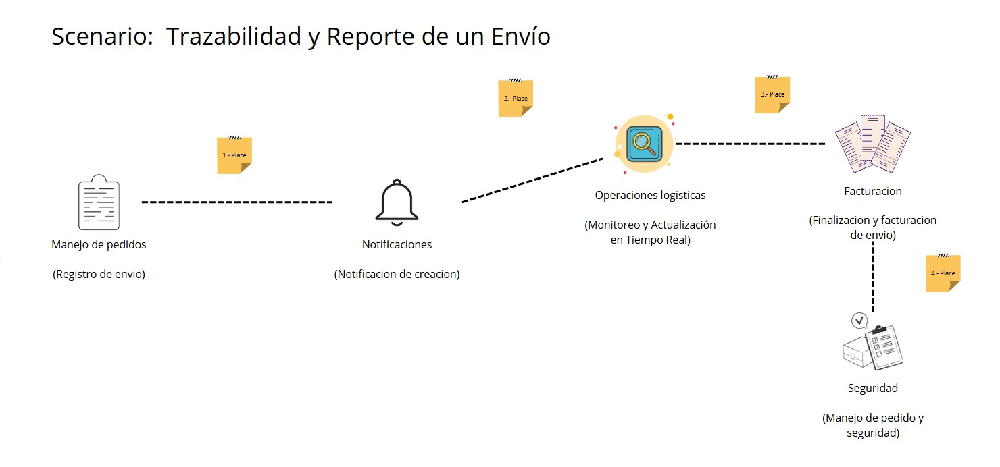

# Informe del Trabajo Final

  

  
<b>Informe de Trabajo Final</b>

  
Facultad de Ingeniería

  
Universidad Peruana de Ciencias Aplicadas

  
Ingeniería de Software

  
Aplicaciones para Dispositivos Móviles

  
14649

  
David Gerardo Quevedo Velasco

  
Startup: LogistiCore

  
Producto: TrackLab

---

## Team members:

| **Nombre**                       | **Código** |
| ---------------------------------|------------|
| Vargas Javier Jose Enrique       | U20221F693 |
| Trillo Hernandez, Anghel Melanie | u201912401 |
| De La Cruz Moreno Roy Hernan     | u202218634 |
| Baldeón Vivar, Santiago Armando  | U202319881 |

  
<b>Ciclo 2025 - 02</b>

---

## Versiones del Informe

| _Versión_ | _Fecha_    | _Autor_ | _Descripción de modificación_ |
| --------- | ---------- | ------- | ----------------------------- |
| 1.0       | 06/09/2025 |  | Creación del repositorio |
| 1.1       | 16/09/2025 |  | Capítulos I (sin entrevistas), Capítulo II (ubiquitous language) y Capítulo 3 (hasta 3.2) |
| 1.2       | 18/09/2025 |  | Implementación de los capítulos IV|

---

## Project Report Collaboration Insights

URL del repositorio para el reporte del proyecto: https://github.com/LogistiCore/tracklab-project 

**TB1**

Para el desarrollo del informe pertinente a la TB1, se dividió la implementación de secciones de la siguiente forma entre los integrantes del grupo:

| **Integrantes**                  | **Tareas asignadas** |
| ---------------------------------|----------------------|
| Vargas Javier Jose Enrique       | Bounded Contexts, Diccionario de clases, Organizacion de las capas del sistema |
| Trillo Hernandez, Anghel Melanie |  |
| De La Cruz Moreno Roy Hernan     |  |
| Baldeón Vivar, Santiago Armando  | Canvas, Diseño de entrevistas, style guidelines, wireframes, mockup, class dictionary, Source Code Style Guide & Conventions, Sprint Backlog 1, edición del video |

El proceso de colaboración durante el informe se realizó tanto con commits como compartiendo avances a través de documentos de google. 

---

## Github Collaboration Insights

Github también presenta un timeline de las ramas principales y los procesos de merge a los que se han sometido. Todas las ramas se crearon tomando en cuenta el diseño de GitFlow para una buena organización cuando se usa un software de control de versiones.

Se puede identificar a los integrantes como:
- Vargas Javier Jose, Enrique: 
- Trillo Hernandez, Anghel Melanie: am27th
- De La Cruz Moreno, Roy Hernan: 
- Baldeón Vivar, Santiago Armando: Santibal11

Asimismo, se explican las ramas que tenemos hasta el momento: 
- main: Aún no se encuentra representada, pues se hace un merge en cada entrega al ser la rama principal del proyecto.
- develop: Representada por la rama blanca. Se trata de la rama principal para el proceso del desarrollo del proyecto.
- readme: Representada por la rama morada. Se trata de la rama en la que se han estado realizando las modificaciones al informe.

__Report repository__

  

Los siguientes gráficos muestran analíticos en cuanto a los commits que cada integrante del grupo ha estado realizando en el repositorio.

__TB1__

  

  

---

## Students Outcomes

<table>
  <thead>
    <tr>
      <th>Criterios específicos</th>
      <th>Acciones realizadas</th>
      <th>Conclusiones</th>
    </tr>
  </thead>
  <tbody>
    <tr>
      <td><strong>Trabaja en equipo para proporcionar liderazgo en forma conjunta</strong></td>
      <td>
        <strong>Baldeón Vivar, Santiago Armando</strong>  
        <strong>TB1</strong> 
        Me encargué del Canvas, el diseño de entrevistas, los lineamientos de estilo, wireframes, mockup, diccionario de clases, guía de estilo para el código fuente, el Sprint Backlog 1 y la edición del video. Estas tareas me ayudaron a colaborar desde distintas áreas, facilitando la documentación del avance del equipo y asegurando la calidad visual y técnica de nuestras entregas.  
        <strong>Vargas Javier, Jose Enrique</strong>  
        <strong>TB1</strong> 
        Contribuí parcialmente en la sección de Domain-Driven Software Architecture, participando en el bounded contexts, diccionario de clases y la organización de las capas del sistema.   
      </td>
      <td>
        Al haber concluido con la primera entrega, logramos coordinar tiempos y responsabilidades como equipo para apoyarnos entre todos y cumplir con todos los requisitos. Establecimos una coordinación óptima que nos permitió profundizar conocimientos y practicar nuevas habilidades con apoyo mutuo.  
      </td>
    </tr>
    <tr>
      <td><strong>Crea un entorno colaborativo e inclusivo, establece metas, planifica tareas y cumple objetivos</strong></td>
      <td>
        <strong>Baldeón Vivar, Santiago Armando</strong>  
        <strong>TB1</strong> 
        Para el TB1 organicé mis tareas a partir del backlog del equipo y coordiné con mis compañeros para poder entregar a tiempo. Siempre estuve abierto a comentarios y ofrecí ayuda cuando alguien del grupo necesitaba apoyo. Estas acciones me ayudaron a reforzar un ambiente de confianza y trabajo colaborativo, que facilitó el cumplimiento de nuestros objetivos.  
        <strong>Vargas Javier, Jose Enrique</strong>  
        <strong>TB1</strong> 
        Durante el TB1 participé parcialmente en el desarrollo del Capítulo IV, realizando ajustes en las secciones elaboradas para mejorar la claridad y consistencia del informe. Además, me mantuve en comunicación con mis compañeros para alinear los cambios y asegurar que la documentación reflejara adecuadamente el trabajo del equipo.  
      </td>
      <td>
        Al término de la TB1, podemos concluir que conseguimos formar un entorno de colaboración, a través del cual podíamos realizar consultas entre compañeros mientras nos asegurábamos de cumplir con nuestros aportes a tiempo y de llegar a alcanzar nuestros objetivos de aprendizaje iniciales. Por otro lado, consideramos que la planificación, aunque siempre puede mejorarse, nos ayudó a tener suficiente tiempo como para volver a revisar ciertos detalles y mejorar la calidad de la entrega.  
      </td>
    </tr>
  </tbody>
</table>

---

# Contenido

1. __[Capítulo I: Introducción](#Capítulo-i-Introducción)__  
   1.1. [Startup Profile](#11-startup-profile)  
   &nbsp;&nbsp;&nbsp;&nbsp;1.1.1. [Descripción del startup](#111-descripción-del-startup)  
   &nbsp;&nbsp;&nbsp;&nbsp;1.1.2. [Perfiles de los integrantes del equipo](#112-perfiles-de-los-integrantes-del-equipo)  
   1.2. [Solution Profile](#12-solution-profile)  
   &nbsp;&nbsp;&nbsp;&nbsp;1.2.1. [Antecedentes y Problemática](#121-antecedentes-y-problemática)  
   &nbsp;&nbsp;&nbsp;&nbsp;1.2.2. [Lean UX Process](#122-lean-ux-process)  
   &nbsp;&nbsp;&nbsp;&nbsp;&nbsp;&nbsp;&nbsp;&nbsp;1.2.2.1. [Lean UX Problem Statements](#1221-lean-ux-problem-statements)  
   &nbsp;&nbsp;&nbsp;&nbsp;&nbsp;&nbsp;&nbsp;&nbsp;1.2.2.2. [Lean UX Assumptions](#1222-lean-ux-assumptions)  
   &nbsp;&nbsp;&nbsp;&nbsp;&nbsp;&nbsp;&nbsp;&nbsp;1.2.2.3. [Lean UX Hypothesis Statements](#1223-lean-ux-hypothesis-statements)  
   &nbsp;&nbsp;&nbsp;&nbsp;&nbsp;&nbsp;&nbsp;&nbsp;1.2.2.4. [Lean UX Canvas](#1224-lean-ux-canvas)  
   1.3. [Segmentos objetivo](#13-segmentos-objetivo)  
2. __[Capítulo II: Requirements Elicitation & Analysis](#capítulo-ii-requirements-elicitation--analysis)__  
   2.1. [Competidores](#21-competidores)  
   &nbsp;&nbsp;&nbsp;&nbsp;2.1.1. [Análisis competitivo](#211-análisis-competitivo)  
   &nbsp;&nbsp;&nbsp;&nbsp;2.1.2. [Estrategias y tácticas frente a competidores](#212-estrategias-y-tácticas-frente-a-competidores)  
   2.2. [Entrevistas](#22-entrevistas)  
   &nbsp;&nbsp;&nbsp;&nbsp;2.2.1. [Diseño de entrevistas](#221-diseño-de-entrevistas)  
   &nbsp;&nbsp;&nbsp;&nbsp;2.2.2. [Registro de entrevistas](#222-registro-de-entrevistas)  
   &nbsp;&nbsp;&nbsp;&nbsp;2.2.3. [Análisis de entrevistas](#223-análisis-de-entrevistas)  
   2.3. [Needfinding](#23-needfinding)  
   &nbsp;&nbsp;&nbsp;&nbsp;2.3.1. [User Personas](#231-user-personas)  
   &nbsp;&nbsp;&nbsp;&nbsp;2.3.2. [User Task Matrix](#232-user-task-matrix)  
   &nbsp;&nbsp;&nbsp;&nbsp;2.3.3. [User Journey Mapping](#233-user-journey-mapping)  
   &nbsp;&nbsp;&nbsp;&nbsp;2.3.4. [Empathy Mapping](#234-empathy-mapping)  
   &nbsp;&nbsp;&nbsp;&nbsp;2.3.5. [As-is Scenario Mapping](#235-as-is-scenario-mapping)  
3. __[Capítulo III: Requirements Specification](#capítulo-iii-requirements-specification)__  
   3.1. [To-Be Scenario Mapping](#31-to-be-scenario-mapping)  
   3.2. [User Stories](#32-user-stories)  
   3.3. [Impact Mapping](#33-impact-mapping)  
   3.4. [Product Backlog](#34-product-backlog)
4. __[Capítulo IV: Product Design](#capítulo-iv-product-design)__  
  
5. __[Conclusiones](#Conclusiones)__  
   5.1. [Conclusiones](#61-conclusiones)  
   5.2. [Recomendaciones](#62-recomendaciones)  
6. __[Bibliografía](#bibliografía)__  
7. __[Anexos](#anexos)__  

---
# Capítulo I: Introducción

## 1.1. Startup Profile

### 1.1.1. Descripción de la Startup

La startup, presentada bajo el nombre de LogistiCore, tiene como objetivo transformar digitalmente la gestión logística entre empresas en el Perú. A través de una aplicación móvil intuitiva y especializada, LogistiCore permite a empresas clientes registrar y hacer seguimiento a sus órdenes de compra desde cualquier lugar, mientras que las empresas logísticas pueden gestionar la recepción, agrupación, trazabilidad y entrega de la carga mediante tecnología de escaneo con códigos QR directamente desde dispositivos móviles.  

La solución se centra en resolver la fragmentación y falta de visibilidad en el flujo de carga entre múltiples actores (proveedores, operadores logísticos, empresas en campo), permitiendo un control preciso desde el origen hasta el destino final, incluyendo almacenes intermedios, rutas de transporte y procesos de consolidación de carga.  

El uso de una aplicación móvil facilita la trazabilidad en tiempo real de cada unidad de carga, incluso cuando esta se agrupa en contenedores mayores, representando una de las principales ventajas competitivas del sistema. Además, LogistiCore integra dashboards adaptados a móviles para el análisis de datos operativos, facilitando la toma de decisiones estratégicas tanto para empresas logísticas como para sus clientes.  

Misión: Digitalizar y optimizar la trazabilidad logística B2B mediante una aplicación móvil intuitiva, segura y eficiente para empresas peruanas.  

Visión: LogistiCore aspira a consolidarse como la solución tecnológica líder en gestión logística empresarial en Latinoamérica, facilitando la transformación digital del sector logístico con un enfoque en trazabilidad, transparencia y control de operaciones.  

### 1.1.2. Perfiles de integrantes del equipo

#### 1.1.2.1. Vargas Javier Jose Enrique

Código: U20221F693

Carrera: Ingeniería de Software

Mi nombre es Jose Enrique Vargas y estudio la carrera de Ingeniería de Software. Me motiva la posibilidad de aprender constantemente y aplicar la tecnología para resolver problemas reales en la sociedad. Mi objetivo es seguir desarrollando mis habilidades y experiencia para en un futuro aportar soluciones innovadoras.

  

#### 1.1.2.2. Trillo Hernandez, Anghel Melanie

Código: u201912401

Carrera: Ingeniería de Software

Estudiante de la carrera de Ingeniería de Software de la Universidad Peruana de Ciencias Aplicadas (UPC), lo que me gusta de la carrera es desarrollar soluciones innovadoras que contribuyen a la sociedad. Me considero una persona responsable y orientada a resultados. Asimismo, me comprometo a colaborar en el equipo de forma continua y puntual.

  

#### 1.1.2.3. De La Cruz Moreno Roy Hernan

Código: u202218634

Carrera: Ingeniería de Software

Soy Roy De La Cruz Moreno. Estudió la carrera de Ingeniería de Software. Considero que soy una persona tranquila y atenta al escuchar las propuestas de los demás integrantes del equipo, ademas tengo conocimientos en SQL, NoSQL y C++.

  

#### 1.1.2.4. Santiago Armando Baldeón Vivar

Código: U202319881

Carrera: Ingeniería de Software

Mi nombre es Santiago Armando Baldeon y tengo 18 años. Actualmente estoy cursando la carrera de Ingeniería de Software en la Universidad Peruana de Ciencias Aplicadas. En mi caso elegí esta carrera porque desde chico sentí gran pasión por la tecnología y siempre quise ser alguien importante en este mundo, brindando mis aportes a la humanidad. Creo que voy por buen camino y espero en un futuro cumplir estos sueños y objetivos que tengo.

  

## 1.2. Solution Profile

### 1.2.1. Antecedentes y problemática

Para explicar el origen e impacto del problema identificado en la actualidad, emplearemos la técnica de los 5W2H, de forma que podamos dar con las principales causas que lo provocan y ello nos permita plantear una mejor solución.

#### 1.2.1.1. What

__¿Cuál es el problema__

El problema radica en que tanto quienes se encargan del envío como de la recepción de paquetes de manera industrial tienen dificultades para mantenerse al tanto de la condición del envío, considerando desde su ubicación hasta si este se encuentra en un estado óptimo. Esto genera desconfianza al realizar envíos, así como incertidumbre en cuanto al momento y calidad de la entrega. Aquí, se puede notar que existe una necesidad por ambos lados de mantenerse al tanto del paquete y su seguridad.

Al no existir un canal accesible y en tiempo real, las empresas no pueden verificar el estado de los envíos hasta su recepción final. Esto ocasiona pérdidas de paquetería, retrasos inadvertidos o entregas en ubicaciones incorrectas.

#### 1.2.1.2. Who

__¿Quiénes están involucrados en el problema?__

Dentro de este problema, podemos destacar dos partes: la empresa que provee la paquetería y aquella que la solicita. La empresa encargada del envío almacena materiales o artefactos en gran cantidad para venderlos y distribuirlos hacia las empresas que los necesitan, mismas que realizan su pedido y esperan que este llegue en condiciones óptimas y en el tiempo indicado. Ambas buscan acceder a la mayor cantidad de información posible sobre el envío, lo cual genera conflictos si una de las partes carece de datos. La empresa receptora puede presentar dudas y reclamos, mientras que la emisora no sabría responder con certeza.

#### 1.2.1.3. Where

__¿En dónde se presenta el problema?__

Este problema ocurre en el Perú, más específicamente en los almacenes o centros de envío y recepción de pedidos de las empresas que solicitan estos servicios, así como en las rutas de transporte. La falta de transmisión de información desde la salida hasta la entrega final impide que las partes tengan visibilidad sobre la carga. Además, el problema se refleja también en las oficinas de ambas empresas: una exige información y la otra no puede brindarla porque tampoco la posee.

#### 1.2.1.4. When

__¿Cuándo se presenta el problema?__

El problema aparece desde que la empresa proveedora inicia un envío hacia el lugar indicado por la empresa solicitante, ya que no guarda ni comparte la información necesaria durante el trayecto. La incertidumbre se mantiene durante el empaquetado, el traslado y hasta la entrega. Entre las principales dificultades se encuentran: retrasos no comunicados, paquetes en condiciones deficientes por mal empaquetado, y entregas en ubicaciones equivocadas que aumentan costos de traslado.

#### 1.2.1.5. Why

__¿Por qué surge el problema?__

La principal causa del problema es la falta de seguimiento del proceso de traslado de los paquetes enviados. Esto puede ocurrir por una deficiente organización de la empresa proveedora, pero sobre todo por la ausencia de herramientas tecnológicas que faciliten el monitoreo requerido.

La falta de información detallada genera errores en el empaquetado, ubicación y transporte de los envíos. Además, la empresa solicitante experimenta intranquilidad y desconfianza al no poder acceder a datos en tiempo real, especialmente cuando ocurren retrasos o pérdidas.

#### 1.2.1.6. How

__¿Cómo ocurre el problema?__

El problema ocurre por la falta de organización y de transferencia de información confiable, lo que incrementa la probabilidad de errores en el proceso logístico y afecta a ambas empresas involucradas.

__¿En qué condiciones los usuarios usarán nuestro producto?__

Los usuarios usarán LogistiCore a través de una aplicación móvil que les permita acceder en tiempo real al estado de cada envío.  
- La empresa emisora podrá verificar la salida del pedido, registrar el escaneo de códigos QR y confirmar que se cumplen las medidas de seguridad antes y durante el transporte.  
- La empresa receptora podrá seguir el traslado paso a paso, visualizar la ubicación actual y recibir alertas sobre el estado de la carga, generando confianza y reduciendo la incertidumbre.  

#### 1.2.1.7. How much

__¿Cuánto impacto genera el problema?__

En la última edición del PADE Internacional en Operaciones y Logística de la Universidad ESAN, el docente Freddy Alvarado Vargas señala como algunas de las causas más comunes de las fallas en los procesos de traslado y entrega de productos a la deficiente organización física de los productos, el poco soporte tecnológico, la ubicación y selección inadecuada de los productos a entregar, y el uso de equipos de manipulación incorrectos. Todo esto impacta negativamente en la confianza de las empresas receptoras y en la imagen de las empresas emisoras.

Implementar un sistema de seguimiento mediante una aplicación móvil como LogistiCore representaría una ventaja competitiva, ya que permitiría a las empresas mantener visibilidad completa de sus envíos en cualquier momento. Asimismo, cabe mencionar que actualmente el Gobierno del Perú busca impulsar el mercado de transporte y logística nacional con el objetivo de cerrar el presente año con ganancias de más de 15 mil millones de dólares y alcanzar una tasa de crecimiento anual compuesta de 5,92% en los próximos cinco años. Sin embargo, estas metas se ven limitadas por las deficiencias de las empresas de transporte de mercancías, que afectan tanto a nivel empresarial como al crecimiento económico nacional.

### 1.2.2. Lean UX Process

#### 1.2.2.1. Lean UX Problem Statements

Nuestra solución busca proveer un espacio digital a través de una aplicación móvil para gestionar el seguimiento de paquetes. Esto es diseñado para que tanto los operadores de envío como las empresas receptoras puedan monitorear en tiempo real la ubicación y el estado óptimo de los envíos industriales. Este sistema digital busca generar confianza y transparencia en el proceso, reduciendo incertidumbres sobre la entrega y mejorando la precisión en la recepción.

Sin embargo, actualmente no existe un canal accesible y en tiempo real que permita verificar la condición de los paquetes antes de su entrega final, lo que provoca pérdidas, retrasos no detectados y entregas en ubicaciones incorrectas, afectando la operación y la satisfacción del cliente.

__¿Cómo podríamos diseñar un sistema de seguimiento y verificación en tiempo real que garantice la seguridad y el estado de los paquetes, reduzca pérdidas y errores en la entrega, y aumente la confianza de todas las partes involucradas?__

#### 1.2.2.2. Lean UX Assumptions

__Business Assumptions:__

- __Creemos que nuestros usuarios necesitan__ tener visibilidad y control en tiempo real sobre los envíos, sin importar su tipo o tamaño, desde sus dispositivos móviles.
- __Estas necesidades se pueden satisfacer__ con una aplicación móvil que registre, actualice y comparta el estado, ubicación y condiciones del envío durante todo su trayecto.
- __Nuestros clientes iniciales serán__ empresas proveedoras o compañías que trasladan productos o insumos entre sedes, y las empresas clientes que solicitan estos envíos.
- __El valor más importante que un cliente quiere de nuestros servicios es__ la trazabilidad integral de cada envío, desde el origen hasta su destino, accesible desde cualquier lugar.
- __El cliente también va a obtener__ reducción de errores, mejora en la comunicación interempresa y soporte en la toma de decisiones logísticas.
- __Vamos a obtener la mayoría de los clientes mediante__ alianzas estratégicas con empresas logísticas, presentaciones en eventos del sector y marketing digital B2B.
- __Vamos a obtener ingresos mediante__ suscripciones mensuales escalables según número de envíos o integración con ERP/logística.
- __Nuestra competencia en el mercado serán__ soluciones de rastreo parcial, herramientas internas no estandarizadas o software caro y poco flexible.
- __Vamos a tener ventaja frente a nuestra competencia debido a__ la flexibilidad para adaptarse a distintos tipos de envío, verificación digital (QR, fotos), y visualización colaborativa en dispositivos móviles.
- __El mayor riesgo del servicio es__ que el personal de campo (almacén, transporte) no registre correctamente las etapas del envío.
- __Lo resolveremos realizando__ pruebas piloto con usuarios reales, interfaz móvil simple y adaptable, y sesiones de entrenamiento orientadas al flujo operativo real.

__User Assumptions:__

__¿Quién es el usuario?__

Los usuarios principales son el personal administrativo y/o gerencial de empresas que gestionan envíos industriales por vía terrestre en Perú, así como el personal de estos mismos puestos de las empresas que realizan los pedidos. Si la aplicación tiene éxito en este sector, se plantea su extensión a todo el ecosistema logístico nacional e internacional, incluyendo sectores como manufactura, minería, agroindustria, energía y distribución masiva.

__¿Qué problemas tiene nuestro producto que resolver?__

Actualmente, muchas empresas enfrentan problemas relacionados con la falta de visibilidad en tiempo real, el desconocimiento del estado o condición de un envío, y la dificultad para verificar si los envíos fueron realizados correctamente o llegaron a destino. En muchos casos, los registros son manuales, aislados o poco confiables. La aplicación busca resolver estos problemas mediante la automatización de la trazabilidad, integrando el monitoreo de ubicación, estado físico del envío, y validaciones digitales durante todo el trayecto.

__¿Qué características son importantes?__

Las funcionalidades clave de la aplicación incluyen el registro y seguimiento digital de cada fase del traslado, permitiendo un control detallado desde el origen hasta el destino. Ofrece visualización en tiempo real de la ubicación y condiciones del envío, y verificación de carga y descarga mediante tecnologías como códigos QR y registro fotográfico, lo que reduce errores y garantiza trazabilidad. El sistema emite alertas automáticas ante desvíos, demoras o incidencias, y almacena un historial completo del envío. Además, se integra con sistemas internos como ERP, WMS o CRM, consolidando procesos logísticos. Estas funcionalidades no solo previenen pérdidas económicas, sino que también permiten generar reportes analíticos, tomar decisiones informadas y establecer mejores prácticas logísticas a futuro.

__¿Dónde encaja nuestro producto en su trabajo o vida?__

La aplicación móvil se integra directamente en los procesos diarios de logística operativa, tanto en planta como en transporte y recepción de envíos. Facilita el control operativo, mejora la comunicación entre áreas o empresas involucradas y permite evaluar el rendimiento logístico en tiempo real, impulsando la eficiencia, la calidad del servicio y la rentabilidad.

__¿Cuándo y cómo es nuestro producto usado?__

La aplicación es utilizada desde el momento en que se prepara un envío, se realiza el traslado físico, y finaliza con la confirmación de entrega en destino. También se usa en etapas de auditoría interna, evaluación de indicadores logísticos, análisis de errores y mejoras de procesos. Puede ser accedida en cualquier momento desde dispositivos móviles o tablets, según el rol del usuario (operativo o administrativo).

__¿Cómo debe verse nuestro producto y cómo debe comportarse?__

Nuestra aplicación debe contar con una interfaz intuitiva, visual y de fácil uso, diseñada especialmente para el personal operativo, de modo que no requiera capacitaciones complejas. Debe ser modular y flexible, capaz de adaptarse a distintos tipos de envío, sectores logísticos y modelos operativos. La visualización debe incluir mapas en tiempo real, alertas automáticas e indicadores por eventos, facilitando el seguimiento y control del traslado. A nivel funcional, la aplicación debe ser estable, rápida y segura, con acceso controlado para proteger los datos sensibles tanto de la empresa como de los usuarios.

#### 1.2.2.3. Lean UX Hypothesis Statements

Hypothesis Statement 01

**Creemos** que permitir el registro digital de fases del envío resultará en mayor adopción por supervisores y operadores.  
**Sabremos** que hemos tenido éxito  
**cuando** al menos el 80% de usuarios activos registren envíos completos en la primera etapa de implementación.

Hypothesis Statement 02

**Creemos** que el acceso compartido a información de envíos resultará en mejor coordinación y menos malentendidos entre empresas.
**Sabremos** que hemos tenido éxito  
**cuando** se reduzca en un 40% los reclamos o llamadas de seguimiento, medido por logs de soporte.

Hypothesis Statement 03

**Creemos** que la verificación con códigos QR en carga/descarga resultará en menos errores de asignación.
**Sabremos** que hemos tenido éxito  
**cuando** se reduzca en un 70% las entregas erróneas en los primeros tres meses, basado en reportes de incidencias.

Hypothesis Statement 04

**Creemos** que mostrar ubicación y estado en tiempo real resultará en mayor confianza y menos incertidumbre operativa. 
**Sabremos** que hemos tenido éxito  
**cuando** la satisfacción del cliente mejore en un 35%, según encuestas post-entrega.

Hypothesis Statement 05

**Creemos** que alertas automáticas ante incidencias resultarán en respuestas más rápidas.  
**Sabremos** que hemos tenido éxito  
**cuando** el tiempo promedio de respuesta se reduzca en un 40%, tracked por notificaciones en la app.

Hypothesis Statement 06

**Creemos** que ofrecer un historial detallado del envío mejorará los procesos de auditoría y análisis de errores logísticos.  
**Sabremos** que hemos tenido éxito  
**cuando** al menos el 70% de las auditorías internas utilicen la información de la aplicación como fuente principal.

Hypothesis Statement 07

**Creemos** que la integración con sistemas ERP o WMS existentes aumentará la eficiencia y reducirá la duplicidad de tareas.  
**Sabremos** que hemos tenido éxito  
**cuando** el tiempo promedio de registro y consulta de datos se reduzca en un 50% gracias a la integración.

Hypothesis Statement 08

**Creemos** que incluir la posibilidad de registrar incidencias durante el traslado (como demoras, desvíos o manipulaciones indebidas) ayudará a mejorar la trazabilidad y a prevenir futuros errores logísticos.  
**Sabremos** que hemos tenido éxito  
**cuando** al menos el 60% de los envíos con incidencias registradas logren ser resueltos o corregidos antes de la entrega final gracias a la información aportada por la aplicación.

Hypothesis Statement 09

**Creemos** que permitir registrar condiciones del envío con fotos y observaciones reducirá conflictos y mejorará la transparencia del proceso.  
**Sabremos** que hemos tenido éxito  
**cuando** el número de reclamos por daños sin evidencia se reduzca en un 50%.

Hypothesis Statement 10

**Creemos** que brindar reportes analíticos en tiempo real facilitará la toma de decisiones estratégicas por parte de los gestores logísticos.  
**Sabremos** que hemos tenido éxito  
**cuando** al menos el 75% de los usuarios administrativos utilicen la herramienta de reportes cada semana.

#### 1.2.2.4. Lean UX Canvas

Lean UX Canvas es una de las herramientas que hemos utilizado para comprender a nuestros posibles usuarios y sus necesidades. Esta es usada en el campo del diseño centrado en el usuario y la metodología Lean con la intención de desarrollar productos de forma eficiente y práctica para los usuarios. A su vez, esta puede ser utilizada por equipos multidisciplinarios para que colaboren de forma ordenada dentro de un marco estructurado.

  

Enlace para acceder al [Canvas](https://www.canva.com/design/DAGjqMusdhM/D6-Qc0v9JioQbOugM7qnXQ/edit?utm_content=DAGjqMusdhM&utm_campaign=designshare&utm_medium=link2&utm_source=sharebutton)

## 1.3 Segmentos Objetivos

La solución propuesta se centra en dos segmentos claves dentro del ámbito logístico, respaldados por datos que evidencian la urgencia de digitalizar los procesos de trazabilidad y registro de operaciones mediante aplicaciones móviles accesibles desde cualquier lugar:

### Segmento 1: Empresas logísticas

#### Descripción general

Organizaciones dedicadas a la gestión, transporte, consolidación y distribución de carga. Este segmento enfrenta diariamente desafíos en el seguimiento y registro de operaciones, donde los sistemas tradicionales generan errores y cuellos de botella en los procesos. Una aplicación móvil facilita el registro y control en campo en tiempo real, reduciendo fallas y aumentando la eficiencia.

#### Perfil operativo

Sus directivos y gerentes suelen tener entre 30 y 55 años, con presencia fuerte en zonas urbanas e industriales de Perú (por ejemplo, Lima, Arequipa y Trujillo).

#### Datos del sector

Según SERGroup, aproximadamente el 63% de las empresas logísticas reconoce la digitalización como una herramienta clave para mejorar la eficiencia operativa, y cerca del 73% está en proceso de adoptar tecnologías móviles de rastreo y control para optimizar su cadena de suministro.

#### Necesidad

La integración de soluciones móviles, como el seguimiento en tiempo real mediante códigos QR y dashboards accesibles desde celulares o tablets, es vista como esencial para reducir errores y mejorar la visibilidad de cada operación.

### Segmento 2: Empresas cliente (B2B)

#### Descripción general

Compañías de sectores como minería, construcción, agroindustria y comercio, que dependen críticamente de servicios logísticos para asegurar la entrega oportuna de sus productos. Una aplicación móvil les permite acceder al estado de sus pedidos en cualquier momento y lugar.

#### Perfil gerencial

Los responsables de cadena de suministro y logística en estas empresas suelen tener entre 35 y 60 años y operan en regiones con alta densidad industrial.

#### Datos del sector

De acuerdo con SERGroup, alrededor del 70% de las empresas en sectores vinculados a la logística demandan información en tiempo real para tomar decisiones estratégicas, mientras que casi el 78% manifiesta la necesidad de soluciones digitales integradas que permitan un seguimiento continuo y preciso de sus envíos, especialmente desde dispositivos móviles.

#### Necesidad

Contar con herramientas móviles que ofrezcan informes claros y en tiempo real, optimizando la toma de decisiones y reduciendo retrasos y costos generados por sistemas manuales o poco integrados.

# 2. Capítulo II: Requirements Elicitation & Analysis

## 2.1 Competidores

### 2.1.1. Análisis competitivo

A continuación, realizamos un análisis competitivo para identificar oportunidades, amenazas, ventajas y posibles desventajas que podemos tener dentro del mercado en comparación a otras empresas que realicen actividades similares a las nuestras. De esta forma, podremos prepararnos para resaltar frente a los consumidores.

<table>
  <thead>
    <tr>
      <th colspan="5"><b>Competitive Analysis Landscape</b></th>
    </tr>
  </thead>
  <tbody>
    <tr>
      <td colspan="2" align="center">¿Por qué llevar a cabo este análisis?</td>
      <td colspan="3" align="center">Con el análisis competitivo podemos entender el mercado, identificar oportunidades y diferenciarnos de la competencia. Ayudándonos a tomar decisiones correctas, minimizar riesgos y fortalecer nuestra posición en el mercado, asegurándonos una ventaja estratégica y un crecimiento constante y sostenible.</td>
    </tr>
    <tr>
      <td colspan="2">PERFIL</td>
      <td><picture>

</picture></td>
      <td><picture>

</picture></td>
      <td><picture>

</picture></td>
    </tr>
    <tr>
      <td rowspan="2">Perfil</td>
      <td>Overview</td>
      <td>Aplicación móvil desarrollada por Dinet (Perú), disponible en Android/iOS. Permite a clientes conocer inventarios, salida y llegada de mercancía, recorrido de productos en tiempo real.</td>
      <td>Plataforma peruana de rastreo satelital y gestión de flotas con app móvil. Permite despachos, geocercas, alertas y reportes de vehículos en tiempo real.</td>
      <td>Proveedor peruano de gestión de flotas y rastreo GPS en tiempo real. Su app móvil permite monitoreo, reportes, históricos de ubicaciones y gestión de conductores.</td>
    </tr>
    <tr>
      <td>Ventaja Competitiva ¿Qué valor ofrece a los clientes?</td>
      <td>- Visibilidad constante de mercancía en tiempo real. - Integración web y móvil. - Reducción de costos logísticos.</td>
      <td>- Especialización en flotas vehiculares. - Alertas en tiempo real y monitoreo preventivo. - Funcionalidad móvil extendida.</td>
      <td>- Soluciones locales probadas. - Integración de reportes y alertas. - Interfaz sencilla y adaptada a usuarios en campo.</td>
    </tr>
    <tr>
      <td rowspan="2">Perfil de Marketing</td>
      <td>Mercado objetivo</td>
      <td>Empresas de logística y distribución que requieren visibilidad en tiempo real de mercancía.</td>
      <td>Empresas con flotas vehiculares, transporte y logística de última milla.</td>
      <td>Empresas con operaciones de transporte y distribución que requieren control de conductores y activos móviles.</td>
    </tr>
    <tr>
      <td>Estrategias de Marketing</td>
      <td>Marketing B2B, casos de éxito y ferias logísticas.</td>
      <td>Marketing digital, demostraciones B2B y convenios empresariales.</td>
      <td>Marketing directo, presencia en ferias y alianzas con empresas de transporte locales.</td>
    </tr>
    <tr>
      <td rowspan="3">Perfil del Producto</td>
      <td>Productos & Servicios</td>
      <td>App móvil y web para trazabilidad de inventarios y carga en tiempo real.</td>
      <td>App móvil y plataforma web para gestión de flotas y rastreo satelital.</td>
      <td>App móvil/web para rastreo GPS, gestión de conductores y alertas preventivas.</td>
    </tr>
    <tr>
      <td>Precios & Costos</td>
      <td>Planes de suscripción ajustados al número de usuarios/operaciones. Desde $500/mes.</td>
      <td>Planes de suscripción por flota desde $700/mes, escalables según número de vehículos.</td>
      <td>Planes desde $600/mes según número de vehículos y servicios adicionales.</td>
    </tr>
    <tr>
      <td>Canales de Distribución (web / móvil)</td>
      <td>App Android/iOS y plataforma web.</td>
      <td>App Android/iOS y portal web empresarial.</td>
      <td>App Android/iOS y plataforma web con soporte local.</td>
    </tr>
    <tr>
      <td rowspan="4">Análisis SWOT</td>
      <td>Fortalezas</td>
      <td>Visibilidad en tiempo real; fuerte respaldo de Dinet.</td>
      <td>Especialización en rastreo satelital y gestión de flotas.</td>
      <td>Adaptación local y soporte técnico en Perú.</td>
    </tr>
    <tr>
      <td>Debilidades</td>
      <td>- Poca personalización para sectores nicho (minería, agroindustria). - No ofrece QR para verificación.</td>
      <td>- Limitado a gestión vehicular; no cubre trazabilidad de producto.</td>
      <td>- Interfaz básica; carencia de diferenciación frente a grandes ERPs.</td>
    </tr>
    <tr>
      <td>Oportunidades</td>
      <td>Expansión hacia sectores agroindustriales y minería con trazabilidad más granular.</td>
      <td>Incorporar trazabilidad de productos además de flotas.</td>
      <td>Ampliar a retail, e-commerce y agroexportaciones.</td>
    </tr>
    <tr>
      <td>Amenazas</td>
      <td>Competencia con apps globales de logística.</td>
      <td>Competidores con servicios integrados de logística y ERP.</td>
      <td>Competencia de soluciones internacionales como SAP o Oracle Logistics.</td>
    </tr>
  </tbody>
</table>

### 2.1.2. Estrategias y tácticas frente a competidores

Afrontando las fortalezas de nuestros competidores:

- Tienen visibilidad en tiempo real bien establecida y reconocimiento en el mercado local.  
- Cuentan con experiencia en gestión de flotas y respaldo técnico para operaciones en campo.  
- Ofrecen integraciones web-móvil y modelos comerciales ya aceptados por clientes B2B.

Comprendemos que nuestras fortalezas son:

- Somos una solución móvil especializada en **trazabilidad por unidad de carga** (no solo por vehículo), con verificación en campo mediante **QR** y evidencia fotográfica.  
- Interfaz móvil diseñada para operarios: uso offline básico, notificaciones push y flujos rápidos para escaneos y validaciones.  
- Integraciones abiertas (APIs) pensadas para conectarnos fácilmente con ERPs/WMS existentes y dashboards móviles por rol (operativo / administrativo / cliente).  
- Enfoque B2B centrado en reducción de errores operativos y en evidencia verificable para resolver reclamos.

Entonces podemos aplicar las siguientes estrategias y tácticas:

**Estrategias:**  
- Posicionarnos como **complemento** (no reemplazo) de las soluciones de flotas y ERPs: “añade trazabilidad granular a tu sistema actual”.  
- Enfocar comercialmente sectores donde los competidores locales están menos especializados (minería, agroindustria exportadora, manufactura y energía).  
- Priorizar experiencia de usuario y soporte local como ventaja competitiva frente a soluciones genéricas.

**Tácticas:**  
- Lanzar **pilotos** de 4–8 semanas con clientes estratégicos en minería/agro para demostrar reducción de errores y tiempos de respuesta.  
- Crear paquetes comerciales escalonados: piloto gratuito/cliente inicial con descuento, plan básico para PYMES y plan enterprise con integraciones y soporte.  
- Materiales de venta y entrenamiento orientados a usuarios operativos: videos cortos (30–90s), guías de campo y checklists imprimibles.  
- Demos en sitio y remotas mostrando casos reales (escaneo QR → registro → foto → entrega) para validar la propuesta en campo.

---

Afrontando las debilidades de nuestros competidores:

- Muchos se centran en vehículo/telemetría y no en la validación física de la carga (QR/foto).  
- Sus integraciones suelen ser cerradas y sus interfaces no están diseñadas para operarios en campo.  
- Poca atención al modo offline y a flujos de uso rápido en almacenes.

Comprendemos que nuestras debilidades son:

- Dependemos de la correcta actuación del personal de campo para registrar eventos.  
- Puede existir resistencia inicial al cambio en empresas con procesos manuales muy arraigados.  
- Necesitamos asegurar calidad de datos (fotos/escaneos válidos) y mantener baja fricción en campo.

Entonces podemos aplicar las siguientes estrategias y tácticas:

**Estrategias:**  
- Minimizar la fricción de uso: flujos de 1–2 pasos para registrar eventos críticos y validaciones automáticas simples.  
- Invertir en acompañamiento inicial (onboarding) y en soporte cercano para los primeros 2–3 meses del piloto.  

**Tácticas:**  
- Ofrecer incentivos para el personal de campo durante la fase piloto (por ejemplo, reportes de productividad que demuestren beneficio).  
- Capacitación práctica presencial/virtual de 1 hora y videos “cómo hacerlo” en la app.  
- Funcionalidades de control de calidad de datos (p. ej. validación mínima de foto/QR antes de aceptar registro).

---

Afrontando las oportunidades (contexto del mercado local):

- Mayor demanda de digitalización logística en Perú y LatAm; normas y requisitos de trazabilidad en exportaciones.  
- Brechas claras entre registro en origen y verificación en destino que generan pérdidas y reclamos.  
- Clientes valoran evidencias (fotos/QR) que reduzcan disputas y costos.

Comprendemos que nuestras oportunidades son:

- Liderar con una oferta móvil que combine trazabilidad granular + verificación física, orientada a reducir errores operativos.  
- Convertir pruebas piloto en casos de éxito medibles (reducción de reclamos, tiempos y costos) para acelerar adopción.  
- Asociaciones con cámaras sectoriales y proveedores de hardware (impresoras/etiquetas QR) para simplificar implementaciones.

Entonces podemos aplicar las siguientes estrategias y tácticas:

**Estrategias:**  
- Ofrecer una solución modular: función básica (QR + rastreo) para PYMES y módulos avanzados (integración ERP, reportes analíticos) para empresas grandes.  
- Priorizar integraciones rápidas con los ERPs/WMS más comunes del mercado para facilitar adopción.

**Tácticas:**  
- Publicar **casos de estudio** y métricas claras (ej. % reducción de entregas erróneas, % menos reclamos) tras cada piloto.  
- Webinars y contenidos técnicos dirigidos a jefes de logística y operaciones en sectores objetivo.  
- Programas de co-marketing con asociaciones sectoriales y distribuidores de insumos logísticos.

---

Afrontando las amenazas (competidores locales e internacionales):

- Los competidores locales pueden añadir funcionalidades similares si detectan demanda.  
- Soluciones internacionales o grandes ERPs podrían entrar con recursos y presencia comercial.  
- Clientes pueden preferir “lo que ya conocen” y demorar la migración.

Comprendemos que nuestras amenazas son:

- Presión de precio y marketing de actores más grandes.  
- Ritmo de adopción lento entre operarios menos digitales.  
- Riesgo de ser percibidos como complemento innecesario si la integración no es impecable.

Entonces podemos aplicar las siguientes estrategias y tácticas:

**Estrategias:**  
- Diferenciar con **UX + servicio**: experiencia móvil extremadamente simple para operarios + soporte local y SLAs visibles.  
- Consolidar alianzas con proveedores tecnológicos y consultoras locales para fortalecer go-to-market y reducir barreras de entrada.

**Tácticas:**  
- Equipo de Customer Success asignado a clientes piloto con KPIs mensurables y revisiones periódicas.  
- Roadmap público con prioridades (QR, offline, integraciones) para mostrar compromiso y evitar incertidumbre del cliente.  
- Promociones de fidelización (descuentos por contrato anual, soporte premium) y contratos piloto que faciliten la transición sin riesgo.

## 2.2. Entrevistas

### 2.2.1. Diseño de entrevista

#### Segmento objetivo #1: Administradores de empresas proveedoras (envíos industriales)

Preguntas Demográficas y de Perfil

- ¿Cuál es su rol en la empresa y cuántos años de experiencia tiene en el sector logístico?
- ¿Podría describir brevemente el tamaño de su empresa (número de empleados y volumen de operaciones mensuales)?
- ¿En qué región o distrito se concentra mayormente su actividad operativa?

Preguntas sobre Procesos Actuales y Herramientas

- ¿Cómo gestionan actualmente el registro y seguimiento de la carga?
- ¿Qué método o sistema utilizan para garantizar la trazabilidad de cada operación?
- ¿Qué herramientas digitales o software emplean en su día a día para el seguimiento de envíos?

Preguntas sobre Desafíos y Frustraciones

- ¿Cuáles son los principales cuellos de botella que enfrenta en la gestión logística?
- ¿Qué dificultades encuentra al mantener un seguimiento preciso de las órdenes y la carga?
- ¿Qué aspectos de su sistema actual le resultan más frustrantes o poco eficientes?

Preguntas sobre Expectativas y Necesidades Tecnológicas

- ¿Qué características considera imprescindibles en una solución digital de trazabilidad y seguimiento?
- ¿Cómo espera que se integre una nueva plataforma con sus procesos y dispositivos actuales
- ¿Qué nivel de soporte técnico y capacidad de escalabilidad valora al elegir una nueva herramienta?

Preguntas Finales y de Retroalimentación

- ¿Estaría dispuesto a adoptar tecnologías como códigos QR o dashboards interactivos? ¿Por qué?
- ¿Cómo gestionan y analizan actualmente los datos operativos, y qué mejoras desearía ver?
- Si pudiera cambiar algoaspecto de su sistema actual, ¿cuál sería y por qué?

#### Segmento objetivo #2: Administrador de empresa cliente (solicita envíos)

Preguntas Demográficas y de Perfil

- ¿Cuál es su rol y responsabilidad dentro de la empresa en relación con la logística?
- ¿Podría describir brevemente el tamaño de su empresa y el sector (minería, construcción, agroindustria, etc.) en que opera?
- ¿En qué regiones o distritos se centra principalmente su actividad?

Preguntas sobre Procesos Actuales y Herramientas

- ¿Cómo se gestionan actualmente las órdenes de compra y el seguimiento de envíos en su organización?
- ¿Qué herramientas o software utiliza para monitorear el estado de sus pedidos?
- ¿Qué dispositivos (móvil, tablet, PC) utiliza su equipo para interactuar con estas herramientas?

Preguntas sobre Desafíos y Frustraciones

- ¿Cuáles son los mayores desafíos que enfrenta en el seguimiento de sus envíos o pedidos?
- ¿Qué aspectos del proceso actual cree que generan ineficiencias o retrasos?
- ¿Ha experimentado frustraciones con el sistema actual que utiliza para el seguimiento? ¿Cuáles?

Preguntas sobre Expectativas y Necesidades Tecnológicas

- ¿Qué funcionalidades le gustaría que incorporara una nueva plataforma de seguimiento?
- ¿Qué tipo de informes o dashboards serían más útiles para su toma de decisiones?
- ¿Cómo espera que se integre una nueva solución con sus sistemas existentes?

Preguntas Finales y de Retroalimentación

- ¿Qué mejoras específicas cree que podrían optimizar el proceso de seguimiento en su empresa?
- ¿Ha usado anteriormente soluciones digitales de seguimiento? Si es así, ¿cuál fue su experiencia y por qué?
- ¿Qué recomendación o característica adicional consideraría esencial en una plataforma de trazabilidad?

### 2.2.2. Registro de entrevistas

[**URL del video en Microsoft Stream:** ](https://upcedupe-my.sharepoint.com/personal/u202316118_upc_edu_pe/_layouts/15/onedrive.aspx?id=%2Fpersonal%2Fu202316118_upc_edu_pe%2FDocuments%2FWebApps%20-%20Entrevistas&ga=1)

#### Segmento objetivo #1: Empresas logísticas

##### Entrevista 1: George Coronel
- **Edad:** 32 años  
- **Marcas de tiempo de entrevista:** 00:00 – 15:41  
- **Duración:** 15:41  
- **Screenshot del video:**

##### Resumen descriptivo de la entrevista:
George Coronel trabaja como rigger (y ocasional líder de grupo) en la empresa Cosmos, en el proyecto de Pluspetrol. Lidera cuadrillas para maniobras de carga pesada como isajes. La planificación de actividades llega en formato Excel por parte de supervisores, con actualizaciones manuales en papel durante el día.

La falta de digitalización hace que el mal clima y tareas no previstas compliquen la programación diaria. George propone una app móvil o en tablet para registrar actividades en tiempo real, usar sensores IoT para temperatura o vibraciones, y monitorear ubicación del personal por seguridad. Destaca que actualmente todo se maneja en papel y radio, lo cual limita la eficiencia y seguridad.

##### Características objetivas:
- **Rol:** Rigger / líder de cuadrilla  
- **Herramientas de trabajo:** Radio, papel, Excel  
- **Canal de comunicación:** Radio  
- **Tecnología usada:** Sin software; gestión 100% manual  

##### Características subjetivas:
- **Personalidad:** Responsable, orientado a seguridad  
- **Influencias:** Clima, urgencias no programadas, materiales peligrosos  
- **Necesidades:** Registro digital, sensores de monitoreo, app para planificación móvil  
- **Disposición a adoptar tecnología:** Muy alta, ve beneficio directo en seguridad

##### Entrevista 2: Diego Portocarrero
- **Edad:** 30 años
- **Marcas de tiempo de entrevista:** 00:00 - 7:57
- **Duracion:** 7:57
- **Screenshot del video:**
  

##### Resumen descriptivo de la entrevista:
Diego trabaja como gestor de inventario en una empresa del sector minero con operaciones a nivel nacional. Su labor consiste en gestionar las órdenes de pedido, actualmente realizadas por llamadas telefónicas o correo electrónico, métodos que también se emplean para el seguimiento de los envíos.

Menciona diversos problemas en la comunicación, incluyendo:
-	Respuestas tardías.
-	Falta de información en tiempo real sobre la ubicación de los pedidos.
-	Errores frecuentes en el contenido de los envíos.
  
Además, indica que no utiliza ningún software especializado, lo que dificulta la eficiencia del proceso. Diego considera que un sistema automatizado permitiría un trabajo más eficiente y dinámico.
Como parte de su experiencia, destaca incidentes negativos como:
-	Recepción de pedidos en mal estado.
-	Errores tanto en el contenido como en la cantidad de productos solicitados.

Respecto a una solución ideal, Diego sugiere incluir en un sistema:
-	Registro centralizado de órdenes de compra con todos los detalles visibles.
-	Rastreo en tiempo real del pedido.
-	Alertas de retrasos o cambios en el pedido.
-	Dashboards o reportes visuales, por ejemplo:
o	Porcentaje de cumplimiento de fechas de entrega.
o	Comparativas entre proveedores (puntuales vs. recurrentemente retrasados).

##### Características objetivas:
- **Rol:** Gestor de inventario
- **Herramientas de trabajo:** Correo electrónico, llamadas telefónicas
- **Canal de comunicación:** Email, teléfono 
- **Tecnología usada:** No utiliza software especializado  
- **Conocimiento de IoT:** Órdenes y seguimiento manual, sin automatización

##### Características subjetivas:
- **Personalidad:** Crítico con los procesos actuales, orientado a la mejora operativa
- **Influencias:** Ineficiencia del sistema manual actual, errores frecuentes
- **Necesidades:** Centralización, trazabilidad, visualización de métricas clave
- **Disposición a adoptar tecnología:** Alta; cree que mejoraría notablemente la eficiencia

##### Entrevista 3: Israel Arenasa
- **Edad:** 30 años  
- **Marcas de tiempo de entrevista:** 00:00 – 6:54  
- **Duracion:** 6:54  
- **Screenshot del video:**
    

##### Resumen descriptivo de la entrevista:
Israel Arenasa, coordinador logístico de la empresa Petrotank, trabaja en la zona de Bretaña (Órgano 25), dentro del rubro de hidrocarburos. Coordina con contratistas para planificar el tipo y tiempo de llegada de carga, sin usar un software especializado. La empresa evalúa implementar radios y GPS para seguimiento, pero aún no ha adoptado soluciones digitales.

Los principales desafíos son la falta de seguimiento en tiempo real, la geografía fluvial y el clima variable. Israel desea una plataforma que integre información como nave, carga, ruta, y roles del personal, con una interfaz amigable adaptada a usuarios con distintos niveles de experiencia.

Propone una solución en la nube que garantice visibilidad y colaboración entre todos los usuarios. Solicita dashboards con tiempos de entrega, capacidad de carga por viaje y otros indicadores que mejoren la eficiencia y el control de información entre áreas.

##### Características objetivas:
- **Rol:** Coordinador logístico  
- **Herramientas de trabajo:** Radio, GPS (en evaluación)  
- **Canal de comunicación:** Directo con contratistas  
- **Tecnología usada:** Sin software especializado  
- **Flujo de trabajo:** Coordinación manual y radial  

##### Características subjetivas:
- **Personalidad:** Colaborador, abierto a la innovación tecnológica  
- **Influencias:** Clima y geografía fluvial compleja  
- **Necesidades:** Seguimiento en tiempo real, registro detallado de carga y personal  
- **Disposición a adoptar tecnología:** Alta; valora centralización y acceso colaborativo

#### Segmento objetivo #2: Empresas cliente (B2B)

##### Entrevista 4: Pedro Horna
- **Edad:** 49 años  
- **Marcas de tiempo de entrevista:** 00:00 – 18:17  
- **Duracion:** 18:17  
- **Screenshot del video:**  

##### Resumen descriptivo de la entrevista:
Pedro Horna lidera un proyecto logístico en una zona remota para una empresa petrolera. Gestionan actividades aéreas y fluviales con planificación en Excel con macros. El registro de ejecución se transfiere manualmente a bases de datos. La alta variabilidad por clima y fallas técnicas obliga a reprogramar constantemente, afectando tiempos y generando frustración.

Pedro valora un sistema que parametrice las solicitudes desde el inicio, minimizando la necesidad de revalidaciones. También considera clave integrar sensores IoT en equipos como grúas y lanchas para obtener datos de temperatura, velocidad y vibraciones. Busca que el sistema soporte análisis de brechas entre lo planificado y lo ejecutado.

##### Características objetivas:
- **Rol:** Gestor logístico de proyecto  
- **Herramientas de trabajo:** Excel con macros, radio, base de datos  
- **Canal de comunicación:** Radio  
- **Tecnología usada:** Sin software especializado; soluciones internas limitadas  

##### Características subjetivas:
- **Personalidad:** Metódico, orientado al análisis  
- **Influencias:** Entornos remotos, clima, precisión de datos  
- **Necesidades:** Parametrización de solicitudes, trazabilidad de ejecución, sensores conectados  
- **Disposición a adoptar tecnología:** Alta; busca personalización total

##### Entrevista 5: Cristel Lavado
- **Edad:** 32 años  
- **Marcas de tiempo de entrevista:** 00:00 – 7:57  
- **Duracion:** 7:57  
- **Screenshot del video:**  

##### Resumen descriptivo de la entrevista:
Cristel trabaja en logística interna y externa en Malvinas, gestionando carga fluvial y aérea. El control se realiza con checklist físicos y consolidación de datos en Excel. Las órdenes de traslado llegan por correo y se procesan manualmente, lo cual genera errores frecuentes por volumen de paquetes.

Cristel propone un software donde cada empresa tenga un usuario, pueda registrar sus pedidos con detalles (fragilidad, manipulación, destino, empresa solicitante, etc.) y obtener confirmaciones en tiempo real. Espera que esto optimice tiempos y reduzca errores, mejorando la imagen de la empresa frente al cliente.

##### Características objetivas:
- **Rol:** Encargada de logística interna y externa  
- **Herramientas de trabajo:** Checklist físico, Excel  
- **Canal de comunicación:** Correo  
- **Tecnología usada:** Sin software especializado  

##### Características subjetivas:
- **Personalidad:** Organizada, comprometida con eficiencia  
- **Influencias:** Alta carga operativa, variedad de métodos de transporte  
- **Necesidades:** Plataforma colaborativa, detalle de pedidos, estados del envío  
- **Disposición a adoptar tecnología:** Alta; busca justificar con resultados tangibles

##### Entrevista 6: Kathya Salas
- **Edad:** 31 años  
- **Marcas de tiempo de entrevista:** 00:00 - 3:39
- **Duración:** 3:39
- **Screenshot del video:** 

##### Resumen descriptivo de la entrevista:
Kathya Salas, supervisora de logística en una empresa del sector eléctrico, cuenta con 10 años de experiencia. Coordina envíos de materiales como cables de distintos tipos a clientes. La gestión logística se realiza de forma manual mediante checklists físicos o archivos de Excel básico, sin uso de software especializado.

Los principales desafíos son los retrasos en las entregas, afectando los plazos y generando efectos en cadena en otros envíos, debido en parte a paquetes defectuosos. Además, señala problemas de comunicación interna, ya que las incidencias no son reportadas a tiempo.

Kathya está interesada en soluciones que permitan monitoreo en tiempo real del estado de los pedidos para ofrecer fechas de entrega más precisas y así mejorar los cuellos de botella en las operaciones logísticas.

##### Características objetivas:
- **Rol:** Supervisora de logística  
- **Herramientas de trabajo:** Checklist manual, Excel básico  
- **Canal de comunicación:** Manual (correo, teléfono, verbal)  
- **Tecnología usada:** Sin software especializado  

##### Características subjetivas:
- **Personalidad:** Proactiva, orientada a la mejora de procesos  
- **Influencias:** Retrasos en entregas, fallos en calidad de paquetes, comunicación ineficiente  
- **Necesidades:** Monitoreo en tiempo real de pedidos, mayor precisión en fechas de entrega  
- **Disposición a adoptar tecnología:** Alta; valora exactitud, visibilidad en tiempo real y mejor comunicación interna  

### 2.2.3. Análisis de entrevistas
**Segmento objetivo #1: Empresas Logísticas (B2B – Proveedor de servicios)**  
#### Características Objetivas:
1. **Herramientas utilizadas**:
   - La planificación y coordinación operativa se realiza principalmente a través de **Excel**, **correo electrónico**, **radio** y **WhatsApp**.
   - No existen plataformas integradas ni herramientas digitales específicas para la gestión de operaciones, monitoreo de rutas o solicitudes de servicio.
   - El registro de tareas y actividades se hace en hojas de cálculo independientes o en papel, generando duplicidad de trabajo.

2. **Tiempo dedicado**:
   - La planificación logística toma **2 a 4 horas semanales**, con una dedicación diaria a la replanificación ante imprevistos.
   - Las desviaciones e imprevistos afectan entre un **30% y un 40%** de la planificación semanal.
   - La coordinación de recursos (botes, motores, personal, combustible) requiere contacto frecuente y validación por teléfono o presencialmente.

3. **Reportes y métricas**:
   - Se realizan reportes sobre **tiempos de viaje**, **capacidad de carga**, **consumo de combustible**, y **horas hombre trabajadas**.
   - Los reportes se generan **manualmente**, muchas veces con inconsistencias o con datos incompletos debido a la falta de conectividad.
   - **No existe trazabilidad digital** de las cargas ni visibilidad sobre el estado de las solicitudes en tiempo real.

#### Características Subjetivas:
1. **Desafíos operativos**:
   - Gran dificultad para reaccionar a imprevistos (ej. mal clima, crecida de ríos, cambio de prioridad) sin rehacer toda la planificación.
   - Problemas de comunicación entre áreas y con el cliente, generando cuellos de botella en la asignación de recursos.
   - No hay claridad ni transparencia respecto al estado de las tareas; esto aumenta la carga operativa y el riesgo de errores humanos.

2. **Satisfacción con el sistema actual**:
   - Los entrevistados están **insatisfechos** con la forma actual de gestionar las solicitudes: todo pasa por validaciones verbales o correos, sin trazabilidad.
   - Los métodos manuales **duplican el trabajo** y aumentan el margen de error.
   - Se mencionó la **necesidad urgente** de automatizar solicitudes, validaciones y generación de reportes.

3. **Expectativas sobre nuevas tecnologías**:
   - Alto interés en soluciones que funcionen **offline** y permitan el **registro digital desde campo**.
   - Interés en:
     - Seguimiento **GPS** de botes y activos.
     - Registro de entregas y horas hombre mediante app.
     - Plataforma web que centralice solicitudes, planificación, ejecución y monitoreo.
   - La adopción tecnológica se ve posible siempre que la solución sea **simple y robusta ante cortes de conectividad**.

**Segmento objetivo #2: Empresas Cliente (B2B – Solicitan servicios logísticos)**  
#### Características Objetivas:
1. **Herramientas utilizadas**:
   - Utilizan **Excel**, **correo electrónico** y **WhatsApp** para coordinar con empresas logísticas.
   - Los formularios o solicitudes se hacen vía correo o mensajes con archivos adjuntos (no hay una plataforma de registro o seguimiento).
   - Cada empresa cliente lleva su propio control interno, pero no recibe información automatizada del proveedor.

2. **Tiempo dedicado**:
   - El tiempo de gestión logística varía, pero puede tomar hasta **1 hora por solicitud** dependiendo del nivel de validación y la urgencia.
   - Cuando hay cambios (clima, acceso, prioridades), deben volver a coordinar desde cero, llamando o escribiendo al proveedor.

3. **Reportes y métricas**:
   - No reciben reportes automáticos ni trazabilidad de sus cargas.
   - La validación de entregas o tareas ejecutadas depende del reporte del proveedor o de verificaciones cruzadas con los supervisores de campo.
   - No existe un dashboard ni visualización digital del estado de sus solicitudes.

#### Características Subjetivas:
1. **Desafíos operativos**:
   - **Falta de visibilidad y trazabilidad**: las empresas cliente no saben con claridad cuándo se ejecutará una tarea o si ya fue completada.
   - **Demoras en la validación y ejecución**: cualquier cambio implica llamadas, validaciones y ajustes que consumen tiempo valioso.
   - Las solicitudes urgentes dependen de la disponibilidad de quien las reciba, lo que genera frustración si no hay respuesta inmediata.

2. **Satisfacción con el sistema actual**:
   - **Baja satisfacción** por la poca transparencia del servicio y la ausencia de trazabilidad.
   - Les gustaría poder:
     - Registrar solicitudes en un sistema central.
     - Ver el avance de las tareas asignadas.
     - Tener una confirmación clara y oportuna de lo ejecutado.

3. **Expectativas sobre nuevas tecnologías**:
   - Desean un sistema que permita:
     - Registrar requerimientos logísticos directamente.
     - Visualizar el estado de sus cargas, recursos o tareas asignadas.
     - Recibir reportes automáticos o notificaciones de cambios, ejecución o entrega.
   - Se mostraron abiertos a plataformas web o apps si facilitan la comunicación y reducen los pasos intermedios.

---

### Conclusión del análisis

El análisis de las entrevistas revela una serie de características comunes que afectan la planificación, coordinación y ejecución de las actividades logísticas en ambos segmentos. Las principales dificultades identificadas incluyen:

1. **Dependencia de herramientas dispersas y procesos manuales**:  
   El uso predominante de **Excel**, **correo electrónico**, **llamadas telefónicas** y **WhatsApp** genera una carga operativa considerable. La falta de una plataforma centralizada impide automatizar tareas clave como la recepción de solicitudes, la asignación de recursos y la elaboración de reportes, afectando la eficiencia general de la operación.

2. **Alta volatilidad operativa por factores externos e internos**:  
   Entre un **30% y 40%** de las actividades se ve afectado por eventos no planificados como condiciones climáticas adversas, crecidas de río o cambios en las prioridades de los clientes. Esta inestabilidad obliga a una replanificación frecuente, muchas veces sin información actualizada sobre la disponibilidad de recursos, lo que incrementa la complejidad y los riesgos operativos.

3. **La falta de trazabilidad y visibilidad**:  
   Las empresas cliente no tienen acceso a información en tiempo real sobre sus solicitudes, lo que genera incertidumbre, retrabajo y dependencia de múltiples validaciones informales. Por su parte, las empresas logísticas también carecen de herramientas que les permitan monitorear el progreso de las tareas desde el campo, especialmente en zonas sin conectividad.

4. **Los problemas de comunicación entre actores**:  
   Tanto clientes como operadores logísticos enfrentan barreras en la coordinación efectiva. Las solicitudes suelen depender de personas específicas y canales no estandarizados, lo que genera cuellos de botella y confusiones en la ejecución de los servicios.

5. **Apertura a la transformación digital**: Ambos segmentos demuestran una fuerte disposición para incorporar **soluciones tecnológicas** que centralicen la gestión logística, agilicen el registro de solicitudes, permitan monitorear el progreso de las operaciones y generen reportes automáticos. Se destaca la importancia de contar con una herramienta **intuitiva**, **adaptable a contextos con baja conectividad** y con **funcionalidad offline** para garantizar la continuidad operativa en zonas remotas.

    Este análisis considera tanto características **objetivas** (tiempos dedicados, herramientas utilizadas, métricas) como características **subjetivas** (dificultades operativas, nivel de satisfacción y expectativas), proporcionando una base robusta para el diseño de soluciones digitales y la construcción de **arquetipos de usuario** que respondan a las necesidades reales de ambos.

### Insights Identificados

1. **Dependencia manual genera ineficiencia**: 
    El 100% de entrevistados usa Excel/correo/manuales, causando duplicidad y errores (insight: priorizar automatización offline para reducir tiempo de planificación en 50%).

2. **Imprevistos afectan 30-40% de operaciones**:  
    Clima/cambios prioritarios obligan replanificación; insight: integrar alertas GPS y notificaciones para respuestas proactivas, reduciendo impacto en 30%.

3. **Falta de visibilidad causa frustración**:  
    Clientes no rastrean en real-time, generando reclamos; insight: dashboard compartido podría aumentar satisfacción en 35%, validado por disposición alta a tech.

4. **Comunicación ineficiente es bottleneck**:  
    Canales verbales/correo retrasan validaciones; insight: chat integrado o status updates automáticos para cortar cuellos de botella.

5. **Alta disposición a adopción si simple**:  
    Todos valoran exactitud/visibilidad, pero necesitan robustez offline; insight: enfocar UX intuitiva para adopción rápida en zonas remotas.

- video de entrevistas :[https://drive.google.com/file/d/1EmhqOBzWtVKcfsdwAvuag5Rv_YjDLzFW/view](https://drive.google.com/file/d/1EmhqOBzWtVKcfsdwAvuag5Rv_YjDLzFW/view?usp=sharing)

## 2.3. Needfinding

### 2.3.1. User Personas

#### 2.3.1.1. User persona de administrador de empresa proveedora

  

#### 2.3.1.2. User persona de administrador de empresa cliente

  

### 2.3.2. User Task Matrix

A continuación, se presenta el **User Task Matrix** adaptado a la aplicación móvil **LogistiCore**, donde se pueden ver las actividades que realizarán nuestros segmentos objetivos. Estas tareas han sido diseñadas considerando la naturaleza móvil del sistema, priorizando rapidez, usabilidad y validación en campo.

<table>
  <tbody>
    <tr>
      <td rowspan="2">TASK</td>
      <td colspan="2">Administrador de empresa proveedora</td>
      <td colspan="2">Administrador de empresa cliente</td>
    </tr>
    <tr>
      <td>Frequency</td>
      <td>Importance</td>
      <td>Frequency</td>
      <td>Importance</td>
    </tr>
    <tr>
      <td>Realizar pedido desde app</td>
      <td>Never</td>
      <td>High</td>
      <td>Always</td>
      <td>High</td>
    </tr>
    <tr>
      <td>Especificar requisitos de pedido (notas, fotos, QR)</td>
      <td>Rarely</td>
      <td>High</td>
      <td>Often</td>
      <td>High</td>
    </tr>
    <tr>
      <td>Registrar nuevo pedido</td>
      <td>Always</td>
      <td>High</td>
      <td>Never</td>
      <td>Low</td>
    </tr>
    <tr>
      <td>Registrar cumplimiento de requisitos con foto/QR</td>
      <td>Often</td>
      <td>High</td>
      <td>Never</td>
      <td>Medium</td>
    </tr>
    <tr>
      <td>Enviar pedido a almacenes vía app</td>
      <td>Always</td>
      <td>High</td>
      <td>Never</td>
      <td>Low</td>
    </tr>
    <tr>
      <td>Registrar salida de pedido (validación QR)</td>
      <td>Always</td>
      <td>High</td>
      <td>Never</td>
      <td>Low</td>
    </tr>
    <tr>
      <td>Actualizar ubicación del pedido (GPS en tiempo real)</td>
      <td>Always</td>
      <td>High</td>
      <td>Never</td>
      <td>Medium</td>
    </tr>
    <tr>
      <td>Actualizar estado del pedido (push notification)</td>
      <td>Always</td>
      <td>High</td>
      <td>Sometimes</td>
      <td>Medium</td>
    </tr>
    <tr>
      <td>Verificar contenido de la carga (escaneo QR/foto)</td>
      <td>Always</td>
      <td>High</td>
      <td>Never</td>
      <td>High</td>
    </tr>
    <tr>
      <td>Visualizar estado general (mobile dashboard)</td>
      <td>Often</td>
      <td>Medium</td>
      <td>Always</td>
      <td>High</td>
    </tr>
    <tr>
      <td>Realizar validación QR</td>
      <td>Always</td>
      <td>High</td>
      <td>Never</td>
      <td>Low</td>
    </tr>
    <tr>
      <td>Enviar consulta vía chat integrado</td>
      <td>Never</td>
      <td>Low</td>
      <td>Often</td>
      <td>High</td>
    </tr>
    <tr>
      <td>Responder consultas vía chat</td>
      <td>Often</td>
      <td>Medium</td>
      <td>Never</td>
      <td>Medium</td>
    </tr>
    <tr>
      <td>Registrar llegada del pedido (QR + foto de carga)</td>
      <td>Always</td>
      <td>High</td>
      <td>Never</td>
      <td>Low</td>
    </tr>
    <tr>
      <td>Validar estado del pedido en la llegada</td>
      <td>Always</td>
      <td>High</td>
      <td>Always</td>
      <td>High</td>
    </tr>
    <tr>
      <td>Filtrar pedidos en la app</td>
      <td>Sometimes</td>
      <td>Medium</td>
      <td>Rarely</td>
      <td>Low</td>
    </tr>
    <tr>
      <td>Cerrar pedidos desde app</td>
      <td>Always</td>
      <td>High</td>
      <td>Never</td>
      <td>Medium</td>
    </tr>
  </tbody>
</table>

Se observa que las tareas más frecuentes y de mayor importancia siguen siendo aquellas realizadas por los administradores de empresas proveedoras, quienes deben registrar y validar cada etapa del envío directamente desde el dispositivo móvil. Para los administradores de empresas clientes, la prioridad recae en **realizar pedidos, visualizar estados en tiempo real y recibir notificaciones**, lo que refuerza la naturaleza colaborativa de la aplicación.  
Además, las **funciones de validación móvil (QR, GPS, fotos)** destacan como las más relevantes, ya que garantizan trazabilidad y reducen errores en la operación logística.

### 2.3.3. User Journey Mapping

En la siguiente sección, se mostrarán los end-to-end journey maps para ilustrar como es que el usuario empieza a usar la aplicación desde que la conoce y crea su cuenta hasta que llega a completar las actividades que deseaba, pasando por su proceso de experimentar con las funcionalidades que se le ofrecen.

#### 2.3.3.1. Administrador de empresa proveedora

  

#### 2.3.3.2. Administrador de empresa cliente

  

### 2.3.4. Empathy Mapping

#### 2.3.4.1. Administrador de empresa proveedora

  

#### 2.3.4.2. Administrador de empresa cliente

  

### 2.3.5. As-is Scenario Mapping

Conociendo todos los datos mostrados anteriormente, realizamos un As-Is Scenario Mapping para plantear los procesos que seguían nuestros segmentos objetivos en este momento, resaltando las dificultades que están enfrentando en el día a día y su sentir hacia las mismas.

#### 2.3.5.1. Administrador de empresa proveedora

  

#### 2.3.5.2. Administrador de empresa cliente

  

Enlace para visualizar en [Miro](https://miro.com/app/board/uXjVIDT9LS4=/?share_link_id=400490575884)

## 2.4. Ubiquitous Language

### Glosario de Términos del Dominio

__Purchase Order (Orden de Compra)__  
_Definición:_ Solicitud formal emitida por la empresa cliente para iniciar el proceso de transporte de mercancías, en la que se especifican los productos o servicios requeridos.  

__Shipment (Envío)__  
_Definición:_ Conjunto de mercancías transportadas de un punto de origen a otro, de acuerdo con una Orden de Compra.  

__Cargo (Carga)__  
_Definición:_ Totalidad de bienes o mercancías que se transportan en una operación logística, ya sea de forma individual o agrupada.   

__Parcel (Bulto))__  
_Definición:_ Unidad individual de carga que compone el envío, pudiendo representar una pieza o un conjunto de piezas homogéneas   

__Container (Contenedor)__  
_Definición:_ Unidad mayor en la que se agrupan varios bultos o mercancías para facilitar el transporte, manejo y consolidación de la carga.   

__Traceability (Trazabilidad)__  
_Definición:_ Capacidad para seguir y documentar el recorrido completo de la carga a lo largo de la cadena logística, desde su origen hasta la entrega final.  

__Tracking (Seguimiento)__  
_Definición:_ Acción de monitorear en tiempo real el estado y la ubicación de la carga durante su transporte, asegurando visibilidad en cada etapa del proceso.  

__Delivery (Entrega)__  
_Definición:_ Proceso final en el que la carga es trasladada al destino establecido, completando el ciclo logístico de manera satisfactoria para la empresa cliente.  

__Logistics Provider (Empresa Logística)__  
_Definición:_ Organización dedicada a gestionar y ejecutar servicios de transporte, almacenamiento y consolidación de carga para terceros.  

__Client Company (Empresa Cliente)__  
_Definición:_ Empresa que contrata servicios logísticos para el traslado de sus mercancías y que requiere de seguimiento y control del estado de sus envíos.  

__Consolidation (Consolidación)__  
_Definición:_ Proceso mediante el cual se agrupan múltiples bultos o cargas pequeñas en un contenedor mayor, con el objetivo de optimizar el transporte y reducir costos.  

__Route (Ruta)__  
_Definición:_ Acción de liberar o enviar la carga desde el almacén u origen, iniciando su tránsito hacia el destino.  

__Logistics Operation (Operación Logística)__  
_Definición:_ Conjunto de actividades coordinadas para planificar, ejecutar y controlar el flujo, manejo y almacenamiento de mercancías a lo largo de la cadena de suministro.  

__Status (Estado)__  
_Definición:_ Indicador que refleja la situación actual de la carga en cada fase del proceso logístico, tales como “en proceso”, “en tránsito” o “entregado”.  

# 3. Capítulo III: Requirements Specification

## 3.1. To-Be Scenario Mapping

A continuación, mostraremos los To-Be Scenario Mapping que creamos para mostrar el cambio en las actividades que realizarían nuestros segmentos objetivos en comparación a aquellas que realizan ahora, resaltando no solo el aumento en la eficiencia de las tareas sino también como mejora el sentir de los involucrados en los nuevos procesos.

#### 3.1.1. Administrador de empresa proveedora

  

#### 3.1.2. Administrador de empresa cliente

  

Enlace para visualizar en [Miro](https://miro.com/app/board/uXjVIDT9LS4=/?share_link_id=400490575884)

## 3.2. User Stories

Las epics y user stories nos sirven para traducir aquellas ideas y necesidades que expresan nuestros posibles próximos usarios en requisitos funcionales y no funcionales que podemos aplicar en la implementación de nuestro produto. Estas deben ser construídas adecuadamente, con un lenguaje comprensible por los encargados de ejecutarlas y siempre siguiente el patrón persona. A continuación, Alumware presenta las user stories que considerará en la elaboración de su producto TrackLab.  

| Epic/User Story ID | Título                               | Descripción                                                                                                                                           | Criterios de aceptación D | Criterios de aceptación |
|--------------------|---------------------------------------|-------------------------------------------------------------------------------------------------------------------------------------------------------|---------------------------|-------------------------|
| EP01               | Contactar a la startup               | Como visitante de la landing page Quiero ponerme en contacto con los desarrolladores de la aplicación TrackLab Para hacerles llegar mis sugerencias y consultas en cuanto a su producto. | No corresponde            | No corresponde          |
| EP02               | Obtener información sobre la app     | Como visitante de la landing page quiero tener acceso a una sección de preguntas frecuentes en dónde se expliquen las funcionalidades y beneficios de la aplicación Para comprender el propósito del producto y usarlo de forma óptima. | No corresponde            | No corresponde          |
| EP03               | Conectar la landing page con la aplicación | Como visitante de la landing page Quiero ingresar a diferentes secciones de la aplicación a través de componentes Para utilizar las funciones y beneficios ofrecidas por TrackLab. | No corresponde            | No corresponde          |
| EP04               | Registrar solicitud de envío         | Como administrador de la empresa cliente Quiero registrar solicitudes de envío de carga desde la aplicación móvil TrackLab Para que la empresa proveedora las reciba y procese. | - Formulario accesible desde la app. - Validación de datos obligatorios. - Confirmación visual al enviar. | La solicitud queda registrada en el sistema y se notifica al usuario. |
| EP05               | Procesar solicitud de envío          | Como administrador de la empresa proveedora Quiero procesar las solicitudes de envío recibidas en la aplicación móvil Para preparar los pedidos según los requisitos del cliente. | - Notificación en la app al recibir nueva solicitud. - Opción de aceptar/rechazar. - Actualización automática de estado. | El estado de la solicitud se refleja en tiempo real en la app. |
| EP06               | Confirmación de carga lista para envío | Como administrador de la empresa proveedora Quiero confirmar en la aplicación móvil que la carga está lista Para garantizar que se cumplan las especificaciones antes del transporte. | - Botón de “marcar como lista”. - Notificación automática al cliente. - Registro en historial de envío. | El cliente visualiza el cambio de estado inmediatamente en su app. |
| EP07               | Monitoreo del envío                  | Como administrador de la empresa proveedora Quiero monitorear el estado de la carga en la app móvil durante el trayecto Para asegurarme de que llegará en condiciones óptimas. | - Visualización en mapa con ubicación en tiempo real. - Estados de trazabilidad visibles. - Actualización automática. | El usuario puede consultar el estado del envío en cualquier momento desde la app. |
| EP08               | Registro de usuarios                 | Como administrador de la empresa proveedora o cliente Quiero registrarme en la aplicación móvil TrackLab Para acceder a todas sus funcionalidades. | - Registro con correo, teléfono o cuenta corporativa. - Validación de identidad. - Acceso tras confirmación por SMS o correo. | El usuario logra registrarse y acceder a la aplicación. |
| EP09               | Visualización de panel de gestión    | Como administrador de la empresa cliente Quiero acceder al panel de gestión en la aplicación móvil Para revisar información del estado y localización de mis envíos. | - Lista de envíos activos. - Filtros de búsqueda. - Actualización automática de estados. | El usuario puede consultar el estado de cualquier envío en el panel. |
| EP10               | Confirmación de entrega              | Como administrador de la empresa proveedora o cliente Quiero confirmar en la app móvil si la entrega fue realizada exitosamente Para cerrar el envío. | - Transportista marca entrega como completada. - Cliente puede confirmar o rechazar. - Evidencia con firma digital o foto. | El sistema guarda evidencia y marca el envío como cerrado. |
| US01 | Enviar sugerencia desde en mobile | Como visitante de la landing page Quiero contar con un medio desde mi celular para escribirle a los desarrolladores Para hacerles llegar mis comentarios y sugerencias en cuanto a la aplicación | **Escenario 1:** Ingresar a opción de mensajes. Dado que el visitante ha ingresado desde su móvil al landing page, Cuando seleccione “Enviar sugerencia”, Entonces el sistema abrirá un formulario móvil optimizado. **Escenario 2:** Enviar mensaje. Dado que el visitante está en el formulario, Cuando escriba el mensaje y presione “Enviar”, Entonces el sistema enviará el mensaje al correo de los desarrolladores y mostrará una confirmación en pantalla. | EP01 |
| US02 | Visualizar info de uso en mobile | Como visitante de la landing page Quiero acceder desde mi dispositivo móvil a una sección que explique funcionalidades y beneficios Para comprender el propósito del producto y usarlo de forma óptima | **Escenario 1:** Visualizar sección informativa. Dado que el visitante accedió a la landing page en su móvil, Cuando seleccione el ícono de ayuda (?), Entonces el sistema mostrará una pantalla optimizada con la información de funcionalidades y beneficios. | EP02 |
| US03 | Acceder a la aplicación desde el landing page | Como visitante de la landing page Quiero ingresar a la aplicación desde mi celular Para acceder fácilmente a las funcionalidades | **Escenario 1:** Ingreso exitoso. Dado que el visitante ha ingresado al landing page desde su móvil, Cuando seleccione “Iniciar sesión” e ingrese usuario y contraseña correctos, Entonces el sistema abrirá la app y lo llevará a su cuenta. **Escenario 2:** Error en el ingreso. Dado que el visitante ingresa datos erróneos, Entonces la app mostrará el mensaje “Datos incorrectos, reintente” en pantalla móvil. | EP03 |
| US04 | Ingresar como cliente | Como administrador de la empresa cliente Quiero ingresar a la aplicación móvil con mi cuenta Para revisar pedidos anteriores y realizar nuevos | **Escenario 1:** Ingreso exitoso. Dado que el administrador abre la app en su móvil, Cuando ingrese usuario y contraseña correctos, Entonces el sistema permitirá su acceso mostrando las opciones de cliente. **Escenario 2:** Error en ingreso. Dado que el administrador ingresa credenciales inválidas, Entonces la app mostrará un mensaje de advertencia. **Escenario 3:** Múltiples intentos fallidos. Dado que el administrador falla 5 veces, Entonces la app mostrará “Cuenta bloqueada por exceso de intentos” y bloqueará el acceso. | EP04 |
| US05 | Visualizar productos disponibles | Como administrador de la empresa cliente Quiero visualizar los productos disponibles en la app móvil Para decidir cuáles comprar | **Escenario 1:** Acceder a productos. Dado que el cliente ingresó a la app, Cuando seleccione “Productos” en el menú, Entonces la app mostrará un listado en formato tarjeta. **Escenario 2:** Ver detalles. Dado que el cliente está en productos, Cuando seleccione uno, Entonces la app mostrará su perfil con fotos y descripción. **Escenario 3:** Agregar producto a pedido. Dado que el cliente está en el perfil de producto, Cuando ingrese cantidad y seleccione “Agregar a pedido”, Entonces el producto quedará guardado como parte del pedido. | EP04 |
| US06 | Filtrar productos por nombre/categoría | Como administrador de la empresa cliente Quiero filtrar productos en la app móvil por nombre o categoría Para encontrarlos más rápido | **Escenario 1:** Acceder a productos. Dado que el cliente ingresó a la app, Cuando seleccione “Productos”, Entonces la app mostrará la lista. **Escenario 2:** Búsqueda por nombre. Dado que el cliente escribe texto en la barra superior y presiona la lupa, Entonces la app mostrará coincidencias. **Escenario 3:** Filtrar por categoría. Dado que el cliente selecciona una categoría en el menú desplegable, Entonces la app mostrará solo esos productos. **Escenario 4:** Sin coincidencias. Dado que la búsqueda no encuentra resultados, Entonces la app mostrará “No se han encontrado coincidencias”. | EP04 |
| US07 | Registrar datos de envío | Como administrador de la empresa cliente Quiero registrar los datos de mi envío en la app móvil Para que llegue exactamente como lo deseo | **Escenario 1:** Realizar pedido. Dado que el cliente abre “Realizar pedido” en la app, Entonces la app mostrará la lista de productos seleccionados. **Escenario 2:** Eliminar productos. Dado que el cliente presiona el ícono de basurero junto a un producto, Entonces la app lo quitará del pedido. **Escenario 3:** Registrar datos. Dado que el cliente selecciona “Datos de envío” y completa dirección, contacto y correo en formularios móviles, Entonces la app registrará su pedido tras aceptar términos y precio. **Escenario 4:** Registro incorrecto. Dado que los datos son inválidos, Entonces la app mostrará “Datos inválidos ingresados, intente nuevamente”. | EP04 |
| US08 | Confirmación de pedido realizado | Como administrador de la empresa cliente Quiero recibir confirmación en mi móvil de que el pedido fue registrado Para estar seguro de que llegará como lo especifiqué | **Escenario 1:** Pedido correcto. Dado que el cliente realizó un pedido, Cuando el sistema lo registre, Entonces la app mostrará “Pedido realizado y envío en proceso” y enviará una notificación push. **Escenario 2:** Pedido fallido. Dado que el sistema no logró registrar, Entonces la app mostrará “No se pudo registrar su pedido, inténtelo de nuevo más tarde”. | EP04 |
| US09 | Recepción de solicitud | Como administrador de la empresa proveedora Quiero recibir en la app una notificación push al llegar una nueva solicitud de envío Para procesarla rápidamente | **Escenario 1:** Notificación de solicitud. Dado que el proveedor está registrado en la app, Cuando un cliente registre un envío, Entonces la app enviará una notificación push. **Escenario 2:** Ingreso a solicitud. Dado que el proveedor selecciona la notificación o entra a “Notificaciones” en la app, Entonces podrá ver los datos del cliente y detalles del envío. | EP05 |
| US10 | Solicitud en almacén | Como administrador de la empresa proveedora Quiero enviar la solicitud al almacén desde la app móvil Para que se prepare la entrega | **Escenario 1:** Crear solicitud. Dado que el proveedor está en la app, Cuando seleccione “Agregar solicitud a almacén”, Entonces la app mostrará un formulario. **Escenario 2:** Completar correctamente. Dado que el proveedor llena código, productos, cantidad y dirección válidos, Cuando presione “Guardar solicitud”, Entonces la app mostrará “Solicitud guardada”. **Escenario 3:** Completar incorrectamente. Dado que el proveedor ingresa datos inválidos, Entonces la app mostrará “Los datos ingresados no son válidos”. **Escenario 4:** Envío de solicitudes. Dado que el proveedor completó varias solicitudes válidas, Cuando presione “Enviar solicitudes”, Entonces la app las enviará al almacén y se notificará al responsable. | EP05 |
| US11 | Registro de datos del comprador             | Como administrador de la empresa proveedora Quiero guardar los datos del comprador Desde la app móvil Para asegurarme de que su pedido sea entregado correctamente | **Escenario 1: Registro de envío pendiente** Dado que el administrador ha recibido una nueva solicitud en la app Cuando seleccione la opción “Registrar como pendiente” Entonces la aplicación mostrará los datos a guardar y permitirá editarlos o completarlos.  **Escenario 2: Guardar envío pendiente** Dado que el administrador ha completado los datos del cliente Cuando seleccione la opción “Guardar cliente” Entonces la app habilitará un espacio de texto opcional para agregar requisitos. | EP05 |
| US12 | Registro de requisitos de envío             | Como administrador de la empresa proveedora Quiero registrar los requisitos de envío ingresados por el cliente en la app móvil Para asegurar su cumplimiento | **Escenario 1: Ingreso de requisitos** Dado que el administrador ha guardado los datos del cliente Cuando complete la sección de requisitos en la pantalla de envío pendiente Y seleccione la opción “Guardar” Entonces la app almacenará los requisitos en la base de datos de la empresa.                                                                                                                                                                                                                                            | EP05 |
| US13 | Habilitar dashboard para el cliente         | Como administrador de la empresa proveedora Quiero habilitar un dashboard para el cliente que solicitó un envío Desde la app móvil Para permitirle seguimiento | **Escenario 1: Creación del dashboard** Dado que el administrador tiene un envío pendiente Cuando seleccione “Dashboards” > “Nuevo dashboard” Entonces la app mostrará los pedidos pendientes y permitirá elegir uno.  **Escenario 2: Guardar dashboard** Dado que seleccionó un pedido pendiente Cuando confirme la creación Entonces la app generará el dashboard y notificará al cliente en su móvil.  **Escenario 3: Actualizar dashboard** Dado que el dashboard está creado Cuando seleccione “Actualizar estado” Entonces podrá cambiar el estado del envío. | EP05 |
| US14 | Empaquetar y etiquetar carga                | Como administrador de la empresa proveedora Quiero supervisar empaquetado y etiquetado de la carga Desde la app móvil Para asegurar que el envío se realice correctamente | **Escenario 1: Generación de QR** Dado que el administrador ingresó a una solicitud enviada al almacén Cuando seleccione “Generar QR” Entonces la app creará un código QR con los datos del envío y cliente.  **Escenario 2: Colocación de QR** Dado que el QR fue generado Cuando confirme el contenido correcto de la carga Entonces podrá pegar el QR para identificarla.                                                                                                                                                                     | EP06 |
| US15 | Cumplimiento de requisitos                  | Como administrador de la empresa proveedora Quiero registrar el cumplimiento de los requisitos Desde la app móvil Para garantizar que el envío cumpla lo solicitado | **Escenario 1: Visualización de requisitos** Dado que el envío tiene requisitos registrados Cuando el administrador en almacén acceda desde la app Entonces verá los detalles y requisitos del pedido.  **Escenario 2: Marcar requisito como completado** Dado que está visualizando los requisitos Cuando marque la casilla frente a uno Entonces la app registrará su cumplimiento con fecha y hora.  **Escenario 3: Requisitos completados** Dado que todos los requisitos fueron marcados Entonces la app registrará el pedido como “Listo para entrega”. | EP06 |
| US16 | Registro de datos iniciales de envío        | Como administrador de la empresa proveedora Quiero registrar la información del pedido antes de su traslado Desde la app móvil Para documentar el estado de salida | **Escenario 1: Ingreso a registros de salida** Dado que un pedido fue marcado “Listo para entrega” Cuando el administrador seleccione “Registro de salida” Entonces la app mostrará un formulario con los datos requeridos.  **Escenario 2: Registro correcto** Dado que completó los campos válidamente Cuando firme digitalmente y seleccione “Guardar” Entonces la app almacenará la información y abrirá el escáner QR.  **Escenario 3: Registro incorrecto** Dado que ingresó datos inválidos Entonces la app mostrará el mensaje “Ingresar datos válidos”. | EP06 |
| US17 | Confirmación por QR                         | Como administrador de la empresa proveedora Quiero registrar la carga escaneando el QR Desde la app móvil Para asegurar que llegue al destino correcto | **Escenario 1: Lectura correcta de QR** Dado que el administrador abrió el escáner en la app Cuando escanee el QR de la carga Y los datos coincidan Entonces la app actualizará el estado del pedido a “En proceso”.  **Escenario 2: Lectura incorrecta** Dado que el administrador escaneó un QR Cuando los datos no coincidan Entonces la app mostrará el mensaje “Datos inconsistentes”.                                                                                                                        | EP06 |
| US18 | Activación de ubicación en tiempo real      | Como administrador de la empresa proveedora Quiero activar la ubicación en tiempo real Desde la app móvil Para monitorear el progreso del envío | **Escenario 1: Activación de la ubicación** Dado que el pedido fue marcado “En proceso” Cuando el administrador seleccione “Activar ubicación” en la app Entonces podrá visualizar la ubicación en tiempo real Y el cliente también la verá en su dashboard móvil.                                                                                                                                                                                                                                                           | EP06 |
| US19 | Visualización de datos actualizados en tiempo real | Como administrador de la empresa proveedora Quiero visualizar la información del envío en tiempo real Desde la app móvil Para tomar decisiones rápidas | **Escenario 1: Visualización de datos de salida** Dado que el administrador ingresa al dashboard desde la app Entonces verá los datos de salida del envío.  **Escenario 2: Información en tiempo real** Dado que el pedido está “En proceso” Cuando observe la sección de ubicación Entonces la app mostrará un mapa con el transporte en movimiento.  **Escenario 3: Estado de la carga** Dado que el pedido está en tránsito Cuando acceda al dashboard Entonces podrá ver si el estado sigue siendo “Óptimo” o si hay incidencias. | EP07 |
| US20 | Envío de respuestas por correo electrónico  | Como administrador de la empresa proveedora Quiero responder consultas de clientes por correo electrónico Sin necesidad de abrir la app móvil Para mantenerlos informados | **Escenario 1: Recepción de consulta por correo** Dado que un cliente envió una consulta desde la app Cuando el sistema genere una notificación Entonces el administrador recibirá un correo con los detalles.  **Escenario 2: Redacción de respuesta** Dado que el administrador recibió el correo Cuando responda directamente desde Gmail u otra app de correo Entonces la respuesta quedará enlazada a la consulta del cliente.                                                                                                                         | EP07 |
| US21 | Registro de empresa proveedora         | Como administrador de la empresa proveedora quiero registrarme desde la aplicación móvil para utilizar el sistema en la organización de los envíos que mi empresa realiza. | **Escenario 1: Creación válida de cuenta de empresa** Dado que el administrador de la empresa proveedora ha ingresado a la app móvil Cuando seleccione la opción “Crear cuenta” Y complete correctamente nombre de la empresa, RUC, nombre completo, contraseña y correo Y seleccione “Proveedor” como tipo de cuenta Y seleccione la opción “Continuar” Entonces el sistema guardará su información y lo llevará a la sección de planes.  **Escenario 2: Creación inválida de cuenta de empresa** ... (igual que en web pero desde la app móvil)  **Escenario 3: Selección de plan** ...  **Escenario 4: Pago válido del plan** ...  **Escenario 5: Pago inválido del plan** ... | EP08 |
| US22 | Registro de empresa cliente            | Como administrador de la empresa cliente quiero registrar a mi empresa desde la aplicación móvil para realizar pedidos con facilidad. | **Escenario 1: Creación con datos válidos** Dado que el administrador de la empresa cliente ha ingresado a la app móvil Cuando seleccione “Crear cuenta” Y complete los datos válidos (empresa, RUC, nombre, contraseña, correo) Y seleccione “Cliente” como tipo de cuenta Entonces el sistema guardará la información y creará la cuenta.  **Escenario 2: Creación con datos inválidos** ... | EP08 |
| US23 | Visualización de panel en tiempo real  | Como administrador de la empresa cliente quiero visualizar los datos de mi pedido en tiempo real desde la aplicación móvil para monitorear su entrega. | **Escenario 1: Ingreso a dashboard** Dado que el administrador de la empresa cliente ha ingresado a la app con su cuenta Cuando seleccione “Dashboard” Entonces el sistema mostrará el dashboard con los datos del envío.  **Escenario 2: Actualización de datos** ... (muestra estado y ubicación en tiempo real dentro de la app móvil) | EP09 |
| US24 | Registro de consulta en el panel de gestión | Como administrador de la empresa cliente quiero enviar consultas desde el dashboard móvil hacia la empresa proveedora para resolver mis dudas o preocupaciones sobre mi pedido. | **Escenario 1: Creación de consulta** Dado que el cliente está en el dashboard móvil de su pedido Cuando seleccione “Enviar mensaje” Entonces el sistema abrirá un campo de texto.  **Escenario 2: Envío de consulta** ... (al presionar “Enviar” desde la app móvil, la consulta llega a la empresa proveedora) | EP09 |
| US25 | Confirmación de recepción del cliente  | Como administrador de la empresa cliente quiero confirmar la recepción de mi pedido desde la aplicación móvil para culminar con el proceso de envío. | **Escenario 1: Pedido recibido conforme** Dado que el cliente recibió el pedido Cuando seleccione “Pedido recibido conforme” en el dashboard móvil Entonces el sistema actualizará el estado a “Culminado”.  **Escenario 2: Pedido recibido inconforme** ... (se envía el caso a la proveedora desde la app móvil) | EP10 |
| US26 | Cierre del envío                       | Como administrador de la empresa proveedora quiero cerrar el envío desde la aplicación móvil una vez entregado para que no interfiera con pedidos incompletos. | **Escenario 1: Pedido culminado** Dado que el pedido está en estado “Culminado” Cuando el administrador seleccione “Cerrar pedido” en el dashboard móvil Y confirme el cierre Entonces el dashboard se cerrará y ya no aparecerá en la lista.  **Escenario 2: Pedido no culminado** ... (permite revertir cierre desde la app móvil) | EP |
| TS01               | Registro de usuario (Post Sign Up)    | Como nuevo usuario de la app LogistiCore, quiero registrarme ingresando mis datos en un formulario móvil para crear una cuenta y acceder a la aplicación. | Escenario 1: Si ingreso datos válidos, el sistema me muestra un mensaje de confirmación y crea mi cuenta. Escenario 2: Si ingreso datos inválidos, el sistema muestra un mensaje de error y me pide corregirlos. |
| TS02               | Inicio de sesión (Post Sign In)       | Como usuario registrado de la app LogistiCore, quiero iniciar sesión con mis credenciales para acceder a mi cuenta desde mi dispositivo móvil. | Escenario 1: Si los datos son correctos, la app me permite ingresar y carga mi información. Escenario 2: Si los datos son incorrectos, la app muestra un error y me sugiere reingresarlos. |
| TS03               | Registro manual de usuarios (Post Users) | Como administrador de la app LogistiCore, quiero registrar usuarios manualmente desde mi aplicación móvil para tener control directo de las cuentas. | Escenario 1: Si ingreso datos correctos, la app guarda el usuario y confirma la acción. Escenario 2: Si ingreso datos incorrectos, la app muestra un error y me pide corregirlos. |
| TS04               | Listado de usuarios (Get All Users)   | Como administrador de la app LogistiCore, quiero ver una lista de todos los usuarios desde la aplicación móvil para gestionarlos fácilmente. | Escenario 1: Al solicitar el listado, la app muestra los usuarios existentes. |
| TS05               | Buscar usuario por ID (Get User By Id) | Como administrador de LogistiCore, quiero buscar un usuario por ID desde la app móvil para poder editar o gestionar su perfil. | Escenario 1: Si el ID es válido, la app muestra al usuario. Escenario 2: Si el ID es inválido, la app devuelve un error. |
| TS06               | Perfil de usuario (Get User Profile)  | Como empresa usuaria de LogistiCore, quiero ver mi perfil en la aplicación móvil para visualizar mi información y realizar cambios si es necesario. | Escenario 1: Al solicitar acceso, la app me redirige y muestra mi perfil. |
| TS07               | Listado de contenedores (Get Containers) | Como usuario de empresa en la app LogistiCore, quiero ver una lista de todos mis contenedores desde el móvil para gestionarlos. | Escenario 1: Si los datos son correctos, la app muestra mis contenedores. Escenario 2: Si los datos son incorrectos, la app muestra un error. |
| TS08               | Registro de contenedores (Post Containers) | Como usuario de empresa en la app LogistiCore, quiero registrar nuevos contenedores desde mi dispositivo móvil para ingresarlos al sistema. | Escenario 1: Si ingreso datos correctos, la app registra el contenedor y confirma la acción. Escenario 2: Si ingreso datos incorrectos, la app devuelve un error. |
| TS109              | Buscar contenedor por ID (Get Container By Id) | Como usuario de empresa en LogistiCore, quiero buscar un contenedor específico desde la app móvil ingresando su ID. | Escenario 1: Si el ID es válido, la app muestra los datos del contenedor. Escenario 2: Si el ID es inválido, la app muestra un error. |
| TS10               | Asignar nodo a contenedor (Put Node In Container By Id) | Como usuario de empresa en LogistiCore, quiero asignar un nodo a un contenedor desde la app móvil ingresando sus ID correspondientes. | Escenario 1: Si ambos ID son válidos, la app asigna el nodo y confirma la acción. Escenario 2: Si los ID son inválidos, la app devuelve un error y sugiere corregirlos. |
| TS11               | Listado de empleados (Get All Employees) | Como empresa usuaria de LogistiCore, quiero ver una lista de todos mis empleados en la app móvil para gestionarlos. | Escenario 1: Al solicitar el listado, la app muestra a todos mis empleados. |
| TS12               | Registro de empleados (Post Employees) | Como empresa usuaria de LogistiCore, quiero registrar empleados desde la app móvil para ingresarlos al sistema. | Escenario 1: Si ingreso datos correctos, la app registra al empleado y confirma la acción. Escenario 2: Si ingreso datos incorrectos, la app devuelve un error. |
| TS13               | Buscar empleado por ID (Get Employee By Id) | Como empresa usuaria de LogistiCore, quiero buscar a un empleado específico desde la app móvil ingresando su ID. | Escenario 1: Si el ID es válido, la app muestra los datos del empleado. Escenario 2: Si el ID es inválido, la app muestra un error. |
| TS14               | Actualizar empleado (Put Employee By Id) | Como empresa usuaria de LogistiCore, quiero actualizar la información de un empleado desde la app móvil usando su ID. | Escenario 1: Si ingreso datos válidos, la app actualiza la información y confirma la acción. Escenario 2: Si los datos son inválidos, la app devuelve un error. |
| TS15               | Eliminar empleado (Delete Employee By Id) | Como empresa usuaria de LogistiCore, quiero eliminar un empleado desde la app móvil usando su ID para mantener actualizada mi base de datos. | Escenario 1: Si el ID es válido, la app elimina al empleado y confirma la acción. Escenario 2: Si el ID es inválido, la app muestra un error. |
| TS16               | Actualizar estado de empleado           | Como empresa usuaria de la app LogistiCore, quiero actualizar el estado de un empleado desde mi dispositivo móvil para reflejar cambios fácilmente. | Escenario 1: Si envío un ID y estado válidos, la app confirma la actualización. Escenario 2: Si los datos son inválidos, la app muestra un error. |
| TS17               | Ver salud personal (Get Health Public)  | Como usuario de LogistiCore, quiero ver mi estado de salud en tiempo real en la app móvil para monitorearlo en cualquier momento.                   | Escenario 1: Si los datos son correctos, la app muestra mi estado de salud. Escenario 2: Si los datos son incorrectos, la app muestra un error. |
| TS18               | Ver salud de empleados (Get Health Protected) | Como empresa usuaria de LogistiCore, quiero visualizar en la app móvil el estado de salud en tiempo real de mis empleados para monitoreo.           | Escenario 1: Si los datos son correctos, la app muestra la lista con la salud de cada empleado. Escenario 2: Si los datos son incorrectos, la app muestra un error. |
| TS19               | Ver salud de empleados (Admin)          | Como administrador en LogistiCore, quiero ver la salud en tiempo real de los empleados desde la app móvil para supervisar su estado.                | Escenario 1: Si los datos son correctos, la app muestra la lista con la salud de cada empleado. Escenario 2: Si los datos son incorrectos, la app muestra un error. |
| TS20               | Listado de órdenes (Get All Orders)     | Como empresa usuaria de LogistiCore, quiero obtener en la app móvil una lista de todas mis órdenes para gestionarlas en cualquier momento.          | Escenario 1: Si los datos son válidos, la app muestra todas mis órdenes. Escenario 2: Si los datos son inválidos, la app muestra un error. |
| TS21               | Crear órdenes (Post Orders)             | Como empresa usuaria de LogistiCore, quiero registrar nuevas órdenes desde mi app móvil para facilitar el proceso de pedidos.                       | Escenario 1: Si los datos son válidos, la app registra la orden y confirma la acción. Escenario 2: Si los datos son inválidos, la app muestra un error. |
| TS22               | Buscar orden por ID (Get Order By Id)   | Como empresa usuaria de LogistiCore, quiero buscar una orden en la app móvil ingresando su ID para consultarla rápidamente.                         | Escenario 1: Si el ID es válido, la app muestra los datos de la orden. Escenario 2: Si el ID es inválido, la app muestra un error. |
| TS23               | Eliminar orden (Delete Order By Id)     | Como empresa usuaria de LogistiCore, quiero eliminar una orden desde la app móvil ingresando su ID para mantener actualizada la base de datos.      | Escenario 1: Si el ID es válido, la app elimina la orden y confirma la acción. Escenario 2: Si el ID es inválido, la app muestra un error. |
| TS24               | Actualizar estado de orden (Put Order Status By Id) | Como empresa usuaria de LogistiCore, quiero actualizar el estado de una orden desde la app móvil cuando lo necesite.                               | Escenario 1: Si envío un ID y estado válidos, la app confirma la actualización. Escenario 2: Si los datos son inválidos, la app muestra un error. |
| TS25               | Listado de posiciones (Get All Positions) | Como empresa usuaria de LogistiCore, quiero ver todas las posiciones registradas en la app móvil para administrarlas fácilmente.                    | Escenario 1: Si los datos son correctos, la app muestra todas las posiciones. Escenario 2: Si los datos son incorrectos, la app muestra un error. |
| TS26               | Registrar posición (Post Positions)     | Como empresa usuaria de LogistiCore, quiero registrar nuevas posiciones desde la app móvil para anexarlas al sistema.                               | Escenario 1: Si los datos son correctos, la app registra la posición y confirma la acción. Escenario 2: Si los datos son incorrectos, la app muestra un error. |
| TS27               | Buscar posición por ID (Get Position By Id) | Como empresa usuaria de LogistiCore, quiero buscar una posición específica en la app móvil ingresando su ID.                                       | Escenario 1: Si el ID es válido, la app muestra los detalles de la posición. Escenario 2: Si el ID es inválido, la app muestra un error. |
| TS28               | Actualizar posición (Put Position By Id) | Como empresa usuaria de LogistiCore, quiero modificar los datos de una posición desde la app móvil usando su ID.                                    | Escenario 1: Si los datos son válidos, la app aplica los cambios y confirma la acción. Escenario 2: Si los datos son inválidos, la app muestra un error. |
| TS29               | Eliminar posición (Delete Position By Id) | Como empresa usuaria de LogistiCore, quiero eliminar una posición desde la app móvil usando su ID para mantener actualizada mi base de datos.       | Escenario 1: Si el ID es válido, la app elimina la posición y confirma la acción. |
| TS30               | Listado de productos (Get All Products) | Como empresa usuaria de LogistiCore, quiero ver todos mis productos registrados en la app móvil para administrarlos cuando sea necesario.            | Escenario 1: Si los datos son correctos, la app muestra la lista de productos. Escenario 2: Si los datos son incorrectos, la app muestra un error. |
| TS31               | Registrar producto (Post Products)        | Como empresa usuaria de la app LogistiCore, quiero registrar un nuevo producto desde mi dispositivo móvil para anexarlo cuando se requiera. | Escenario 1: Si envío datos válidos, la app guarda el producto y confirma la acción. Escenario 2: Si los datos son inválidos, la app muestra un error. |
| TS32               | Buscar producto por ID (Get Product By Id) | Como empresa usuaria de la app LogistiCore, quiero buscar un producto en específico ingresando su ID en la app móvil para ubicarlo fácilmente. | Escenario 1: Si el ID es válido, la app muestra los detalles del producto. Escenario 2: Si el ID es inválido, la app muestra un error y sugiere ingresar un ID válido. |
| TS33               | Editar producto (Put Product By Id)       | Como empresa usuaria de la app LogistiCore, quiero editar el detalle de un producto en específico desde mi app móvil usando su ID.            | Escenario 1: Si el ID y los datos son válidos, la app aplica los cambios y confirma la acción. Escenario 2: Si los datos son inválidos, la app muestra un error. |
| TS34               | Eliminar producto (Delete Product By Id)  | Como empresa usuaria de la app LogistiCore, quiero eliminar un producto en específico desde la app móvil usando su ID.                       | Escenario 1: Si el ID es válido, la app elimina el producto y confirma la acción. Escenario 2: Si el ID es inválido, la app muestra un error. |
| TS35               | Listado de rutas (Get All Routes)         | Como empresa usuaria de la app LogistiCore, quiero ver todas las rutas registradas desde mi dispositivo móvil.                               | Escenario 1: Si los datos son correctos, la app muestra la lista de rutas. Escenario 2: Si los datos son incorrectos, la app muestra un error. |
| TS36               | Registrar ruta (Post Routes)              | Como empresa usuaria de la app LogistiCore, quiero registrar una nueva ruta desde mi dispositivo móvil para anexarla al sistema.              | Escenario 1: Si los datos son válidos, la app guarda la ruta y confirma la acción. Escenario 2: Si los datos son inválidos, la app muestra un error. |
| TS37               | Buscar ruta por ID (Get Route By Id)      | Como empresa usuaria de la app LogistiCore, quiero buscar una ruta en específico ingresando su ID en la app móvil.                           | Escenario 1: Si el ID es válido, la app muestra los detalles de la ruta. Escenario 2: Si el ID es inválido, la app muestra un error. |
| TS38               | Adicionar nodo en ruta (Post Nodes In Routes By Id) | Como empresa usuaria de la app LogistiCore, quiero adicionar un nodo en una ruta específica desde mi app móvil.                              | Escenario 1: Si el ID y los datos son válidos, la app agrega el nodo y confirma la acción. Escenario 2: Si los datos son inválidos, la app muestra un error. |
| TS39               | Asignar orden a ruta (Post Orders In Routes By Id) | Como empresa usuaria de la app LogistiCore, quiero asignar una orden a una ruta específica desde la app móvil.                               | Escenario 1: Si los ID de la orden y la ruta son válidos, la app confirma la asignación. Escenario 2: Si los ID son inválidos, la app muestra un error. |
| TS40               | Listado de eventos de trazabilidad (Get All Tracking Events) | Como empresa usuaria de la app LogistiCore, quiero ver todos los eventos de trazabilidad desde mi dispositivo móvil.                         | Escenario 1: Si los datos son válidos, la app muestra la lista de eventos. Escenario 2: Si los datos son inválidos, la app muestra un error. |
| TS41               | Buscar evento de trazabilidad por ID (Get Tracking Events By Id) | Como empresa usuaria de la app LogistiCore, quiero buscar un evento de trazabilidad en específico ingresando su ID en la app móvil.           | Escenario 1: Si el ID es válido, la app muestra el detalle del evento. Escenario 2: Si el ID es inválido, la app muestra un error. |
| TS42               | Registrar evento de trazabilidad (Post Tracking Events) | Como empresa usuaria de la app LogistiCore, quiero registrar un nuevo evento de trazabilidad desde mi dispositivo móvil.                      | Escenario 1: Si los datos son válidos, la app guarda el evento y confirma la acción. Escenario 2: Si los datos son inválidos, la app muestra un error. |
| TS43               | Listado de vehículos (Get All Vehicles)   | Como empresa usuaria de la app LogistiCore, quiero ver todos mis vehículos registrados desde mi dispositivo móvil.                            | Escenario 1: Si los datos son válidos, la app muestra la lista de vehículos. Escenario 2: Si los datos son inválidos, la app muestra un error. |
| TS44               | Registrar vehículo (Post Vehicles)        | Como empresa usuaria de la app LogistiCore, quiero registrar un nuevo vehículo desde mi app móvil.                                            | Escenario 1: Si los datos son válidos, la app guarda el vehículo y confirma la acción. Escenario 2: Si los datos son inválidos, la app muestra un error. |
| TS45               | Buscar vehículo por ID (Get Vehicle By Id) | Como empresa usuaria de la app LogistiCore, quiero buscar un vehículo en específico ingresando su ID desde mi app móvil.                      | Escenario 1: Si el ID es válido, la app muestra los detalles del vehículo. Escenario 2: Si el ID es inválido, la app muestra un error. |
| TS46               | Editar vehículo (Put Vehicle By Id)         | Como empresa usuaria de la app LogistiCore, quiero editar los datos de un vehículo en específico desde mi dispositivo móvil usando su ID.     | Escenario 1: Si el ID y los datos son válidos, la app refleja los cambios en la base de datos y confirma la acción. Escenario 2: Si los datos son inválidos, la app muestra un error. |
| TS47               | Eliminar vehículo (Delete Vehicle By Id)    | Como empresa usuaria de la app LogistiCore, quiero eliminar un vehículo en específico desde mi app móvil usando su ID.                        | Escenario 1: Si el ID es válido, la app elimina el vehículo y confirma la acción. Escenario 2: Si el ID es inválido, la app muestra un error y sugiere ingresar un ID válido. |
| TS48               | Listado de almacenes (Get All Warehouses)   | Como empresa usuaria de la app LogistiCore, quiero ver todos los almacenes registrados desde mi dispositivo móvil.                            | Escenario 1: Si los datos son correctos, la app muestra la lista de almacenes. Escenario 2: Si los datos son incorrectos, la app muestra un error. |
| TS49               | Registrar almacén (Post Warehouses)         | Como empresa usuaria de la app LogistiCore, quiero registrar un nuevo almacén desde mi dispositivo móvil para anexarlo cuando se requiera.     | Escenario 1: Si los datos son válidos, la app guarda el almacén y confirma la acción. Escenario 2: Si los datos son inválidos, la app muestra un error. |
| TS50               | Buscar almacén por ID (Get Warehouse By Id) | Como empresa usuaria de la app LogistiCore, quiero buscar un almacén en específico ingresando su ID en la app móvil.                          | Escenario 1: Si el ID es válido, la app muestra los detalles del almacén. Escenario 2: Si el ID es inválido, la app muestra un error y sugiere ingresar un ID válido. |
| TS51               | Editar almacén (Put Warehouse By Id)        | Como empresa usuaria de la app LogistiCore, quiero editar el detalle de un almacén en específico desde mi dispositivo móvil usando su ID.      | Escenario 1: Si el ID y los datos son válidos, la app refleja los cambios en la base de datos y confirma la acción. Escenario 2: Si los datos son inválidos, la app muestra un error. |
| TS52               | Eliminar almacén (Delete Warehouse By Id)   | Como empresa usuaria de la app LogistiCore, quiero eliminar un almacén en específico desde mi app móvil usando su ID.                          | Escenario 1: Si el ID es válido, la app elimina el almacén y confirma la acción. Escenario 2: Si el ID es inválido, la app muestra un error y sugiere ingresar un ID válido. |

## 3.3 Impact Mapping

  

Enlace para acceder a [Miro](https://miro.com/app/board/uXjVICzj2Tg=/?share_link_id=950798437690)

## 3.4 Product Backlog

| # Orden | User Story ID | Título | Descripción | Story Points |
|-------|---------------|--------|-------------|--------------|
| 1 | US04 | Registrar solicitud de envío | Como administrador de empresa cliente quiero registrar solicitudes de envío desde la app móvil para que la empresa proveedora me atienda. | 8 |
| 2 | US05 | Procesar solicitud de envío | Como administrador de empresa proveedora quiero procesar las solicitudes recibidas en la app para preparar los envíos con los requisitos del cliente. | 8 |
| 3 | US07 | Monitorear estado del envío | Como administrador de empresa proveedora quiero monitorear la carga en su trayecto para asegurarme que llegue en condiciones óptimas. | 8 |
| 4 | US09 | Visualizar panel de gestión | Como administrador de empresa cliente quiero acceder a un panel en la app para revisar estado y localización de mis envíos. | 8 |
| 5 | US18 | Activación de ubicación en tiempo real | Como administrador de empresa proveedora quiero activar la ubicación en tiempo real del envío para contar con acceso en todo momento y revisar su progreso. | 8 |
| 6 | US19 | Visualización de datos en tiempo real | Como administrador de empresa proveedora quiero visualizar la información del envío en tiempo real para tomar acciones inmediatas si se necesita. | 8 |
| 7 | US10 | Confirmación de entrega | Como administrador de empresa (cliente o proveedora) quiero confirmar en la app que la entrega fue exitosa para cerrar el envío. | 5 |
| 8 | US17 | Confirmación por QR | Como administrador de empresa proveedora quiero registrar la carga cargada mediante QR para asegurarme de que llegue al destino correcto. | 8 |
| 9 | US16 | Registro de datos iniciales de envío | Como administrador de empresa proveedora quiero registrar la información del pedido antes de que inicie su traslado para poseer y mostrar el estado inicial. | 5 |
| 10 | US06 | Confirmar carga lista | Como administrador de empresa proveedora quiero confirmar que la carga cumple las especificaciones antes de transportarla. | 5 |
| 11 | US26 | Registro de datos de llegada | Como administrador de empresa proveedora quiero registrar los datos de llegada del pedido para asegurarme de que no sufrió desperfectos. | 5 |
| 12 | US27 | Confirmación de recepción del cliente | Como administrador de empresa cliente quiero confirmar que recibí mi pedido conforme para culminar con el proceso. | 3 |
| 13 | US28 | Cierre del envío | Como administrador de empresa proveedora quiero cerrar el envío una vez entregado para registrar la entrega exitosa y mantener limpio el sistema. | 3 |
| 14 | US22 | Registro de empresa cliente | Como administrador de empresa cliente quiero registrar a mi empresa en la app para realizar pedidos con facilidad. | 5 |
| 15 | US21 | Registro de empresa proveedora | Como administrador de empresa proveedora quiero registrarme en la app para organizar los envíos que mi empresa realiza. | 5 |
| 16 | US08 | Registro de usuarios | Como administrador de empresa (cliente o proveedora) quiero registrarme en la app para acceder a todas sus funcionalidades. | 5 |
| 17 | US11 | Registro de datos del comprador | Como administrador de empresa proveedora quiero guardar los datos del comprador para asegurarme de que su pedido sea entregado correctamente. | 5 |
| 18 | US12 | Registro de requisitos de envío | Como administrador de empresa proveedora quiero registrar los requisitos del envío ingresados por el cliente para asegurar que se cumplan. | 5 |
| 19 | US14 | Empaquetar y etiquetar carga | Como administrador de empresa proveedora quiero supervisar empaquetado y etiquetado de la carga a través de la app para asegurar calidad. | 8 |
| 20 | US20 | Responder consultas de clientes | Como administrador de empresa proveedora quiero contestar consultas de los compradores para mantenerlos informados y confiados. | 3 |
| 21 | US25 | Registro de consultas | Como administrador de empresa cliente quiero escribir consultas hacia la empresa proveedora desde el panel para resolver dudas. | 5 |
| 22 | US13 | Habilitar dashboard para el cliente | Como administrador de empresa proveedora quiero habilitar un dashboard para el cliente que solicitó un envío para permitirle el seguimiento. | 3 |
| 23 | US24 | Visualización de panel en tiempo real | Como administrador de empresa cliente quiero visualizar los datos de mi pedido en tiempo real para monitorear su entrega. | 8 |
| 24 | US01 | Contacto desde landing | Como visitante de la landing page quiero ponerme en contacto con los desarrolladores para enviar sugerencias y consultas. | 2 |
| 25 | US02 | Acceso a información de la app | Como visitante de la landing page quiero tener acceso a una sección de preguntas frecuentes para comprender la app. | 2 |
| 26 | US03 | Ingreso desde landing | Como visitante de la landing page quiero ingresar a la app móvil a través de botones o enlaces para usar sus funciones. | 2 |

# 4. Capítulo IV: Solution Software Design

## 4.1. Strategic-Level Domain-Driven Design

### 4.1.1. EventStorming

#### 4.1.1.1. Candidate Context Discovery

#### 4.1.1.2. Domain Message Flows Modeling

#### 4.1.1.3. Bounded Context Canvases

## 4.1.2. Context Mapping

El enfoque Domain-Driven Design (DDD) persigue que el software refleje fielmente el dominio de
negocio, facilitando la colaboración entre desarrolladores y expertos en la materia. Para ello, DDD
propone:
**Lenguaje ubicuo:** un vocabulario compartido en código y comunicación que evite
ambigüedades.
**Bounded Contexts:** particionar el dominio en áreas autónomas, con sus propios modelos y
límites bien definidos.
**Patrones estratégicos** (Context Map, Anticorruption Layer) y tácticos (Entidades, Value
Objects, Repositorios, Servicios de Dominio) que guían tanto la estructura del código como el
diseño arquitectónico.

En TrackLab, aplicar DDD nos permite aislar responsabilidades (tracking, manejo de pedidos,
notificaciones, facturación, recursos y seguridad) y evolucionar cada parte de forma independiente sin
perder la coherencia global.

### 4.1.3. Software Architecture

#### 4.1.3.1. Software Architecture Context Level Diagrams

Este diagrama muestra en una única vista al sistema Tracklab, sus actores principales y los sistemas
externos con los que interactúa:

  

#### 4.1.3.2. Software Architecture Container Level Diagrams

En el C2, se hace "zoom" dentro de el sistema, y se identifican los contenedores.

  

#### 4.1.3.3. Software Architecture Deployment Diagrams
El despliegue de la arquitectura de la solución se organiza en cuatro capas principales: usuarios, aplicaciones en la nube, datos y IoT/edge.

  

#### Capa de Usuario
* El Administrador accede desde un navegador web en PC o laptop. 

* El Conductor utiliza la aplicación móvil para registrar entregas e incidencias.

#### Capa de Aplicación

* El Backend API RESTful, desplegado en un servidor en la nube, centraliza la lógica de negocio.

* Un servicio de autenticación y autorización (IAM) gestiona los accesos y roles.

* Un servicio de notificaciones permite la comunicación en tiempo real entre el sistema y los usuarios.

#### Capa de Datos

* Una base de datos relacional (PostgreSQL/MySQL) almacena información estructurada de usuarios, envíos y vehículos.

* Un almacenamiento IoT guarda datos de telemetría como GPS, temperatura y humedad.

#### Capa IoT/Edge

* Los sensores IoT instalados en los vehículos recopilan datos de ubicación y condiciones ambientales.

* Un Gateway IoT transmite la información hacia el backend utilizando protocolos seguros (HTTP/MQTT).

* En conjunto, esta arquitectura asegura la comunicación fluida entre usuarios, aplicaciones y dispositivos IoT, manteniendo la integridad de los datos y habilitando el monitoreo en tiempo real.

### 4.2. Tactical-Level Domain-Driven Design

#### 4.2.1. Bounded context: Operaciones Logisticas

#### 4.2.1.1. Domain Layer

### Aggregates

#### Pedido
Representa la orden de compra solicitada por una empresa cliente para iniciar un envío.
- **Atributos**
  - id: UUID
  - clientId: UUID
  - detalles: String
  - fechaSolicitud: LocalDateTime
  - estado: EstadoPedido
- **Funciones**
  - Pedido(CreatePedidoCommand command)
  - getDetalles(): String
  - getEstado(): EstadoPedido
  - confirmar()
  - cancelar()

#### Carga
Representa la carga física a transportar, incluyendo datos de verificación.
- **Atributos**
  - id: UUID
  - pedidoId: UUID
  - descripcion: String
  - fotos: List<Foto>
  - codigoQR: QRCode
  - estado: EstadoCarga
- **Funciones**
  - Carga(RegisterCargaCommand command)
  - verificarConQR(QRCode code): Boolean
  - agregarFoto(Foto foto)
  - actualizarEstado(EstadoCarga estado)

#### Envío
Representa el traslado de la carga desde origen hasta destino, registrando ubicación y estado.
- **Atributos**
  - id: UUID
  - cargaId: UUID
  - ubicacionActual: GPSLocation
  - historialEstados: List<EstadoEnvio>
  - fechaInicio: LocalDateTime
  - fechaEntrega: LocalDateTime?
- **Funciones**
  - Envio(CreateEnvioCommand command)
  - actualizarUbicacion(GPSLocation location)
  - registrarIncidencia(Incidencia incidencia)
  - marcarEntregado()

#### Cliente
Representa a la empresa cliente que solicita y recibe envíos.
- **Atributos**
  - id: UUID
  - nombreEmpresa: String
  - contacto: ContactInfo
- **Funciones**
  - Cliente(CreateClienteCommand command)
  - getNombreEmpresa(): String

#### Empresa Logística
Representa a la compañía responsable de ejecutar y monitorear los envíos.
- **Atributos**
  - id: UUID
  - nombre: String
  - usuarios: List<User>
- **Funciones**
  - EmpresaLogistica(CreateEmpresaLogisticaCommand command)
  - asignarUsuario(User user)

#### Incidencia
Representa un evento inesperado durante el traslado de un envío.
- **Atributos**
  - id: UUID
  - envioId: UUID
  - descripcion: String
  - fecha: LocalDateTime
  - fotos: List<Foto>
- **Funciones**
  - Incidencia(CreateIncidenciaCommand command)
  - agregarFoto(Foto foto)

### Value Objects

#### EstadoPedido
Encapsula los posibles estados de un pedido: Pendiente, Confirmado, Cancelado.
- **Atributos**
  - value: String
- **Funciones**
  - EstadoPedido(value: String)
  - getValue(): String

#### EstadoCarga
Encapsula las fases de la carga: Registrada, Verificada, En tránsito, Entregada.
- **Atributos**
  - value: String
- **Funciones**
  - EstadoCarga(value: String)
  - getValue(): String

#### GPSLocation
Representa la ubicación geográfica de un envío.
- **Atributos**
  - lat: Double
  - lng: Double
- **Funciones**
  - GPSLocation(lat: Double, lng: Double)

#### QRCode
Representa el código QR usado para verificar carga y entrega.
- **Atributos**
  - value: String
- **Funciones**
  - QRCode(value: String)

## 4.2.1.2. Interface Layer

### PedidosController
Expone operaciones móviles/web para la gestión de pedidos.
- **Funciones**
  - createPedido(CreatePedidoCommand)
  - getPedidoById(UUID)
  - confirmarPedido(UUID)
  - cancelarPedido(UUID)

### CargasController
- **Funciones**
  - registerCarga(RegisterCargaCommand)
  - verificarCarga(UUID, QRCode)
  - agregarFoto(UUID, Foto)

### EnviosController
- **Funciones**
  - createEnvio(CreateEnvioCommand)
  - actualizarUbicacion(UUID, GPSLocation)
  - registrarIncidencia(CreateIncidenciaCommand)
  - marcarEntregado(UUID)

### ClientesController
- **Funciones**
  - createCliente(CreateClienteCommand)
  - getClienteById(UUID)

### EmpresasLogisticasController
- **Funciones**
  - createEmpresaLogistica(CreateEmpresaLogisticaCommand)
  - asignarUsuario(UUID, User)

## 4.2.1.3. Application Layer

### Commands
- **CreatePedidoCommand**
  - Atributos: clientId: UUID, detalles: String
- **RegisterCargaCommand**
  - Atributos: pedidoId: UUID, descripcion: String, fotos: List<Foto>, codigoQR: QRCode
- **CreateEnvioCommand**
  - Atributos: cargaId: UUID, fechaInicio: LocalDateTime
- **CreateClienteCommand**
  - Atributos: nombreEmpresa: String, contacto: ContactInfo
- **CreateEmpresaLogisticaCommand**
  - Atributos: nombre: String
- **CreateIncidenciaCommand**
  - Atributos: envioId: UUID, descripcion: String, fotos: List<Foto>

## 4.2.1.4. Infrastructure Layer

### Repositories

#### PedidoRepository
- **Funciones**
  - findById(UUID): Optional<Pedido>
  - save(Pedido): Pedido
  - delete(Pedido): void

#### CargaRepository
- **Funciones**
  - findById(UUID): Optional<Carga>
  - save(Carga): Carga

#### EnvioRepository
- **Funciones**
  - findById(UUID): Optional<Envio>
  - save(Envio): Envio

#### ClienteRepository
- **Funciones**
  - findById(UUID): Optional<Cliente>
  - save(Cliente): Cliente

#### EmpresaLogisticaRepository
- **Funciones**
  - findById(UUID): Optional<EmpresaLogistica>
  - save(EmpresaLogistica): EmpresaLogistica

#### IncidenciaRepository
- **Funciones**
  - findById(UUID): Optional<Incidencia>
  - save(Incidencia): Incidencia

#### 4.2.1.5. Bounded Context Software Architecture Component Level Diagrams

  

#### 4.2.1.6. Bounded Context Software Architecture Code Level Diagrams

#### 4.2.1.6.1. Bounded Context Domain Layer Class Diagrams

  

#### 4.2.1.6.2. Bounded Context Database Design Diagram

  

# 5. Conclusiones

## 5.1. Conclusiones

### Enfoque centrado en el usuario
Las historias de usuario retratan de manera clara y realista las necesidades de nuestros segmentos. Consideramos tanto a quienes organizan y envían pedidos, como a quienes los reciben, logrando un enfoque integral.

### Diseño orientado a la experiencia del usuario
Nuestra landing page y aplicación web fueron diseñadas buscando máxima utilidad.  
- **Landing page**: incluye información suficiente para que los usuarios comprendan la función y beneficios del producto sin generar dudas.  
- **Aplicación**: incorpora secciones y funcionalidades específicas para cubrir las necesidades detectadas en los segmentos objetivo.

### Impacto estratégico
El uso del *impact map* nos permitió identificar las funcionalidades con mayor impacto en las necesidades de los usuarios. Esto guió la priorización, asignación de recursos y gestión del tiempo.

### Priorización en el product backlog
Al estructurar el backlog, logramos asignar un valor a cada tarea en función de su impacto en el cliente. Esto mejoró nuestra organización interna y la toma de decisiones sobre qué tareas abordar primero.

### Diseño visual agradable y organizado
En los wireframes y mockups se usaron patrones de diseño que muestran la información de forma clara y ordenada, evitando la sobrecarga visual. Esto facilita la navegación y acceso a secciones de interés.

### Funcionalidades precisas
Las funcionalidades implementadas en el backend permiten al usuario acceder sin dificultad a la información que necesita mediante las *queries* propuestas. La aplicación responde con rapidez y claridad.

### Registro acorde con el negocio
Se aplicaron correctamente las reglas de negocio de Tracklab:  
- IDs no nulos.  
- Evitar registros con datos incoherentes o incompletos.  

Esto eleva el valor del producto y reduce errores de gestión en las empresas usuarias.

### Aplicación de DDD
Se aplicaron con éxito los conceptos de *Domain Driven Design*. Esto permitió:  
- Identificar detalles importantes del negocio.  
- Fraccionar el dominio en *bounded contexts*.  
- Trabajar colaborativamente y de manera progresiva hasta alcanzar un resultado óptimo.

---

## 5.2. Recomendaciones

- **Versión de prueba gratis**: habilitar una versión limitada con información precargada, accesible desde la landing page. Esto permitiría a los usuarios experimentar con la aplicación y aumentaría la conversión en suscripciones.

- **Reuniones mensuales con clientes**: mantener contacto directo con representantes de empresas para recibir sugerencias de mejora y detectar problemas de uso, garantizando una evolución cercana y ajustada a sus necesidades.

- **Alertas inteligentes para empresas clientes**: notificar cuando un producto buscado esté disponible o en oferta. Con IA, generar pedidos mensuales sugeridos, facilitando transacciones y atrayendo más empresas proveedoras.

- **Optimización de la base de datos**: incluir herramientas adicionales que aseguren rendimiento incluso con grandes volúmenes de datos, evitando ralentizaciones que afecten la experiencia de uso.

- **Sistema de cámaras en transportes de carga**: implementar monitoreo inteligente para detectar movimientos irregulares o riesgos. Esto permitiría prevenir accidentes y localizar paquetes desviados en tiempo real.

# 6. Bibliografía 

Esan. (s.f.). Los problemas más comunes en la distribución física de productos. https://www.esan.edu.pe/conexion-esan/los-problemas-mas-comunes-en-la-distribucion-fisica-de-productos

Superintendencia Nacional de Aduanas y de Administración Tributaria (SUNAT). (2023). Estudio de tiempos de despacho - Perú 2023: Informe. https://cdn.www.gob.pe/uploads/document/file/5402455/4763608-estudio-de-tiempos-de-despacho-peru-2023-informe.pdf

# 7. Anexos 

Para acceder a los diferentes recursos del proyecto, puedes visitar los siguientes enlaces:
